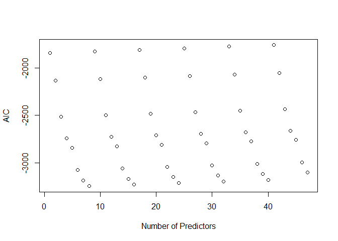
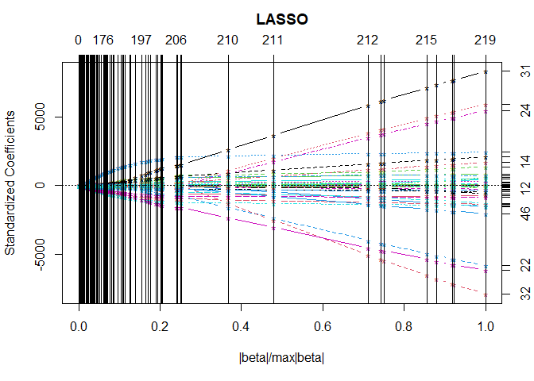
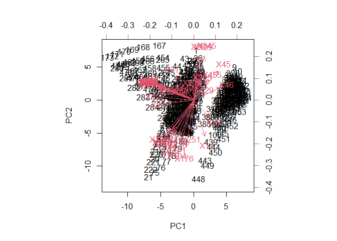
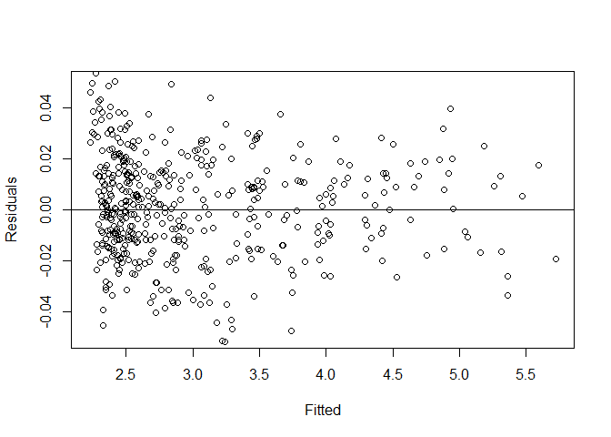
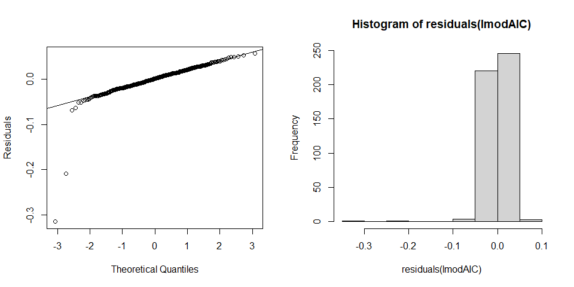
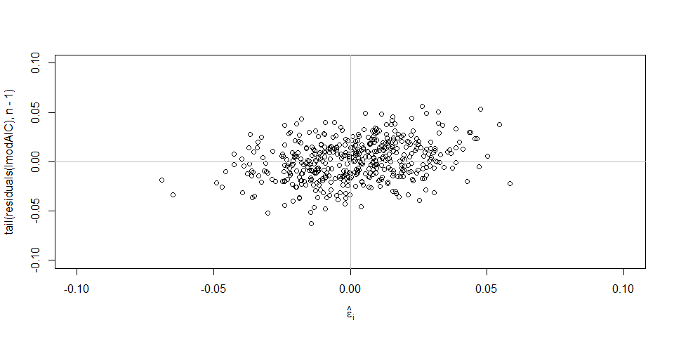
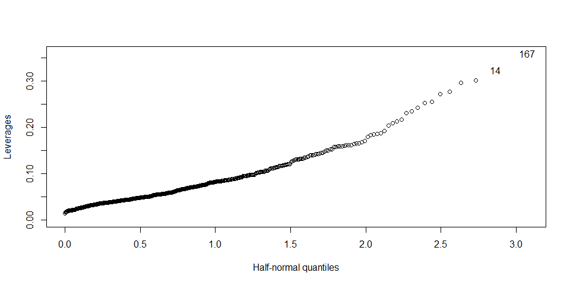

modern regression analysis final
================
Saeah Go
December 6, 2021

# Instruction

Please analyze the attached data set. The data set has header that are
numberings. The first column is the response and the remaining are
predictors. If you noticed that the first 3 predictors are what we used
for our midterm. The original data set is huge (many predictors), please
be careful when you conduct linear model. You may encounter errors if
you didn’t deal with the high dimensionality. Good luck.

# Load data

``` r
glass <- read.table("C:/Users/Saeah Go/OneDrive/Desktop/PSU/Fa2021/STAT364/Final/final.txt", header = T) # load the data using read.table() function
```

First thing I need to do is, import the data which is stored in
“final.txt”. To read the given file, final.txt, I used the
*read.table()* function. I indicated file path and use the option
*header = T* since the dataset has header in the first row.  
We know that the first column `density` is the response and others are
the predictors. The glass dataset has 498 variables and 474
observations. Since the number of variables (498) is greater than the
number of observations (474), we can see that we should use shrinkage
methods to find a good model.

# Correlation Coefficient

To reduce our dataset, let’s compute the correlation of the coefficient
first.  
When we have two independent variables that are very highly correlated,
we definitely should remove one of them because we run into the
multicollinearity conundrum and our regression model’s regression
coefficients related to the two highly correlated variables will be
unreliable.  
In other words, if two variables are so highly correlated they will
obviously impart nearly exactly the same information to our regression
model. But, by including both we are actually weakening the model. My
goal is to reduce the number of variables from 498 to 50.

## X17

First of all, I’ve looked at the correlation with the variable X17.

``` r
subset(cor(glass, glass$X17) > 0.8) # considered as very highly correlated if the value is higher than 0.8
```

    ##          [,1]
    ## density FALSE
    ## X15     FALSE
    ## X16     FALSE
    ## X17      TRUE
    ## X18     FALSE
    ## X19     FALSE
    ## X20      TRUE
    ## X21     FALSE
    ## X22     FALSE
    ## X23      TRUE
    ## X24     FALSE
    ## X25     FALSE
    ## X26     FALSE
    ## X27     FALSE
    ## X28     FALSE
    ## X29     FALSE
    ## X30     FALSE
    ## X31     FALSE
    ## X32     FALSE
    ## X33     FALSE
    ## X34     FALSE
    ## X35     FALSE
    ## X36     FALSE
    ## X37     FALSE
    ## X38     FALSE
    ## X39     FALSE
    ## X40     FALSE
    ## X41     FALSE
    ## X42     FALSE
    ## X43     FALSE
    ## X44     FALSE
    ## X45     FALSE
    ## X46     FALSE
    ## X1       TRUE
    ## X2      FALSE
    ## X3      FALSE
    ## X4       TRUE
    ## X5      FALSE
    ## X6      FALSE
    ## X7       TRUE
    ## X8      FALSE
    ## X9      FALSE
    ## X10      TRUE
    ## X11     FALSE
    ## X12     FALSE
    ## X13     FALSE
    ## X14     FALSE
    ## X15.1   FALSE
    ## X16.1   FALSE
    ## X17.1   FALSE
    ## X18.1   FALSE
    ## X19.1   FALSE
    ## X20.1   FALSE
    ## X21.1   FALSE
    ## X22.1   FALSE
    ## X23.1   FALSE
    ## X24.1   FALSE
    ## X25.1   FALSE
    ## X26.1   FALSE
    ## X27.1   FALSE
    ## X28.1   FALSE
    ## X29.1   FALSE
    ## X30.1   FALSE
    ## X31.1   FALSE
    ## X32.1   FALSE
    ## X33.1   FALSE
    ## X34.1   FALSE
    ## X35.1   FALSE
    ## X36.1   FALSE
    ## X37.1   FALSE
    ## X38.1   FALSE
    ## X39.1   FALSE
    ## X40.1   FALSE
    ## X41.1   FALSE
    ## X42.1   FALSE
    ## X43.1   FALSE
    ## X44.1   FALSE
    ## X45.1   FALSE
    ## X46.1   FALSE
    ## X47     FALSE
    ## X48     FALSE
    ## X49     FALSE
    ## X50     FALSE
    ## X51     FALSE
    ## X52     FALSE
    ## X53     FALSE
    ## X54     FALSE
    ## X55     FALSE
    ## X56     FALSE
    ## X57     FALSE
    ## X58     FALSE
    ## X59     FALSE
    ## X60     FALSE
    ## X61     FALSE
    ## X62     FALSE
    ## X63     FALSE
    ## X64     FALSE
    ## X65     FALSE
    ## X66     FALSE
    ## X67     FALSE
    ## X68     FALSE
    ## X69     FALSE
    ## X70     FALSE
    ## X71     FALSE
    ## X72     FALSE
    ## X73     FALSE
    ## X74     FALSE
    ## X75     FALSE
    ## X76     FALSE
    ## X77     FALSE
    ## X78     FALSE
    ## X79     FALSE
    ## X80     FALSE
    ## X81     FALSE
    ## X82     FALSE
    ## X83     FALSE
    ## X84     FALSE
    ## X85     FALSE
    ## X86     FALSE
    ## X87     FALSE
    ## X88      TRUE
    ## X89     FALSE
    ## X90     FALSE
    ## X91      TRUE
    ## X92     FALSE
    ## X93     FALSE
    ## X94      TRUE
    ## X95     FALSE
    ## X96     FALSE
    ## X97     FALSE
    ## X98     FALSE
    ## X99     FALSE
    ## X100    FALSE
    ## X101    FALSE
    ## X102    FALSE
    ## X103    FALSE
    ## X104    FALSE
    ## X105    FALSE
    ## X106    FALSE
    ## X107     TRUE
    ## X108    FALSE
    ## X109    FALSE
    ## X110    FALSE
    ## X111    FALSE
    ## X112    FALSE
    ## X113    FALSE
    ## X114    FALSE
    ## X115    FALSE
    ## X116    FALSE
    ## X117    FALSE
    ## X118    FALSE
    ## X119    FALSE
    ## X120    FALSE
    ## X121    FALSE
    ## X122    FALSE
    ## X123    FALSE
    ## X124    FALSE
    ## X125    FALSE
    ## X126    FALSE
    ## X127    FALSE
    ## X128    FALSE
    ## X129    FALSE
    ## X130    FALSE
    ## X131    FALSE
    ## X132    FALSE
    ## X133    FALSE
    ## X134    FALSE
    ## X135    FALSE
    ## X136    FALSE
    ## X137    FALSE
    ## X138    FALSE
    ## X139    FALSE
    ## X140    FALSE
    ## X141    FALSE
    ## X142    FALSE
    ## X143    FALSE
    ## X144    FALSE
    ## X145    FALSE
    ## X146    FALSE
    ## X147    FALSE
    ## X148    FALSE
    ## X149    FALSE
    ## X150    FALSE
    ## X151    FALSE
    ## X152    FALSE
    ## X153    FALSE
    ## X154    FALSE
    ## X155    FALSE
    ## X156    FALSE
    ## X157    FALSE
    ## X158    FALSE
    ## X159    FALSE
    ## X160    FALSE
    ## X161    FALSE
    ## X162    FALSE
    ## X163    FALSE
    ## X164    FALSE
    ## X165    FALSE
    ## X166     TRUE
    ## X167    FALSE
    ## X168    FALSE
    ## X169     TRUE
    ## X170    FALSE
    ## X171    FALSE
    ## X172    FALSE
    ## X173    FALSE
    ## X174    FALSE
    ## X175    FALSE
    ## X176    FALSE
    ## X177    FALSE
    ## X178    FALSE
    ## X179     TRUE
    ## X180    FALSE
    ## X181    FALSE
    ## X182     TRUE
    ## X183    FALSE
    ## X184    FALSE
    ## X185    FALSE
    ## X186    FALSE
    ## X187    FALSE
    ## X188    FALSE
    ## X189    FALSE
    ## X190    FALSE
    ## X191    FALSE
    ## X192    FALSE
    ## X193    FALSE
    ## X194    FALSE
    ## X195    FALSE
    ## X196    FALSE
    ## X197    FALSE
    ## X198    FALSE
    ## X199    FALSE
    ## X200    FALSE
    ## X201    FALSE
    ## X202    FALSE
    ## X203    FALSE
    ## X204    FALSE
    ## X205    FALSE
    ## X206    FALSE
    ## X207    FALSE
    ## X208    FALSE
    ## X209    FALSE
    ## X210    FALSE
    ## X211    FALSE
    ## X212    FALSE
    ## X213    FALSE
    ## X214    FALSE
    ## X215    FALSE
    ## X216    FALSE
    ## X217    FALSE
    ## X218    FALSE
    ## X219    FALSE
    ## X220    FALSE
    ## X221    FALSE
    ## X222    FALSE
    ## X223    FALSE
    ## X224    FALSE
    ## X225    FALSE
    ## X226    FALSE
    ## X227    FALSE
    ## X228    FALSE
    ## X229    FALSE
    ## X230    FALSE
    ## X231    FALSE
    ## X232    FALSE
    ## X233    FALSE
    ## X234    FALSE
    ## X235    FALSE
    ## X236    FALSE
    ## X237    FALSE
    ## X238    FALSE
    ## X239    FALSE
    ## X240    FALSE
    ## X241    FALSE
    ## X242    FALSE
    ## X243    FALSE
    ## X244    FALSE
    ## X245    FALSE
    ## X246    FALSE
    ## X247    FALSE
    ## X248    FALSE
    ## X249    FALSE
    ## X250    FALSE
    ## X251    FALSE
    ## X252    FALSE
    ## X253    FALSE
    ## X254    FALSE
    ## X255    FALSE
    ## X256    FALSE
    ## X257    FALSE
    ## X258    FALSE
    ## X259    FALSE
    ## X260    FALSE
    ## X261    FALSE
    ## X262    FALSE
    ## X263    FALSE
    ## X264    FALSE
    ## X265    FALSE
    ## X266    FALSE
    ## X267    FALSE
    ## X268    FALSE
    ## X269    FALSE
    ## X270    FALSE
    ## X271    FALSE
    ## X272    FALSE
    ## X273    FALSE
    ## X274    FALSE
    ## X275    FALSE
    ## X276    FALSE
    ## X277    FALSE
    ## X278    FALSE
    ## X279    FALSE
    ## X280    FALSE
    ## X281    FALSE
    ## X282    FALSE
    ## X283    FALSE
    ## X284    FALSE
    ## X285    FALSE
    ## X286    FALSE
    ## X287    FALSE
    ## X288    FALSE
    ## X289    FALSE
    ## X290    FALSE
    ## X291    FALSE
    ## X292    FALSE
    ## X293    FALSE
    ## X294    FALSE
    ## X295    FALSE
    ## X296    FALSE
    ## X297    FALSE
    ## X298    FALSE
    ## X299    FALSE
    ## X300    FALSE
    ## X301    FALSE
    ## X302    FALSE
    ## X303    FALSE
    ## X304    FALSE
    ## X305    FALSE
    ## X306    FALSE
    ## X307    FALSE
    ## X308    FALSE
    ## X309    FALSE
    ## X310    FALSE
    ## X311    FALSE
    ## X312    FALSE
    ## X313    FALSE
    ## X314    FALSE
    ## X315    FALSE
    ## X316    FALSE
    ## X317    FALSE
    ## X318    FALSE
    ## X319    FALSE
    ## X320    FALSE
    ## X321    FALSE
    ## X322    FALSE
    ## X323    FALSE
    ## X324    FALSE
    ## X325    FALSE
    ## X326    FALSE
    ## X327    FALSE
    ## X328    FALSE
    ## X329    FALSE
    ## X330    FALSE
    ## X331    FALSE
    ## X332    FALSE
    ## X333    FALSE
    ## X334    FALSE
    ## X335    FALSE
    ## X336    FALSE
    ## X337    FALSE
    ## X338    FALSE
    ## X339    FALSE
    ## X340    FALSE
    ## X341    FALSE
    ## X342    FALSE
    ## X343    FALSE
    ## X344    FALSE
    ## X345    FALSE
    ## X346    FALSE
    ## X347    FALSE
    ## X348    FALSE
    ## X349    FALSE
    ## X350    FALSE
    ## X351    FALSE
    ## X352    FALSE
    ## X353    FALSE
    ## X354    FALSE
    ## X355    FALSE
    ## X356    FALSE
    ## X357    FALSE
    ## X358    FALSE
    ## X359    FALSE
    ## X360    FALSE
    ## X361    FALSE
    ## X362    FALSE
    ## X363    FALSE
    ## X364    FALSE
    ## X365    FALSE
    ## X366    FALSE
    ## X367    FALSE
    ## X368    FALSE
    ## X369    FALSE
    ## X370    FALSE
    ## X371    FALSE
    ## X372    FALSE
    ## X373    FALSE
    ## X374    FALSE
    ## X375    FALSE
    ## X376    FALSE
    ## X377    FALSE
    ## X378    FALSE
    ## X379    FALSE
    ## X380    FALSE
    ## X381    FALSE
    ## X382    FALSE
    ## X383    FALSE
    ## X384    FALSE
    ## X385    FALSE
    ## X386    FALSE
    ## X387    FALSE
    ## X388    FALSE
    ## X389    FALSE
    ## X390    FALSE
    ## X391    FALSE
    ## X392    FALSE
    ## X393    FALSE
    ## X394    FALSE
    ## X395    FALSE
    ## X396    FALSE
    ## X397    FALSE
    ## X398    FALSE
    ## X399    FALSE
    ## X400    FALSE
    ## X401    FALSE
    ## X402    FALSE
    ## X403    FALSE
    ## X404    FALSE
    ## X405    FALSE
    ## X406    FALSE
    ## X407    FALSE
    ## X408    FALSE
    ## X409    FALSE
    ## X410    FALSE
    ## X411    FALSE
    ## X412    FALSE
    ## X413    FALSE
    ## X414    FALSE
    ## X415    FALSE
    ## X416    FALSE
    ## X417    FALSE
    ## X418    FALSE
    ## X419    FALSE
    ## X420    FALSE
    ## X421    FALSE
    ## X422    FALSE
    ## X423    FALSE
    ## X424    FALSE
    ## X425    FALSE
    ## X426    FALSE
    ## X427    FALSE
    ## X428    FALSE
    ## X429    FALSE
    ## X430    FALSE
    ## X431    FALSE
    ## X432    FALSE
    ## X433    FALSE
    ## X434    FALSE
    ## X435    FALSE
    ## X436    FALSE
    ## X437    FALSE
    ## X438    FALSE
    ## X439    FALSE
    ## X440    FALSE
    ## X441    FALSE
    ## X442    FALSE
    ## X443    FALSE
    ## X444    FALSE
    ## X445    FALSE
    ## X446    FALSE
    ## X447    FALSE
    ## X448    FALSE
    ## X449    FALSE
    ## X450    FALSE
    ## X451    FALSE
    ## X452    FALSE
    ## X453    FALSE
    ## X454    FALSE
    ## X455    FALSE
    ## X456    FALSE
    ## X457    FALSE
    ## X458    FALSE
    ## X459    FALSE
    ## X460    FALSE
    ## X461    FALSE
    ## X462    FALSE
    ## X463    FALSE
    ## X464    FALSE
    ## X465    FALSE

When I’m looking at the result, X17 is highly correlated with X20, X23,
X1, X4, X7, X10, X88, X91, X94, X107, X166, X169, X179, and X182. So I
will update the glass dataset without these variables.

``` r
simp_glass <- glass %>% 
  select(-c(X20, X23, X1, X4, X7, X10, X88, X91, X94, X107, X166, X169, X179, X182)) # update the dataset
```

So I create a reduced dataset called simp\_glass, I could check that now
we have 484 variables.

## X29

For the next step, I chose X29 and see if there are some variables
highly correlated.

``` r
subset(cor(simp_glass, simp_glass$X29) > 0.8) # considered as very highly correlated if the value is higher than 0.8
```

    ##          [,1]
    ## density FALSE
    ## X15     FALSE
    ## X16     FALSE
    ## X17     FALSE
    ## X18     FALSE
    ## X19     FALSE
    ## X21     FALSE
    ## X22     FALSE
    ## X24     FALSE
    ## X25     FALSE
    ## X26     FALSE
    ## X27     FALSE
    ## X28     FALSE
    ## X29      TRUE
    ## X30     FALSE
    ## X31     FALSE
    ## X32      TRUE
    ## X33     FALSE
    ## X34     FALSE
    ## X35      TRUE
    ## X36     FALSE
    ## X37     FALSE
    ## X38      TRUE
    ## X39     FALSE
    ## X40     FALSE
    ## X41      TRUE
    ## X42     FALSE
    ## X43     FALSE
    ## X44      TRUE
    ## X45     FALSE
    ## X46     FALSE
    ## X2      FALSE
    ## X3      FALSE
    ## X5      FALSE
    ## X6      FALSE
    ## X8      FALSE
    ## X9      FALSE
    ## X11     FALSE
    ## X12     FALSE
    ## X13      TRUE
    ## X14     FALSE
    ## X15.1   FALSE
    ## X16.1    TRUE
    ## X17.1   FALSE
    ## X18.1   FALSE
    ## X19.1    TRUE
    ## X20.1   FALSE
    ## X21.1   FALSE
    ## X22.1    TRUE
    ## X23.1   FALSE
    ## X24.1   FALSE
    ## X25.1    TRUE
    ## X26.1   FALSE
    ## X27.1   FALSE
    ## X28.1    TRUE
    ## X29.1   FALSE
    ## X30.1   FALSE
    ## X31.1   FALSE
    ## X32.1   FALSE
    ## X33.1   FALSE
    ## X34.1   FALSE
    ## X35.1   FALSE
    ## X36.1   FALSE
    ## X37.1   FALSE
    ## X38.1   FALSE
    ## X39.1   FALSE
    ## X40.1   FALSE
    ## X41.1   FALSE
    ## X42.1    TRUE
    ## X43.1   FALSE
    ## X44.1   FALSE
    ## X45.1    TRUE
    ## X46.1   FALSE
    ## X47     FALSE
    ## X48      TRUE
    ## X49     FALSE
    ## X50     FALSE
    ## X51      TRUE
    ## X52     FALSE
    ## X53     FALSE
    ## X54      TRUE
    ## X55     FALSE
    ## X56     FALSE
    ## X57      TRUE
    ## X58     FALSE
    ## X59     FALSE
    ## X60     FALSE
    ## X61     FALSE
    ## X62     FALSE
    ## X63     FALSE
    ## X64     FALSE
    ## X65     FALSE
    ## X66     FALSE
    ## X67     FALSE
    ## X68     FALSE
    ## X69     FALSE
    ## X70     FALSE
    ## X71     FALSE
    ## X72     FALSE
    ## X73     FALSE
    ## X74     FALSE
    ## X75     FALSE
    ## X76     FALSE
    ## X77     FALSE
    ## X78     FALSE
    ## X79     FALSE
    ## X80     FALSE
    ## X81     FALSE
    ## X82     FALSE
    ## X83     FALSE
    ## X84     FALSE
    ## X85     FALSE
    ## X86     FALSE
    ## X87     FALSE
    ## X89     FALSE
    ## X90     FALSE
    ## X92     FALSE
    ## X93     FALSE
    ## X95     FALSE
    ## X96     FALSE
    ## X97      TRUE
    ## X98     FALSE
    ## X99     FALSE
    ## X100     TRUE
    ## X101    FALSE
    ## X102    FALSE
    ## X103     TRUE
    ## X104    FALSE
    ## X105    FALSE
    ## X106     TRUE
    ## X108    FALSE
    ## X109     TRUE
    ## X110    FALSE
    ## X111    FALSE
    ## X112     TRUE
    ## X113    FALSE
    ## X114    FALSE
    ## X115    FALSE
    ## X116    FALSE
    ## X117    FALSE
    ## X118    FALSE
    ## X119    FALSE
    ## X120    FALSE
    ## X121    FALSE
    ## X122    FALSE
    ## X123     TRUE
    ## X124    FALSE
    ## X125    FALSE
    ## X126     TRUE
    ## X127    FALSE
    ## X128    FALSE
    ## X129     TRUE
    ## X130    FALSE
    ## X131    FALSE
    ## X132     TRUE
    ## X133    FALSE
    ## X134    FALSE
    ## X135     TRUE
    ## X136    FALSE
    ## X137    FALSE
    ## X138     TRUE
    ## X139    FALSE
    ## X140    FALSE
    ## X141    FALSE
    ## X142    FALSE
    ## X143    FALSE
    ## X144    FALSE
    ## X145    FALSE
    ## X146    FALSE
    ## X147    FALSE
    ## X148    FALSE
    ## X149    FALSE
    ## X150    FALSE
    ## X151    FALSE
    ## X152    FALSE
    ## X153    FALSE
    ## X154    FALSE
    ## X155    FALSE
    ## X156    FALSE
    ## X157    FALSE
    ## X158    FALSE
    ## X159    FALSE
    ## X160    FALSE
    ## X161    FALSE
    ## X162    FALSE
    ## X163    FALSE
    ## X164    FALSE
    ## X165    FALSE
    ## X167    FALSE
    ## X168    FALSE
    ## X170    FALSE
    ## X171    FALSE
    ## X172     TRUE
    ## X173    FALSE
    ## X174    FALSE
    ## X175     TRUE
    ## X176    FALSE
    ## X177    FALSE
    ## X178     TRUE
    ## X180    FALSE
    ## X181     TRUE
    ## X183    FALSE
    ## X184     TRUE
    ## X185    FALSE
    ## X186    FALSE
    ## X187     TRUE
    ## X188    FALSE
    ## X189    FALSE
    ## X190    FALSE
    ## X191    FALSE
    ## X192    FALSE
    ## X193    FALSE
    ## X194    FALSE
    ## X195     TRUE
    ## X196    FALSE
    ## X197    FALSE
    ## X198     TRUE
    ## X199    FALSE
    ## X200    FALSE
    ## X201     TRUE
    ## X202    FALSE
    ## X203    FALSE
    ## X204     TRUE
    ## X205    FALSE
    ## X206    FALSE
    ## X207     TRUE
    ## X208    FALSE
    ## X209    FALSE
    ## X210     TRUE
    ## X211    FALSE
    ## X212    FALSE
    ## X213    FALSE
    ## X214    FALSE
    ## X215    FALSE
    ## X216    FALSE
    ## X217    FALSE
    ## X218    FALSE
    ## X219    FALSE
    ## X220    FALSE
    ## X221    FALSE
    ## X222    FALSE
    ## X223    FALSE
    ## X224    FALSE
    ## X225    FALSE
    ## X226    FALSE
    ## X227    FALSE
    ## X228    FALSE
    ## X229    FALSE
    ## X230    FALSE
    ## X231    FALSE
    ## X232    FALSE
    ## X233    FALSE
    ## X234    FALSE
    ## X235    FALSE
    ## X236    FALSE
    ## X237    FALSE
    ## X238     TRUE
    ## X239    FALSE
    ## X240    FALSE
    ## X241     TRUE
    ## X242    FALSE
    ## X243    FALSE
    ## X244     TRUE
    ## X245    FALSE
    ## X246     TRUE
    ## X247     TRUE
    ## X248    FALSE
    ## X249     TRUE
    ## X250     TRUE
    ## X251    FALSE
    ## X252    FALSE
    ## X253     TRUE
    ## X254    FALSE
    ## X255    FALSE
    ## X256    FALSE
    ## X257    FALSE
    ## X258     TRUE
    ## X259    FALSE
    ## X260    FALSE
    ## X261     TRUE
    ## X262    FALSE
    ## X263    FALSE
    ## X264     TRUE
    ## X265    FALSE
    ## X266    FALSE
    ## X267     TRUE
    ## X268    FALSE
    ## X269    FALSE
    ## X270     TRUE
    ## X271    FALSE
    ## X272    FALSE
    ## X273     TRUE
    ## X274    FALSE
    ## X275    FALSE
    ## X276    FALSE
    ## X277    FALSE
    ## X278    FALSE
    ## X279    FALSE
    ## X280    FALSE
    ## X281    FALSE
    ## X282    FALSE
    ## X283    FALSE
    ## X284    FALSE
    ## X285    FALSE
    ## X286    FALSE
    ## X287    FALSE
    ## X288    FALSE
    ## X289    FALSE
    ## X290    FALSE
    ## X291    FALSE
    ## X292    FALSE
    ## X293    FALSE
    ## X294    FALSE
    ## X295     TRUE
    ## X296     TRUE
    ## X297     TRUE
    ## X298     TRUE
    ## X299     TRUE
    ## X300     TRUE
    ## X301     TRUE
    ## X302     TRUE
    ## X303     TRUE
    ## X304     TRUE
    ## X305     TRUE
    ## X306     TRUE
    ## X307     TRUE
    ## X308     TRUE
    ## X309    FALSE
    ## X310     TRUE
    ## X311     TRUE
    ## X312     TRUE
    ## X313    FALSE
    ## X314    FALSE
    ## X315     TRUE
    ## X316    FALSE
    ## X317    FALSE
    ## X318     TRUE
    ## X319    FALSE
    ## X320    FALSE
    ## X321     TRUE
    ## X322    FALSE
    ## X323    FALSE
    ## X324     TRUE
    ## X325    FALSE
    ## X326    FALSE
    ## X327     TRUE
    ## X328    FALSE
    ## X329    FALSE
    ## X330    FALSE
    ## X331     TRUE
    ## X332    FALSE
    ## X333    FALSE
    ## X334     TRUE
    ## X335    FALSE
    ## X336    FALSE
    ## X337     TRUE
    ## X338    FALSE
    ## X339    FALSE
    ## X340     TRUE
    ## X341    FALSE
    ## X342    FALSE
    ## X343     TRUE
    ## X344    FALSE
    ## X345    FALSE
    ## X346     TRUE
    ## X347     TRUE
    ## X348     TRUE
    ## X349     TRUE
    ## X350     TRUE
    ## X351     TRUE
    ## X352     TRUE
    ## X353     TRUE
    ## X354     TRUE
    ## X355     TRUE
    ## X356     TRUE
    ## X357    FALSE
    ## X358     TRUE
    ## X359     TRUE
    ## X360     TRUE
    ## X361    FALSE
    ## X362    FALSE
    ## X363     TRUE
    ## X364    FALSE
    ## X365    FALSE
    ## X366     TRUE
    ## X367    FALSE
    ## X368    FALSE
    ## X369     TRUE
    ## X370    FALSE
    ## X371    FALSE
    ## X372     TRUE
    ## X373    FALSE
    ## X374    FALSE
    ## X375    FALSE
    ## X376     TRUE
    ## X377    FALSE
    ## X378    FALSE
    ## X379     TRUE
    ## X380    FALSE
    ## X381    FALSE
    ## X382     TRUE
    ## X383    FALSE
    ## X384    FALSE
    ## X385     TRUE
    ## X386    FALSE
    ## X387    FALSE
    ## X388     TRUE
    ## X389     TRUE
    ## X390     TRUE
    ## X391     TRUE
    ## X392     TRUE
    ## X393     TRUE
    ## X394     TRUE
    ## X395     TRUE
    ## X396    FALSE
    ## X397     TRUE
    ## X398     TRUE
    ## X399     TRUE
    ## X400    FALSE
    ## X401    FALSE
    ## X402     TRUE
    ## X403    FALSE
    ## X404    FALSE
    ## X405     TRUE
    ## X406    FALSE
    ## X407    FALSE
    ## X408     TRUE
    ## X409    FALSE
    ## X410    FALSE
    ## X411    FALSE
    ## X412     TRUE
    ## X413    FALSE
    ## X414    FALSE
    ## X415     TRUE
    ## X416    FALSE
    ## X417    FALSE
    ## X418     TRUE
    ## X419    FALSE
    ## X420    FALSE
    ## X421     TRUE
    ## X422     TRUE
    ## X423     TRUE
    ## X424     TRUE
    ## X425     TRUE
    ## X426    FALSE
    ## X427     TRUE
    ## X428     TRUE
    ## X429     TRUE
    ## X430    FALSE
    ## X431    FALSE
    ## X432     TRUE
    ## X433    FALSE
    ## X434    FALSE
    ## X435     TRUE
    ## X436    FALSE
    ## X437    FALSE
    ## X438    FALSE
    ## X439     TRUE
    ## X440    FALSE
    ## X441    FALSE
    ## X442     TRUE
    ## X443    FALSE
    ## X444    FALSE
    ## X445     TRUE
    ## X446     TRUE
    ## X447    FALSE
    ## X448     TRUE
    ## X449     TRUE
    ## X450     TRUE
    ## X451    FALSE
    ## X452    FALSE
    ## X453     TRUE
    ## X454    FALSE
    ## X455    FALSE
    ## X456    FALSE
    ## X457    FALSE
    ## X458    FALSE
    ## X459    FALSE
    ## X460     TRUE
    ## X461     TRUE
    ## X462     TRUE
    ## X463    FALSE
    ## X464    FALSE
    ## X465    FALSE

When I’m looking at the result, X29 is highly correlated with X32, X35,
X38, X41, X44, X13, X16.1, X19.1, X22.1, X25.1, X28.1, X42.1, X45.1,
X48, X51, X54, X57, X97, X100, X103, X106, X109, X112, X123, X126, X129,
X132, X135, X138, X172, X175, X178, X181, X184, X187, X195, X198, X201,
X204, X207, X210, X238, X241, X244, X246, X247, X249, X250, X253, X258,
X261, X264, X267, X270, X273, X295:X308, X310:X312, X315, X318, X321,
X324, X327, X331, X334, X337, X340, X343, X346:X356, X358:X360, X363,
X366, X369, X372, X376, X379, X382, X385, X388:X395, X397:X399, X402,
X405, X408, X412, X415, X418, X421:X425, X427:X429, X432, X435, X439,
X442, X445, X446, X448, X449, X450, X453, X460, X461, and X462. So I
update the glass dataset again excluding these variables.

``` r
simp_glass <- simp_glass %>% 
  select(-c(X32, X35, X38, X41, X44, X13, X16.1, X19.1, X22.1, X25.1, X28.1, X42.1, X45.1, X48, X51, X54, X57, X97, X100, X103, X106, X109, X112, X123, X126, X129, X132, X135, X138, X172, X175, X178, X181, X184, X187, X195, X198, X201, X204, X207, X210, X238, X241, X244, X246, X247, X249, X250, X253, X258, X261, X264, X267, X270, X273, X295:X308, X310:X312, X315, X318, X321, X324, X327, X331, X334, X337, X340, X343, X346:X356, X358:X360, X363, X366, X369, X372, X376, X379, X382, X385, X388:X395, X397:X399, X402, X405, X408, X412, X415, X418, X421:X425, X427:X429, X432, X435, X439, X442, X445, X446, X448, X449, X450, X453, X460, X461, X462))
```

Now I have 356 variables, so I chose X31.

## X31

``` r
subset(cor(simp_glass, simp_glass$X31) > 0.8) # considered as very highly correlated if the value is higher than 0.8
```

    ##          [,1]
    ## density FALSE
    ## X15     FALSE
    ## X16     FALSE
    ## X17     FALSE
    ## X18     FALSE
    ## X19     FALSE
    ## X21     FALSE
    ## X22     FALSE
    ## X24     FALSE
    ## X25     FALSE
    ## X26     FALSE
    ## X27     FALSE
    ## X28     FALSE
    ## X29     FALSE
    ## X30     FALSE
    ## X31      TRUE
    ## X33      TRUE
    ## X34      TRUE
    ## X36      TRUE
    ## X37      TRUE
    ## X39      TRUE
    ## X40      TRUE
    ## X42     FALSE
    ## X43     FALSE
    ## X45     FALSE
    ## X46     FALSE
    ## X2      FALSE
    ## X3      FALSE
    ## X5      FALSE
    ## X6      FALSE
    ## X8      FALSE
    ## X9      FALSE
    ## X11     FALSE
    ## X12     FALSE
    ## X14     FALSE
    ## X15.1    TRUE
    ## X17.1   FALSE
    ## X18.1    TRUE
    ## X20.1   FALSE
    ## X21.1    TRUE
    ## X23.1   FALSE
    ## X24.1   FALSE
    ## X26.1   FALSE
    ## X27.1   FALSE
    ## X29.1   FALSE
    ## X30.1   FALSE
    ## X31.1   FALSE
    ## X32.1   FALSE
    ## X33.1   FALSE
    ## X34.1   FALSE
    ## X35.1   FALSE
    ## X36.1   FALSE
    ## X37.1   FALSE
    ## X38.1   FALSE
    ## X39.1   FALSE
    ## X40.1   FALSE
    ## X41.1   FALSE
    ## X43.1   FALSE
    ## X44.1    TRUE
    ## X46.1   FALSE
    ## X47      TRUE
    ## X49     FALSE
    ## X50     FALSE
    ## X52     FALSE
    ## X53     FALSE
    ## X55     FALSE
    ## X56     FALSE
    ## X58     FALSE
    ## X59     FALSE
    ## X60     FALSE
    ## X61     FALSE
    ## X62     FALSE
    ## X63     FALSE
    ## X64     FALSE
    ## X65     FALSE
    ## X66     FALSE
    ## X67     FALSE
    ## X68     FALSE
    ## X69     FALSE
    ## X70     FALSE
    ## X71     FALSE
    ## X72     FALSE
    ## X73     FALSE
    ## X74     FALSE
    ## X75     FALSE
    ## X76     FALSE
    ## X77     FALSE
    ## X78     FALSE
    ## X79     FALSE
    ## X80     FALSE
    ## X81     FALSE
    ## X82     FALSE
    ## X83     FALSE
    ## X84     FALSE
    ## X85     FALSE
    ## X86     FALSE
    ## X87     FALSE
    ## X89     FALSE
    ## X90     FALSE
    ## X92     FALSE
    ## X93     FALSE
    ## X95     FALSE
    ## X96     FALSE
    ## X98     FALSE
    ## X99      TRUE
    ## X101    FALSE
    ## X102     TRUE
    ## X104    FALSE
    ## X105    FALSE
    ## X108    FALSE
    ## X110    FALSE
    ## X111    FALSE
    ## X113    FALSE
    ## X114    FALSE
    ## X115    FALSE
    ## X116    FALSE
    ## X117    FALSE
    ## X118    FALSE
    ## X119    FALSE
    ## X120    FALSE
    ## X121    FALSE
    ## X122    FALSE
    ## X124    FALSE
    ## X125     TRUE
    ## X127    FALSE
    ## X128     TRUE
    ## X130    FALSE
    ## X131    FALSE
    ## X133    FALSE
    ## X134    FALSE
    ## X136    FALSE
    ## X137    FALSE
    ## X139    FALSE
    ## X140    FALSE
    ## X141    FALSE
    ## X142    FALSE
    ## X143    FALSE
    ## X144    FALSE
    ## X145    FALSE
    ## X146    FALSE
    ## X147    FALSE
    ## X148    FALSE
    ## X149    FALSE
    ## X150    FALSE
    ## X151    FALSE
    ## X152    FALSE
    ## X153    FALSE
    ## X154    FALSE
    ## X155    FALSE
    ## X156    FALSE
    ## X157    FALSE
    ## X158    FALSE
    ## X159    FALSE
    ## X160    FALSE
    ## X161    FALSE
    ## X162    FALSE
    ## X163    FALSE
    ## X164    FALSE
    ## X165    FALSE
    ## X167    FALSE
    ## X168    FALSE
    ## X170    FALSE
    ## X171    FALSE
    ## X173    FALSE
    ## X174     TRUE
    ## X176    FALSE
    ## X177    FALSE
    ## X180    FALSE
    ## X183    FALSE
    ## X185    FALSE
    ## X186    FALSE
    ## X188    FALSE
    ## X189    FALSE
    ## X190    FALSE
    ## X191    FALSE
    ## X192    FALSE
    ## X193    FALSE
    ## X194    FALSE
    ## X196    FALSE
    ## X197     TRUE
    ## X199    FALSE
    ## X200     TRUE
    ## X202    FALSE
    ## X203     TRUE
    ## X205    FALSE
    ## X206    FALSE
    ## X208    FALSE
    ## X209    FALSE
    ## X211    FALSE
    ## X212    FALSE
    ## X213    FALSE
    ## X214    FALSE
    ## X215    FALSE
    ## X216    FALSE
    ## X217    FALSE
    ## X218    FALSE
    ## X219    FALSE
    ## X220    FALSE
    ## X221    FALSE
    ## X222    FALSE
    ## X223    FALSE
    ## X224    FALSE
    ## X225    FALSE
    ## X226    FALSE
    ## X227    FALSE
    ## X228    FALSE
    ## X229    FALSE
    ## X230    FALSE
    ## X231    FALSE
    ## X232    FALSE
    ## X233    FALSE
    ## X234    FALSE
    ## X235    FALSE
    ## X236    FALSE
    ## X237    FALSE
    ## X239    FALSE
    ## X240    FALSE
    ## X242    FALSE
    ## X243    FALSE
    ## X245    FALSE
    ## X248    FALSE
    ## X251    FALSE
    ## X252    FALSE
    ## X254    FALSE
    ## X255    FALSE
    ## X256    FALSE
    ## X257    FALSE
    ## X259    FALSE
    ## X260     TRUE
    ## X262    FALSE
    ## X263     TRUE
    ## X265    FALSE
    ## X266     TRUE
    ## X268    FALSE
    ## X269     TRUE
    ## X271    FALSE
    ## X272    FALSE
    ## X274    FALSE
    ## X275    FALSE
    ## X276    FALSE
    ## X277    FALSE
    ## X278    FALSE
    ## X279    FALSE
    ## X280    FALSE
    ## X281    FALSE
    ## X282    FALSE
    ## X283    FALSE
    ## X284    FALSE
    ## X285    FALSE
    ## X286    FALSE
    ## X287    FALSE
    ## X288    FALSE
    ## X289    FALSE
    ## X290    FALSE
    ## X291    FALSE
    ## X292    FALSE
    ## X293    FALSE
    ## X294    FALSE
    ## X309    FALSE
    ## X313    FALSE
    ## X314     TRUE
    ## X316     TRUE
    ## X317     TRUE
    ## X319     TRUE
    ## X320     TRUE
    ## X322     TRUE
    ## X323     TRUE
    ## X325    FALSE
    ## X326    FALSE
    ## X328    FALSE
    ## X329    FALSE
    ## X330     TRUE
    ## X332     TRUE
    ## X333     TRUE
    ## X335     TRUE
    ## X336     TRUE
    ## X338     TRUE
    ## X339     TRUE
    ## X341     TRUE
    ## X342    FALSE
    ## X344    FALSE
    ## X345    FALSE
    ## X357    FALSE
    ## X361     TRUE
    ## X362     TRUE
    ## X364     TRUE
    ## X365     TRUE
    ## X367     TRUE
    ## X368     TRUE
    ## X370    FALSE
    ## X371    FALSE
    ## X373    FALSE
    ## X374    FALSE
    ## X375     TRUE
    ## X377     TRUE
    ## X378     TRUE
    ## X380     TRUE
    ## X381     TRUE
    ## X383     TRUE
    ## X384    FALSE
    ## X386    FALSE
    ## X387    FALSE
    ## X396    FALSE
    ## X400     TRUE
    ## X401     TRUE
    ## X403     TRUE
    ## X404     TRUE
    ## X406    FALSE
    ## X407    FALSE
    ## X409    FALSE
    ## X410    FALSE
    ## X411     TRUE
    ## X413     TRUE
    ## X414     TRUE
    ## X416     TRUE
    ## X417    FALSE
    ## X419    FALSE
    ## X420    FALSE
    ## X426    FALSE
    ## X430     TRUE
    ## X431     TRUE
    ## X433     TRUE
    ## X434    FALSE
    ## X436    FALSE
    ## X437    FALSE
    ## X438     TRUE
    ## X440     TRUE
    ## X441    FALSE
    ## X443    FALSE
    ## X444    FALSE
    ## X447    FALSE
    ## X451    FALSE
    ## X452    FALSE
    ## X454    FALSE
    ## X455    FALSE
    ## X456    FALSE
    ## X457    FALSE
    ## X458    FALSE
    ## X459    FALSE
    ## X463    FALSE
    ## X464    FALSE
    ## X465    FALSE

When I’m looking at the result, X31 is highly correlated with X33, X34,
X36, X37, X39, X40, X15.1, X18.1, X21.1, X44.1, X47, X99, X102, X125,
X128, X174, X197, X200, X203, X260, X263, X266, X269, X314, X316, X317,
X319, X320, X322, X323, X330, X332, X333, X335, X336, X338, X339, X341,
X361, X362, X364, X365, X367, X368, X375, X377, X378, X380, X381, X383,
X400, X401, X403, X404, X411, X413, X414, X416, X430, X431, X433, X438,
and X440. So I update the glass dataset again by removing these
variables.

``` r
simp_glass <- simp_glass %>% 
  select(-c(X33, X34, X36, X37, X39, X40, X15.1, X18.1, X21.1, X44.1, X47, X99, X102, X125, X128, X174, X197, X200, X203, X260, X263, X266, X269, X314, X316, X317, X319, X320, X322, X323, X330, X332, X333, X335, X336, X338, X339, X341, X361, X362, X364, X365, X367, X368, X375, X377, X378, X380, X381, X383, X400, X401, X403, X404, X411, X413, X414, X416, X430, X431, X433, X438, X440))
```

Removed 63 variables, and left 293 variables.

## X19

Again, I decided to look at X19.

``` r
subset(cor(simp_glass, simp_glass$X19) > 0.8) # considered as very highly correlated if the value is higher than 0.8
```

    ##          [,1]
    ## density FALSE
    ## X15     FALSE
    ## X16     FALSE
    ## X17     FALSE
    ## X18      TRUE
    ## X19      TRUE
    ## X21      TRUE
    ## X22      TRUE
    ## X24     FALSE
    ## X25      TRUE
    ## X26     FALSE
    ## X27     FALSE
    ## X28      TRUE
    ## X29     FALSE
    ## X30     FALSE
    ## X31     FALSE
    ## X42     FALSE
    ## X43      TRUE
    ## X45     FALSE
    ## X46     FALSE
    ## X2      FALSE
    ## X3       TRUE
    ## X5      FALSE
    ## X6       TRUE
    ## X8      FALSE
    ## X9       TRUE
    ## X11     FALSE
    ## X12      TRUE
    ## X14     FALSE
    ## X17.1   FALSE
    ## X20.1   FALSE
    ## X23.1   FALSE
    ## X24.1   FALSE
    ## X26.1   FALSE
    ## X27.1    TRUE
    ## X29.1   FALSE
    ## X30.1   FALSE
    ## X31.1    TRUE
    ## X32.1    TRUE
    ## X33.1   FALSE
    ## X34.1    TRUE
    ## X35.1    TRUE
    ## X36.1   FALSE
    ## X37.1    TRUE
    ## X38.1    TRUE
    ## X39.1   FALSE
    ## X40.1    TRUE
    ## X41.1    TRUE
    ## X43.1    TRUE
    ## X46.1    TRUE
    ## X49      TRUE
    ## X50      TRUE
    ## X52      TRUE
    ## X53      TRUE
    ## X55      TRUE
    ## X56      TRUE
    ## X58     FALSE
    ## X59     FALSE
    ## X60      TRUE
    ## X61      TRUE
    ## X62      TRUE
    ## X63      TRUE
    ## X64      TRUE
    ## X65      TRUE
    ## X66      TRUE
    ## X67      TRUE
    ## X68      TRUE
    ## X69      TRUE
    ## X70      TRUE
    ## X71      TRUE
    ## X72      TRUE
    ## X73      TRUE
    ## X74      TRUE
    ## X75      TRUE
    ## X76     FALSE
    ## X77      TRUE
    ## X78      TRUE
    ## X79     FALSE
    ## X80      TRUE
    ## X81      TRUE
    ## X82      TRUE
    ## X83      TRUE
    ## X84      TRUE
    ## X85     FALSE
    ## X86      TRUE
    ## X87      TRUE
    ## X89     FALSE
    ## X90      TRUE
    ## X92     FALSE
    ## X93      TRUE
    ## X95     FALSE
    ## X96      TRUE
    ## X98     FALSE
    ## X101    FALSE
    ## X104    FALSE
    ## X105    FALSE
    ## X108    FALSE
    ## X110    FALSE
    ## X111     TRUE
    ## X113    FALSE
    ## X114    FALSE
    ## X115     TRUE
    ## X116     TRUE
    ## X117    FALSE
    ## X118    FALSE
    ## X119     TRUE
    ## X120    FALSE
    ## X121    FALSE
    ## X122     TRUE
    ## X124    FALSE
    ## X127    FALSE
    ## X130    FALSE
    ## X131    FALSE
    ## X133    FALSE
    ## X134     TRUE
    ## X136    FALSE
    ## X137     TRUE
    ## X139    FALSE
    ## X140    FALSE
    ## X141     TRUE
    ## X142     TRUE
    ## X143     TRUE
    ## X144     TRUE
    ## X145     TRUE
    ## X146     TRUE
    ## X147     TRUE
    ## X148     TRUE
    ## X149     TRUE
    ## X150     TRUE
    ## X151     TRUE
    ## X152     TRUE
    ## X153     TRUE
    ## X154    FALSE
    ## X155     TRUE
    ## X156     TRUE
    ## X157    FALSE
    ## X158     TRUE
    ## X159     TRUE
    ## X160     TRUE
    ## X161     TRUE
    ## X162     TRUE
    ## X163    FALSE
    ## X164     TRUE
    ## X165     TRUE
    ## X167    FALSE
    ## X168     TRUE
    ## X170    FALSE
    ## X171     TRUE
    ## X173    FALSE
    ## X176    FALSE
    ## X177    FALSE
    ## X180    FALSE
    ## X183    FALSE
    ## X185    FALSE
    ## X186     TRUE
    ## X188    FALSE
    ## X189    FALSE
    ## X190    FALSE
    ## X191     TRUE
    ## X192    FALSE
    ## X193    FALSE
    ## X194     TRUE
    ## X196    FALSE
    ## X199    FALSE
    ## X202    FALSE
    ## X205    FALSE
    ## X206    FALSE
    ## X208    FALSE
    ## X209     TRUE
    ## X211    FALSE
    ## X212    FALSE
    ## X213     TRUE
    ## X214     TRUE
    ## X215     TRUE
    ## X216     TRUE
    ## X217     TRUE
    ## X218     TRUE
    ## X219     TRUE
    ## X220     TRUE
    ## X221     TRUE
    ## X222     TRUE
    ## X223    FALSE
    ## X224     TRUE
    ## X225     TRUE
    ## X226    FALSE
    ## X227     TRUE
    ## X228     TRUE
    ## X229     TRUE
    ## X230     TRUE
    ## X231     TRUE
    ## X232    FALSE
    ## X233     TRUE
    ## X234     TRUE
    ## X235    FALSE
    ## X236    FALSE
    ## X237     TRUE
    ## X239    FALSE
    ## X240    FALSE
    ## X242    FALSE
    ## X243    FALSE
    ## X245    FALSE
    ## X248    FALSE
    ## X251    FALSE
    ## X252     TRUE
    ## X254    FALSE
    ## X255    FALSE
    ## X256    FALSE
    ## X257     TRUE
    ## X259    FALSE
    ## X262    FALSE
    ## X265    FALSE
    ## X268    FALSE
    ## X271    FALSE
    ## X272     TRUE
    ## X274    FALSE
    ## X275    FALSE
    ## X276     TRUE
    ## X277     TRUE
    ## X278     TRUE
    ## X279     TRUE
    ## X280     TRUE
    ## X281     TRUE
    ## X282     TRUE
    ## X283    FALSE
    ## X284     TRUE
    ## X285     TRUE
    ## X286    FALSE
    ## X287     TRUE
    ## X288     TRUE
    ## X289     TRUE
    ## X290     TRUE
    ## X291     TRUE
    ## X292    FALSE
    ## X293     TRUE
    ## X294     TRUE
    ## X309     TRUE
    ## X313    FALSE
    ## X325    FALSE
    ## X326     TRUE
    ## X328    FALSE
    ## X329    FALSE
    ## X342     TRUE
    ## X344    FALSE
    ## X345    FALSE
    ## X357    FALSE
    ## X370    FALSE
    ## X371     TRUE
    ## X373    FALSE
    ## X374    FALSE
    ## X384     TRUE
    ## X386    FALSE
    ## X387    FALSE
    ## X396    FALSE
    ## X406    FALSE
    ## X407     TRUE
    ## X409    FALSE
    ## X410    FALSE
    ## X417     TRUE
    ## X419    FALSE
    ## X420    FALSE
    ## X426    FALSE
    ## X434     TRUE
    ## X436    FALSE
    ## X437    FALSE
    ## X441     TRUE
    ## X443    FALSE
    ## X444    FALSE
    ## X447     TRUE
    ## X451    FALSE
    ## X452     TRUE
    ## X454    FALSE
    ## X455    FALSE
    ## X456     TRUE
    ## X457    FALSE
    ## X458     TRUE
    ## X459     TRUE
    ## X463    FALSE
    ## X464    FALSE
    ## X465    FALSE

In this case, X18, X21, X22, X25, X28, X43, X3, X6, X9, X12, X27.1,
X31.1, X32.1, X34.1, X35.1, X37.1, X38.1, X40.1:X56, X60:X75, X77, X78,
X80:X84, X86, X87, X90, X93, X96, X111, X115, X116, X119, X122, X134,
X137, X141:X153, X155, X156, X158:X162, X164, X165, X168, X171, X186,
X191, X194, X209, X213:X222, X224, X225, X227:X231, X233, X234, X237,
X252, X257, X272, X276:X282, X284, X285, X287:X291, X293:X309, X326,
X342, X371, X384, X407, X417, X434, X441, X447, X452, X456, X458, and
X459 are highly correlated with X19. Thus I will remove these.

``` r
simp_glass <- simp_glass %>% 
  select(-c(X18, X21, X22, X25, X28, X43, X3, X6, X9, X12, X27.1, X31.1, X32.1, X34.1, X35.1, X37.1, X38.1, X40.1:X56, X60:X75, X77, X78, X80:X84, X86, X87, X90, X93, X96, X111, X115, X116, X119, X122, X134, X137, X141:X153, X155, X156, X158:X162, X164, X165, X168, X171, X186, X191, X194, X209, X213:X222, X224, X225, X227:X231, X233, X234, X237, X252, X257, X272, X276:X282, X284, X285, X287:X291, X293:X309, X326, X342, X371, X384, X407, X417, X434, X441, X447, X452, X456, X458, X459))
```

143 variables are removed, not we have 136 variables.

## X26

Again, I decided to look at X26.

``` r
subset(cor(simp_glass, simp_glass$X26) > 0.8) # considered as very highly correlated if the value is higher than 0.8
```

    ##          [,1]
    ## density FALSE
    ## X15     FALSE
    ## X16     FALSE
    ## X17     FALSE
    ## X19     FALSE
    ## X24     FALSE
    ## X26      TRUE
    ## X27     FALSE
    ## X29     FALSE
    ## X30     FALSE
    ## X31     FALSE
    ## X42     FALSE
    ## X45     FALSE
    ## X46     FALSE
    ## X2      FALSE
    ## X5      FALSE
    ## X8      FALSE
    ## X11     FALSE
    ## X14     FALSE
    ## X17.1   FALSE
    ## X20.1   FALSE
    ## X23.1   FALSE
    ## X24.1   FALSE
    ## X26.1   FALSE
    ## X29.1   FALSE
    ## X30.1   FALSE
    ## X33.1   FALSE
    ## X36.1   FALSE
    ## X39.1   FALSE
    ## X58     FALSE
    ## X59     FALSE
    ## X76     FALSE
    ## X79     FALSE
    ## X85     FALSE
    ## X89     FALSE
    ## X92     FALSE
    ## X95     FALSE
    ## X98     FALSE
    ## X101    FALSE
    ## X104    FALSE
    ## X105    FALSE
    ## X108     TRUE
    ## X110    FALSE
    ## X113    FALSE
    ## X114    FALSE
    ## X117    FALSE
    ## X118    FALSE
    ## X120    FALSE
    ## X121    FALSE
    ## X124    FALSE
    ## X127    FALSE
    ## X130    FALSE
    ## X131    FALSE
    ## X133    FALSE
    ## X136    FALSE
    ## X139    FALSE
    ## X140    FALSE
    ## X154    FALSE
    ## X157    FALSE
    ## X163    FALSE
    ## X167    FALSE
    ## X170    FALSE
    ## X173    FALSE
    ## X176    FALSE
    ## X177    FALSE
    ## X180     TRUE
    ## X183     TRUE
    ## X185    FALSE
    ## X188    FALSE
    ## X189    FALSE
    ## X190    FALSE
    ## X192    FALSE
    ## X193    FALSE
    ## X196    FALSE
    ## X199    FALSE
    ## X202    FALSE
    ## X205    FALSE
    ## X206    FALSE
    ## X208    FALSE
    ## X211    FALSE
    ## X212    FALSE
    ## X223    FALSE
    ## X226    FALSE
    ## X232    FALSE
    ## X235     TRUE
    ## X236    FALSE
    ## X239     TRUE
    ## X240    FALSE
    ## X242     TRUE
    ## X243     TRUE
    ## X245     TRUE
    ## X248     TRUE
    ## X251    FALSE
    ## X254    FALSE
    ## X255     TRUE
    ## X256    FALSE
    ## X259    FALSE
    ## X262    FALSE
    ## X265    FALSE
    ## X268    FALSE
    ## X271    FALSE
    ## X274    FALSE
    ## X275    FALSE
    ## X283    FALSE
    ## X286    FALSE
    ## X292    FALSE
    ## X313    FALSE
    ## X325    FALSE
    ## X328    FALSE
    ## X329    FALSE
    ## X344    FALSE
    ## X345    FALSE
    ## X357    FALSE
    ## X370    FALSE
    ## X373    FALSE
    ## X374    FALSE
    ## X386    FALSE
    ## X387    FALSE
    ## X396    FALSE
    ## X406    FALSE
    ## X409    FALSE
    ## X410    FALSE
    ## X419    FALSE
    ## X420    FALSE
    ## X426    FALSE
    ## X436    FALSE
    ## X437    FALSE
    ## X443    FALSE
    ## X444    FALSE
    ## X451    FALSE
    ## X454    FALSE
    ## X455    FALSE
    ## X457    FALSE
    ## X463    FALSE
    ## X464    FALSE
    ## X465    FALSE

In this case, there are fewer correlated variables compare to the above
cases. Only 10 variables will be removed, X108, X180, X183, X235, X239,
X242:X248, and X255.

``` r
simp_glass <- simp_glass %>% 
  select(-c(X108, X180, X183, X235, X239, X242:X248, X255))
```

10 predictors are removed, now we have left 126.

## X24

Again, I decided to look at X24.

``` r
subset(cor(simp_glass, simp_glass$X24) > 0.8) # considered as very highly correlated if the value is higher than 0.8
```

    ##          [,1]
    ## density FALSE
    ## X15     FALSE
    ## X16     FALSE
    ## X17     FALSE
    ## X19     FALSE
    ## X24      TRUE
    ## X26     FALSE
    ## X27      TRUE
    ## X29     FALSE
    ## X30      TRUE
    ## X31     FALSE
    ## X42      TRUE
    ## X45     FALSE
    ## X46     FALSE
    ## X2       TRUE
    ## X5       TRUE
    ## X8       TRUE
    ## X11      TRUE
    ## X14      TRUE
    ## X17.1    TRUE
    ## X20.1   FALSE
    ## X23.1   FALSE
    ## X24.1   FALSE
    ## X26.1    TRUE
    ## X29.1   FALSE
    ## X30.1   FALSE
    ## X33.1    TRUE
    ## X36.1    TRUE
    ## X39.1   FALSE
    ## X58     FALSE
    ## X59     FALSE
    ## X76     FALSE
    ## X79     FALSE
    ## X85     FALSE
    ## X89      TRUE
    ## X92      TRUE
    ## X95      TRUE
    ## X98      TRUE
    ## X101    FALSE
    ## X104    FALSE
    ## X105    FALSE
    ## X110     TRUE
    ## X113    FALSE
    ## X114    FALSE
    ## X117     TRUE
    ## X118     TRUE
    ## X120    FALSE
    ## X121     TRUE
    ## X124     TRUE
    ## X127     TRUE
    ## X130     TRUE
    ## X131     TRUE
    ## X133     TRUE
    ## X136     TRUE
    ## X139    FALSE
    ## X140    FALSE
    ## X154    FALSE
    ## X157    FALSE
    ## X163    FALSE
    ## X167     TRUE
    ## X170     TRUE
    ## X173    FALSE
    ## X176    FALSE
    ## X177    FALSE
    ## X185    FALSE
    ## X188    FALSE
    ## X189    FALSE
    ## X190     TRUE
    ## X192    FALSE
    ## X193     TRUE
    ## X196     TRUE
    ## X199     TRUE
    ## X202     TRUE
    ## X205     TRUE
    ## X206     TRUE
    ## X208     TRUE
    ## X211    FALSE
    ## X212    FALSE
    ## X223    FALSE
    ## X226    FALSE
    ## X232    FALSE
    ## X236    FALSE
    ## X240    FALSE
    ## X251    FALSE
    ## X254    FALSE
    ## X256     TRUE
    ## X259     TRUE
    ## X262     TRUE
    ## X265     TRUE
    ## X268     TRUE
    ## X271     TRUE
    ## X274    FALSE
    ## X275    FALSE
    ## X283    FALSE
    ## X286    FALSE
    ## X292    FALSE
    ## X313     TRUE
    ## X325     TRUE
    ## X328    FALSE
    ## X329    FALSE
    ## X344    FALSE
    ## X345    FALSE
    ## X357    FALSE
    ## X370     TRUE
    ## X373    FALSE
    ## X374    FALSE
    ## X386    FALSE
    ## X387    FALSE
    ## X396    FALSE
    ## X406     TRUE
    ## X409    FALSE
    ## X410    FALSE
    ## X419    FALSE
    ## X420    FALSE
    ## X426    FALSE
    ## X436    FALSE
    ## X437    FALSE
    ## X443    FALSE
    ## X444    FALSE
    ## X451     TRUE
    ## X454    FALSE
    ## X455    FALSE
    ## X457    FALSE
    ## X463    FALSE
    ## X464    FALSE
    ## X465    FALSE

In this case, there are 47 correlated variables. The removed variables
are: X27, X30, X42, X2:X17.1, X26.1, X33.1, X36.1, X89:X98, X110, X117,
X118, X121:X136, X167, X170, X190, X193:X208, X256:X271, X313, X325,
X370, X406, and X451.

``` r
simp_glass <- simp_glass %>% 
  select(-c(X27, X30, X42, X2:X17.1, X26.1, X33.1, X36.1, X89:X98, X110, X117, X118, X121:X136, X167, X170, X190, X193:X208, X256:X271, X313, X325, X370, X406, X451))
```

We now have 79 variables. Since the density is our response variable, we
have 78 predictors.

## X24.1

Again, I decided to look at X24.1.

``` r
subset(cor(simp_glass, simp_glass$X24.1) > 0.8) # considered as very highly correlated if the value is higher than 0.8
```

    ##          [,1]
    ## density FALSE
    ## X15     FALSE
    ## X16     FALSE
    ## X17     FALSE
    ## X19     FALSE
    ## X24     FALSE
    ## X26     FALSE
    ## X29     FALSE
    ## X31     FALSE
    ## X45     FALSE
    ## X46     FALSE
    ## X20.1   FALSE
    ## X23.1   FALSE
    ## X24.1    TRUE
    ## X29.1   FALSE
    ## X30.1   FALSE
    ## X39.1   FALSE
    ## X58     FALSE
    ## X59     FALSE
    ## X76     FALSE
    ## X79     FALSE
    ## X85     FALSE
    ## X101    FALSE
    ## X104    FALSE
    ## X105     TRUE
    ## X113    FALSE
    ## X114    FALSE
    ## X120    FALSE
    ## X139    FALSE
    ## X140    FALSE
    ## X154    FALSE
    ## X157    FALSE
    ## X163    FALSE
    ## X173    FALSE
    ## X176    FALSE
    ## X177     TRUE
    ## X185    FALSE
    ## X188    FALSE
    ## X189    FALSE
    ## X192    FALSE
    ## X211    FALSE
    ## X212    FALSE
    ## X223    FALSE
    ## X226    FALSE
    ## X232    FALSE
    ## X236    FALSE
    ## X240     TRUE
    ## X251    FALSE
    ## X254    FALSE
    ## X274    FALSE
    ## X275    FALSE
    ## X283    FALSE
    ## X286    FALSE
    ## X292    FALSE
    ## X328    FALSE
    ## X329    FALSE
    ## X344    FALSE
    ## X345    FALSE
    ## X357    FALSE
    ## X373    FALSE
    ## X374    FALSE
    ## X386    FALSE
    ## X387    FALSE
    ## X396    FALSE
    ## X409    FALSE
    ## X410    FALSE
    ## X419    FALSE
    ## X420    FALSE
    ## X426    FALSE
    ## X436    FALSE
    ## X437    FALSE
    ## X443    FALSE
    ## X444    FALSE
    ## X454    FALSE
    ## X455    FALSE
    ## X457    FALSE
    ## X463    FALSE
    ## X464    FALSE
    ## X465    FALSE

There are only three correlated variables with X24.1. X105, X177, and
X240 will be removed.

``` r
simp_glass <- simp_glass %>% 
  select(-c(X105, X177, X240))
```

## X45

Again, I decided to look at X45.

``` r
subset(cor(simp_glass, simp_glass$X45) > 0.8) # considered as very highly correlated if the value is higher than 0.8
```

    ##          [,1]
    ## density FALSE
    ## X15     FALSE
    ## X16     FALSE
    ## X17     FALSE
    ## X19     FALSE
    ## X24     FALSE
    ## X26     FALSE
    ## X29     FALSE
    ## X31     FALSE
    ## X45      TRUE
    ## X46     FALSE
    ## X20.1   FALSE
    ## X23.1   FALSE
    ## X24.1   FALSE
    ## X29.1    TRUE
    ## X30.1   FALSE
    ## X39.1   FALSE
    ## X58     FALSE
    ## X59     FALSE
    ## X76     FALSE
    ## X79     FALSE
    ## X85     FALSE
    ## X101    FALSE
    ## X104    FALSE
    ## X113     TRUE
    ## X114    FALSE
    ## X120    FALSE
    ## X139    FALSE
    ## X140    FALSE
    ## X154    FALSE
    ## X157    FALSE
    ## X163    FALSE
    ## X173    FALSE
    ## X176    FALSE
    ## X185    FALSE
    ## X188     TRUE
    ## X189    FALSE
    ## X192    FALSE
    ## X211     TRUE
    ## X212    FALSE
    ## X223    FALSE
    ## X226    FALSE
    ## X232    FALSE
    ## X236    FALSE
    ## X251    FALSE
    ## X254     TRUE
    ## X274     TRUE
    ## X275    FALSE
    ## X283    FALSE
    ## X286    FALSE
    ## X292    FALSE
    ## X328     TRUE
    ## X329    FALSE
    ## X344     TRUE
    ## X345    FALSE
    ## X357    FALSE
    ## X373     TRUE
    ## X374    FALSE
    ## X386     TRUE
    ## X387    FALSE
    ## X396    FALSE
    ## X409     TRUE
    ## X410    FALSE
    ## X419     TRUE
    ## X420    FALSE
    ## X426    FALSE
    ## X436     TRUE
    ## X437    FALSE
    ## X443     TRUE
    ## X444    FALSE
    ## X454     TRUE
    ## X455    FALSE
    ## X457    FALSE
    ## X463     TRUE
    ## X464     TRUE
    ## X465    FALSE

X45 is highly correlated with X29.1, X113, X188, X211, X254, X274, X328,
X344, X373, X386, X409, X419, X436, X443, X454, X463, and X464.

``` r
simp_glass <- simp_glass %>% 
  select(-c(X29.1, X113, X188, X211, X254, X274, X328, X344, X373, X386, X409, X419, X436, X443, X454, X463, X464))
```

17 variables are removed, now we only have 59 variables left.

## X46

Lastly, I decided to look at the correlation between X46 and the
variables.

``` r
subset(cor(simp_glass, simp_glass$X46) > 0.8) # considered as very highly correlated if the value is higher than 0.8
```

    ##          [,1]
    ## density FALSE
    ## X15     FALSE
    ## X16     FALSE
    ## X17     FALSE
    ## X19     FALSE
    ## X24     FALSE
    ## X26     FALSE
    ## X29     FALSE
    ## X31     FALSE
    ## X45     FALSE
    ## X46      TRUE
    ## X20.1   FALSE
    ## X23.1   FALSE
    ## X24.1   FALSE
    ## X30.1    TRUE
    ## X39.1   FALSE
    ## X58     FALSE
    ## X59     FALSE
    ## X76     FALSE
    ## X79     FALSE
    ## X85     FALSE
    ## X101    FALSE
    ## X104    FALSE
    ## X114     TRUE
    ## X120    FALSE
    ## X139    FALSE
    ## X140    FALSE
    ## X154    FALSE
    ## X157    FALSE
    ## X163    FALSE
    ## X173    FALSE
    ## X176    FALSE
    ## X185    FALSE
    ## X189     TRUE
    ## X192    FALSE
    ## X212    FALSE
    ## X223    FALSE
    ## X226    FALSE
    ## X232    FALSE
    ## X236    FALSE
    ## X251    FALSE
    ## X275    FALSE
    ## X283    FALSE
    ## X286    FALSE
    ## X292    FALSE
    ## X329     TRUE
    ## X345    FALSE
    ## X357    FALSE
    ## X374     TRUE
    ## X387     TRUE
    ## X396    FALSE
    ## X410     TRUE
    ## X420     TRUE
    ## X426    FALSE
    ## X437     TRUE
    ## X444     TRUE
    ## X455    FALSE
    ## X457    FALSE
    ## X465     TRUE

X46 is highly correlated with X30.1, X114, X189, X329, X374, X387, X344,
X410, X420, X409, X437, X444, and X465.

``` r
simp_glass <- simp_glass %>% 
  select(-c(X30.1, X114, X189, X329, X374, X387, X410, X420, X437, X444, X465))
```

eleven variables are removed, now we only have 48 variables. Our goal
was to reduce the number of variables close to 50 variables, so I
thought it’s better to stop here.

``` r
lmod <- lm(density ~ ., data = simp_glass) # fit a model with the reduced dataset 'simp_glass'
```

# Model Selection

We need to do a model selection first, our goal is to select the “best”
subset of predictors. For the testing-based procedures, there are 1.
Backward Elimination 2. Forward Selection 3. Stepwise Regression. At
first I thought maybe I should start with Stepwise Regression, but,
since testing-based procedures has possibility to miss the “optimal”
model and we still have a lot of predictors to do Stepwise Regression
one by one (more than fifty predictors), I eventually not to try the
testing-based procedures. Instead, I thought Criterion-Based Procedures
would be a better choice. We can choose AIC, BIC, Mallow’s
*C*<sub>*p*</sub> etc. And I decided to try AIC (an information
criterion)

## AIC (an information criterion)

``` r
require(leaps)
```

    ## Loading required package: leaps

    ## Warning: package 'leaps' was built under R version 4.0.5

``` r
b <- regsubsets(density ~ ., data = simp_glass)
rs <- summary(b)
rs$which
```

    ##   (Intercept)   X15  X16   X17   X19   X24   X26   X29   X31   X45   X46 X20.1
    ## 1        TRUE FALSE TRUE FALSE FALSE FALSE FALSE FALSE FALSE FALSE FALSE FALSE
    ## 2        TRUE FALSE TRUE FALSE FALSE  TRUE FALSE FALSE FALSE FALSE FALSE FALSE
    ## 3        TRUE  TRUE TRUE FALSE FALSE FALSE FALSE FALSE FALSE FALSE FALSE FALSE
    ## 4        TRUE  TRUE TRUE FALSE FALSE FALSE FALSE  TRUE FALSE FALSE FALSE FALSE
    ## 5        TRUE  TRUE TRUE FALSE FALSE FALSE FALSE FALSE FALSE FALSE FALSE  TRUE
    ## 6        TRUE  TRUE TRUE  TRUE FALSE FALSE FALSE FALSE FALSE FALSE FALSE  TRUE
    ## 7        TRUE  TRUE TRUE FALSE FALSE FALSE  TRUE FALSE  TRUE FALSE FALSE  TRUE
    ## 8        TRUE  TRUE TRUE  TRUE FALSE FALSE FALSE FALSE  TRUE FALSE FALSE  TRUE
    ##   X23.1 X24.1 X39.1   X58   X59   X76   X79   X85  X101  X104  X120  X139  X140
    ## 1 FALSE FALSE FALSE FALSE FALSE FALSE FALSE FALSE FALSE FALSE FALSE FALSE FALSE
    ## 2 FALSE FALSE FALSE FALSE FALSE FALSE FALSE FALSE FALSE FALSE FALSE FALSE FALSE
    ## 3 FALSE FALSE FALSE FALSE FALSE FALSE FALSE FALSE FALSE FALSE FALSE FALSE FALSE
    ## 4 FALSE FALSE FALSE FALSE FALSE FALSE FALSE FALSE FALSE FALSE FALSE FALSE FALSE
    ## 5 FALSE FALSE FALSE FALSE FALSE FALSE FALSE FALSE FALSE FALSE FALSE FALSE FALSE
    ## 6 FALSE  TRUE FALSE FALSE FALSE FALSE FALSE FALSE FALSE  TRUE FALSE FALSE FALSE
    ## 7 FALSE FALSE FALSE FALSE FALSE FALSE FALSE FALSE  TRUE FALSE FALSE FALSE FALSE
    ## 8  TRUE  TRUE FALSE FALSE FALSE FALSE FALSE FALSE FALSE FALSE FALSE FALSE FALSE
    ##    X154  X157  X163  X173  X176  X185  X192  X212  X223  X226  X232  X236  X251
    ## 1 FALSE FALSE FALSE FALSE FALSE FALSE FALSE FALSE FALSE FALSE FALSE FALSE FALSE
    ## 2 FALSE FALSE FALSE FALSE FALSE FALSE FALSE FALSE FALSE FALSE FALSE FALSE FALSE
    ## 3 FALSE FALSE FALSE FALSE FALSE  TRUE FALSE FALSE FALSE FALSE FALSE FALSE FALSE
    ## 4 FALSE FALSE FALSE FALSE FALSE FALSE FALSE FALSE FALSE FALSE FALSE FALSE  TRUE
    ## 5 FALSE FALSE FALSE FALSE FALSE FALSE FALSE FALSE FALSE FALSE FALSE FALSE  TRUE
    ## 6 FALSE FALSE FALSE FALSE FALSE FALSE FALSE FALSE FALSE FALSE FALSE FALSE FALSE
    ## 7 FALSE FALSE FALSE  TRUE FALSE FALSE FALSE FALSE FALSE FALSE FALSE FALSE FALSE
    ## 8 FALSE FALSE FALSE FALSE FALSE  TRUE FALSE FALSE FALSE FALSE FALSE FALSE FALSE
    ##    X275  X283  X286  X292  X345  X357  X396  X426  X455  X457
    ## 1 FALSE FALSE FALSE FALSE FALSE FALSE FALSE FALSE FALSE FALSE
    ## 2 FALSE FALSE FALSE FALSE FALSE FALSE FALSE FALSE FALSE FALSE
    ## 3 FALSE FALSE FALSE FALSE FALSE FALSE FALSE FALSE FALSE FALSE
    ## 4 FALSE FALSE FALSE FALSE FALSE FALSE FALSE FALSE FALSE FALSE
    ## 5 FALSE FALSE FALSE FALSE  TRUE FALSE FALSE FALSE FALSE FALSE
    ## 6 FALSE FALSE FALSE FALSE FALSE FALSE FALSE FALSE FALSE FALSE
    ## 7 FALSE FALSE FALSE FALSE FALSE FALSE FALSE FALSE FALSE FALSE
    ## 8 FALSE FALSE FALSE FALSE FALSE FALSE FALSE FALSE FALSE FALSE

``` r
AIC <- 474 * log(rs$rss/474) + (2:48) * 2
plot(AIC ~ I(1:47), ylab="AIC", xlab="Number of Predictors")
```

<!-- -->

``` r
step(lmod)
```

    ## Start:  AIC=-3344.77
    ## density ~ X15 + X16 + X17 + X19 + X24 + X26 + X29 + X31 + X45 + 
    ##     X46 + X20.1 + X23.1 + X24.1 + X39.1 + X58 + X59 + X76 + X79 + 
    ##     X85 + X101 + X104 + X120 + X139 + X140 + X154 + X157 + X163 + 
    ##     X173 + X176 + X185 + X192 + X212 + X223 + X226 + X232 + X236 + 
    ##     X251 + X275 + X283 + X286 + X292 + X345 + X357 + X396 + X426 + 
    ##     X455 + X457
    ## 
    ##         Df Sum of Sq    RSS     AIC
    ## - X396   1   0.00000 0.3336 -3346.8
    ## - X283   1   0.00001 0.3336 -3346.8
    ## - X223   1   0.00003 0.3336 -3346.7
    ## - X76    1   0.00003 0.3336 -3346.7
    ## - X457   1   0.00003 0.3336 -3346.7
    ## - X426   1   0.00004 0.3336 -3346.7
    ## - X154   1   0.00004 0.3336 -3346.7
    ## - X286   1   0.00009 0.3337 -3346.6
    ## - X292   1   0.00011 0.3337 -3346.6
    ## - X29    1   0.00012 0.3337 -3346.6
    ## - X226   1   0.00014 0.3338 -3346.6
    ## - X24    1   0.00018 0.3338 -3346.5
    ## - X157   1   0.00019 0.3338 -3346.5
    ## - X79    1   0.00023 0.3338 -3346.4
    ## - X232   1   0.00027 0.3339 -3346.4
    ## - X163   1   0.00040 0.3340 -3346.2
    ## - X85    1   0.00044 0.3340 -3346.1
    ## - X23.1  1   0.00085 0.3345 -3345.6
    ## - X17    1   0.00094 0.3345 -3345.4
    ## <none>               0.3336 -3344.8
    ## - X59    1   0.00146 0.3351 -3344.7
    ## - X140   1   0.00148 0.3351 -3344.7
    ## - X212   1   0.00148 0.3351 -3344.7
    ## - X275   1   0.00154 0.3351 -3344.6
    ## - X455   1   0.00178 0.3354 -3344.3
    ## - X20.1  1   0.00188 0.3355 -3344.1
    ## - X357   1   0.00189 0.3355 -3344.1
    ## - X39.1  1   0.00192 0.3355 -3344.0
    ## - X120   1   0.00200 0.3356 -3343.9
    ## - X192   1   0.00226 0.3359 -3343.6
    ## - X236   1   0.00271 0.3363 -3342.9
    ## - X58    1   0.00308 0.3367 -3342.4
    ## - X251   1   0.00315 0.3368 -3342.3
    ## - X104   1   0.00323 0.3368 -3342.2
    ## - X139   1   0.00411 0.3377 -3341.0
    ## - X101   1   0.00480 0.3384 -3340.0
    ## - X19    1   0.00515 0.3388 -3339.5
    ## - X26    1   0.00678 0.3404 -3337.2
    ## - X45    1   0.00717 0.3408 -3336.7
    ## - X185   1   0.00911 0.3427 -3334.0
    ## - X24.1  1   0.00923 0.3428 -3333.8
    ## - X345   1   0.01010 0.3437 -3332.6
    ## - X31    1   0.01067 0.3443 -3331.8
    ## - X46    1   0.01094 0.3445 -3331.5
    ## - X176   1   0.01346 0.3471 -3328.0
    ## - X173   1   0.01388 0.3475 -3327.4
    ## - X15    1   0.03220 0.3658 -3303.1
    ## - X16    1   2.91352 3.2471 -2268.1
    ## 
    ## Step:  AIC=-3346.76
    ## density ~ X15 + X16 + X17 + X19 + X24 + X26 + X29 + X31 + X45 + 
    ##     X46 + X20.1 + X23.1 + X24.1 + X39.1 + X58 + X59 + X76 + X79 + 
    ##     X85 + X101 + X104 + X120 + X139 + X140 + X154 + X157 + X163 + 
    ##     X173 + X176 + X185 + X192 + X212 + X223 + X226 + X232 + X236 + 
    ##     X251 + X275 + X283 + X286 + X292 + X345 + X357 + X426 + X455 + 
    ##     X457
    ## 
    ##         Df Sum of Sq    RSS     AIC
    ## - X283   1   0.00004 0.3337 -3348.7
    ## - X76    1   0.00006 0.3337 -3348.7
    ## - X457   1   0.00009 0.3337 -3348.6
    ## - X29    1   0.00011 0.3337 -3348.6
    ## - X154   1   0.00013 0.3337 -3348.6
    ## - X223   1   0.00014 0.3338 -3348.6
    ## - X426   1   0.00016 0.3338 -3348.5
    ## - X24    1   0.00018 0.3338 -3348.5
    ## - X286   1   0.00031 0.3339 -3348.3
    ## - X292   1   0.00032 0.3339 -3348.3
    ## - X226   1   0.00036 0.3340 -3348.2
    ## - X157   1   0.00039 0.3340 -3348.2
    ## - X79    1   0.00044 0.3340 -3348.1
    ## - X232   1   0.00068 0.3343 -3347.8
    ## - X85    1   0.00078 0.3344 -3347.7
    ## - X163   1   0.00084 0.3345 -3347.6
    ## - X23.1  1   0.00085 0.3345 -3347.6
    ## - X17    1   0.00099 0.3346 -3347.4
    ## <none>               0.3336 -3346.8
    ## - X59    1   0.00151 0.3351 -3346.6
    ## - X140   1   0.00155 0.3352 -3346.6
    ## - X212   1   0.00156 0.3352 -3346.5
    ## - X275   1   0.00164 0.3352 -3346.4
    ## - X20.1  1   0.00189 0.3355 -3346.1
    ## - X357   1   0.00189 0.3355 -3346.1
    ## - X455   1   0.00190 0.3355 -3346.1
    ## - X39.1  1   0.00197 0.3356 -3346.0
    ## - X120   1   0.00207 0.3357 -3345.8
    ## - X192   1   0.00236 0.3360 -3345.4
    ## - X236   1   0.00284 0.3365 -3344.7
    ## - X104   1   0.00323 0.3368 -3344.2
    ## - X251   1   0.00331 0.3369 -3344.1
    ## - X58    1   0.00354 0.3371 -3343.8
    ## - X139   1   0.00464 0.3383 -3342.2
    ## - X101   1   0.00481 0.3384 -3342.0
    ## - X19    1   0.00515 0.3388 -3341.5
    ## - X26    1   0.00693 0.3405 -3339.0
    ## - X45    1   0.00720 0.3408 -3338.6
    ## - X185   1   0.00911 0.3427 -3336.0
    ## - X24.1  1   0.00939 0.3430 -3335.6
    ## - X345   1   0.01094 0.3445 -3333.5
    ## - X46    1   0.01126 0.3449 -3333.0
    ## - X31    1   0.01138 0.3450 -3332.9
    ## - X176   1   0.01346 0.3471 -3330.0
    ## - X173   1   0.01389 0.3475 -3329.4
    ## - X15    1   0.03268 0.3663 -3304.5
    ## - X16    1   3.00526 3.3389 -2256.9
    ## 
    ## Step:  AIC=-3348.7
    ## density ~ X15 + X16 + X17 + X19 + X24 + X26 + X29 + X31 + X45 + 
    ##     X46 + X20.1 + X23.1 + X24.1 + X39.1 + X58 + X59 + X76 + X79 + 
    ##     X85 + X101 + X104 + X120 + X139 + X140 + X154 + X157 + X163 + 
    ##     X173 + X176 + X185 + X192 + X212 + X223 + X226 + X232 + X236 + 
    ##     X251 + X275 + X286 + X292 + X345 + X357 + X426 + X455 + X457
    ## 
    ##         Df Sum of Sq    RSS     AIC
    ## - X76    1   0.00002 0.3337 -3350.7
    ## - X457   1   0.00009 0.3337 -3350.6
    ## - X29    1   0.00009 0.3337 -3350.6
    ## - X426   1   0.00016 0.3338 -3350.5
    ## - X24    1   0.00021 0.3339 -3350.4
    ## - X154   1   0.00025 0.3339 -3350.3
    ## - X292   1   0.00029 0.3339 -3350.3
    ## - X286   1   0.00036 0.3340 -3350.2
    ## - X226   1   0.00049 0.3341 -3350.0
    ## - X157   1   0.00056 0.3342 -3349.9
    ## - X79    1   0.00064 0.3343 -3349.8
    ## - X232   1   0.00067 0.3343 -3349.8
    ## - X223   1   0.00067 0.3343 -3349.7
    ## - X85    1   0.00082 0.3345 -3349.5
    ## - X163   1   0.00088 0.3345 -3349.5
    ## - X23.1  1   0.00090 0.3346 -3349.4
    ## - X17    1   0.00095 0.3346 -3349.4
    ## <none>               0.3337 -3348.7
    ## - X59    1   0.00159 0.3352 -3348.5
    ## - X140   1   0.00163 0.3353 -3348.4
    ## - X212   1   0.00166 0.3353 -3348.3
    ## - X275   1   0.00176 0.3354 -3348.2
    ## - X357   1   0.00189 0.3355 -3348.0
    ## - X20.1  1   0.00195 0.3356 -3347.9
    ## - X39.1  1   0.00199 0.3356 -3347.9
    ## - X455   1   0.00204 0.3357 -3347.8
    ## - X120   1   0.00210 0.3358 -3347.7
    ## - X192   1   0.00239 0.3360 -3347.3
    ## - X236   1   0.00288 0.3365 -3346.6
    ## - X104   1   0.00323 0.3369 -3346.1
    ## - X251   1   0.00335 0.3370 -3346.0
    ## - X58    1   0.00388 0.3375 -3345.2
    ## - X101   1   0.00479 0.3384 -3343.9
    ## - X139   1   0.00503 0.3387 -3343.6
    ## - X19    1   0.00513 0.3388 -3343.5
    ## - X45    1   0.00734 0.3410 -3340.4
    ## - X26    1   0.00752 0.3412 -3340.1
    ## - X24.1  1   0.00940 0.3430 -3337.5
    ## - X185   1   0.01020 0.3439 -3336.4
    ## - X345   1   0.01102 0.3447 -3335.3
    ## - X46    1   0.01127 0.3449 -3335.0
    ## - X31    1   0.01140 0.3450 -3334.8
    ## - X176   1   0.01417 0.3478 -3331.0
    ## - X173   1   0.01512 0.3488 -3329.7
    ## - X15    1   0.03292 0.3666 -3306.1
    ## - X16    1   3.11020 3.4438 -2244.3
    ## 
    ## Step:  AIC=-3350.67
    ## density ~ X15 + X16 + X17 + X19 + X24 + X26 + X29 + X31 + X45 + 
    ##     X46 + X20.1 + X23.1 + X24.1 + X39.1 + X58 + X59 + X79 + X85 + 
    ##     X101 + X104 + X120 + X139 + X140 + X154 + X157 + X163 + X173 + 
    ##     X176 + X185 + X192 + X212 + X223 + X226 + X232 + X236 + X251 + 
    ##     X275 + X286 + X292 + X345 + X357 + X426 + X455 + X457
    ## 
    ##         Df Sum of Sq    RSS     AIC
    ## - X457   1    0.0001 0.3338 -3352.5
    ## - X29    1    0.0001 0.3338 -3352.5
    ## - X426   1    0.0002 0.3338 -3352.4
    ## - X24    1    0.0002 0.3339 -3352.4
    ## - X292   1    0.0003 0.3340 -3352.2
    ## - X286   1    0.0004 0.3340 -3352.1
    ## - X226   1    0.0005 0.3342 -3351.9
    ## - X157   1    0.0006 0.3343 -3351.8
    ## - X232   1    0.0007 0.3343 -3351.7
    ## - X79    1    0.0007 0.3344 -3351.6
    ## - X85    1    0.0008 0.3345 -3351.5
    ## - X163   1    0.0009 0.3345 -3351.5
    ## - X23.1  1    0.0009 0.3346 -3351.4
    ## - X17    1    0.0009 0.3346 -3351.4
    ## <none>               0.3337 -3350.7
    ## - X59    1    0.0016 0.3353 -3350.3
    ## - X140   1    0.0017 0.3354 -3350.2
    ## - X212   1    0.0018 0.3354 -3350.2
    ## - X275   1    0.0019 0.3355 -3350.0
    ## - X357   1    0.0019 0.3356 -3350.0
    ## - X20.1  1    0.0020 0.3357 -3349.8
    ## - X39.1  1    0.0021 0.3357 -3349.7
    ## - X455   1    0.0022 0.3359 -3349.6
    ## - X120   1    0.0022 0.3359 -3349.5
    ## - X192   1    0.0026 0.3362 -3349.1
    ## - X236   1    0.0031 0.3368 -3348.3
    ## - X104   1    0.0033 0.3369 -3348.1
    ## - X251   1    0.0036 0.3373 -3347.5
    ## - X58    1    0.0039 0.3375 -3347.2
    ## - X223   1    0.0046 0.3383 -3346.2
    ## - X101   1    0.0049 0.3386 -3345.8
    ## - X139   1    0.0050 0.3387 -3345.6
    ## - X19    1    0.0051 0.3388 -3345.5
    ## - X154   1    0.0054 0.3391 -3345.0
    ## - X45    1    0.0073 0.3410 -3342.4
    ## - X26    1    0.0075 0.3412 -3342.1
    ## - X24.1  1    0.0098 0.3435 -3339.0
    ## - X185   1    0.0103 0.3439 -3338.3
    ## - X345   1    0.0110 0.3447 -3337.3
    ## - X46    1    0.0113 0.3450 -3336.9
    ## - X31    1    0.0117 0.3453 -3336.4
    ## - X176   1    0.0144 0.3481 -3332.7
    ## - X173   1    0.0154 0.3490 -3331.3
    ## - X15    1    0.0330 0.3666 -3308.0
    ## - X16    1    3.1714 3.5051 -2237.9
    ## 
    ## Step:  AIC=-3352.54
    ## density ~ X15 + X16 + X17 + X19 + X24 + X26 + X29 + X31 + X45 + 
    ##     X46 + X20.1 + X23.1 + X24.1 + X39.1 + X58 + X59 + X79 + X85 + 
    ##     X101 + X104 + X120 + X139 + X140 + X154 + X157 + X163 + X173 + 
    ##     X176 + X185 + X192 + X212 + X223 + X226 + X232 + X236 + X251 + 
    ##     X275 + X286 + X292 + X345 + X357 + X426 + X455
    ## 
    ##         Df Sum of Sq    RSS     AIC
    ## - X29    1    0.0001 0.3338 -3354.5
    ## - X24    1    0.0002 0.3340 -3354.3
    ## - X426   1    0.0004 0.3341 -3354.0
    ## - X157   1    0.0010 0.3348 -3353.1
    ## - X17    1    0.0010 0.3348 -3353.1
    ## - X79    1    0.0010 0.3348 -3353.1
    ## - X23.1  1    0.0010 0.3348 -3353.1
    ## - X226   1    0.0011 0.3348 -3353.0
    ## - X286   1    0.0011 0.3349 -3352.9
    ## - X85    1    0.0014 0.3351 -3352.6
    ## <none>               0.3338 -3352.5
    ## - X59    1    0.0016 0.3354 -3352.3
    ## - X140   1    0.0017 0.3354 -3352.2
    ## - X212   1    0.0017 0.3355 -3352.1
    ## - X357   1    0.0018 0.3356 -3352.0
    ## - X275   1    0.0019 0.3356 -3351.9
    ## - X292   1    0.0019 0.3357 -3351.9
    ## - X163   1    0.0020 0.3358 -3351.7
    ## - X39.1  1    0.0020 0.3358 -3351.7
    ## - X20.1  1    0.0021 0.3358 -3351.6
    ## - X120   1    0.0022 0.3359 -3351.5
    ## - X455   1    0.0022 0.3359 -3351.5
    ## - X232   1    0.0023 0.3361 -3351.3
    ## - X192   1    0.0025 0.3363 -3351.0
    ## - X236   1    0.0031 0.3368 -3350.2
    ## - X104   1    0.0035 0.3372 -3349.6
    ## - X251   1    0.0036 0.3374 -3349.5
    ## - X58    1    0.0038 0.3376 -3349.2
    ## - X223   1    0.0045 0.3383 -3348.2
    ## - X139   1    0.0049 0.3387 -3347.6
    ## - X101   1    0.0050 0.3387 -3347.5
    ## - X19    1    0.0051 0.3388 -3347.4
    ## - X154   1    0.0053 0.3391 -3347.0
    ## - X26    1    0.0075 0.3412 -3344.1
    ## - X45    1    0.0076 0.3414 -3343.9
    ## - X185   1    0.0102 0.3440 -3340.3
    ## - X24.1  1    0.0103 0.3441 -3340.1
    ## - X46    1    0.0115 0.3453 -3338.5
    ## - X31    1    0.0116 0.3454 -3338.3
    ## - X345   1    0.0117 0.3455 -3338.2
    ## - X176   1    0.0143 0.3481 -3334.6
    ## - X173   1    0.0153 0.3491 -3333.3
    ## - X15    1    0.0376 0.3713 -3304.0
    ## - X16    1    3.2340 3.5677 -2231.5
    ## 
    ## Step:  AIC=-3354.46
    ## density ~ X15 + X16 + X17 + X19 + X24 + X26 + X31 + X45 + X46 + 
    ##     X20.1 + X23.1 + X24.1 + X39.1 + X58 + X59 + X79 + X85 + X101 + 
    ##     X104 + X120 + X139 + X140 + X154 + X157 + X163 + X173 + X176 + 
    ##     X185 + X192 + X212 + X223 + X226 + X232 + X236 + X251 + X275 + 
    ##     X286 + X292 + X345 + X357 + X426 + X455
    ## 
    ##         Df Sum of Sq    RSS     AIC
    ## - X24    1    0.0002 0.3341 -3356.1
    ## - X426   1    0.0006 0.3344 -3355.6
    ## - X79    1    0.0011 0.3350 -3354.8
    ## - X157   1    0.0011 0.3350 -3354.8
    ## - X226   1    0.0013 0.3351 -3354.7
    ## - X17    1    0.0013 0.3351 -3354.7
    ## <none>               0.3338 -3354.5
    ## - X286   1    0.0014 0.3352 -3354.5
    ## - X85    1    0.0015 0.3353 -3354.4
    ## - X59    1    0.0017 0.3355 -3354.1
    ## - X23.1  1    0.0017 0.3355 -3354.0
    ## - X140   1    0.0017 0.3356 -3354.0
    ## - X357   1    0.0018 0.3356 -3353.9
    ## - X212   1    0.0018 0.3356 -3353.9
    ## - X275   1    0.0019 0.3358 -3353.7
    ## - X39.1  1    0.0020 0.3359 -3353.6
    ## - X292   1    0.0021 0.3359 -3353.5
    ## - X163   1    0.0021 0.3360 -3353.4
    ## - X120   1    0.0022 0.3360 -3353.4
    ## - X455   1    0.0023 0.3361 -3353.3
    ## - X232   1    0.0024 0.3363 -3353.0
    ## - X192   1    0.0025 0.3363 -3352.9
    ## - X20.1  1    0.0027 0.3365 -3352.6
    ## - X236   1    0.0031 0.3369 -3352.1
    ## - X251   1    0.0036 0.3374 -3351.4
    ## - X58    1    0.0040 0.3378 -3350.8
    ## - X223   1    0.0045 0.3383 -3350.1
    ## - X104   1    0.0051 0.3390 -3349.2
    ## - X19    1    0.0052 0.3390 -3349.1
    ## - X139   1    0.0052 0.3391 -3349.1
    ## - X154   1    0.0053 0.3391 -3349.0
    ## - X101   1    0.0061 0.3399 -3347.9
    ## - X45    1    0.0075 0.3414 -3345.9
    ## - X26    1    0.0078 0.3417 -3345.5
    ## - X185   1    0.0103 0.3441 -3342.1
    ## - X345   1    0.0121 0.3459 -3339.6
    ## - X46    1    0.0124 0.3462 -3339.2
    ## - X31    1    0.0128 0.3466 -3338.6
    ## - X176   1    0.0150 0.3488 -3335.7
    ## - X173   1    0.0153 0.3491 -3335.2
    ## - X24.1  1    0.0171 0.3509 -3332.8
    ## - X15    1    0.0581 0.3919 -3280.5
    ## - X16    1    3.5558 3.8896 -2192.6
    ## 
    ## Step:  AIC=-3356.12
    ## density ~ X15 + X16 + X17 + X19 + X26 + X31 + X45 + X46 + X20.1 + 
    ##     X23.1 + X24.1 + X39.1 + X58 + X59 + X79 + X85 + X101 + X104 + 
    ##     X120 + X139 + X140 + X154 + X157 + X163 + X173 + X176 + X185 + 
    ##     X192 + X212 + X223 + X226 + X232 + X236 + X251 + X275 + X286 + 
    ##     X292 + X345 + X357 + X426 + X455
    ## 
    ##         Df Sum of Sq    RSS     AIC
    ## - X426   1    0.0006 0.3346 -3357.3
    ## - X157   1    0.0011 0.3352 -3356.6
    ## - X79    1    0.0011 0.3352 -3356.6
    ## - X226   1    0.0012 0.3352 -3356.5
    ## - X17    1    0.0013 0.3353 -3356.3
    ## - X286   1    0.0013 0.3354 -3356.3
    ## - X85    1    0.0014 0.3355 -3356.1
    ## <none>               0.3341 -3356.1
    ## - X23.1  1    0.0015 0.3356 -3356.0
    ## - X59    1    0.0016 0.3357 -3355.8
    ## - X140   1    0.0017 0.3358 -3355.7
    ## - X212   1    0.0018 0.3359 -3355.6
    ## - X292   1    0.0019 0.3359 -3355.5
    ## - X275   1    0.0020 0.3360 -3355.3
    ## - X357   1    0.0020 0.3360 -3355.3
    ## - X163   1    0.0020 0.3361 -3355.3
    ## - X39.1  1    0.0021 0.3362 -3355.1
    ## - X232   1    0.0023 0.3363 -3354.9
    ## - X455   1    0.0023 0.3364 -3354.8
    ## - X120   1    0.0024 0.3364 -3354.8
    ## - X20.1  1    0.0025 0.3365 -3354.6
    ## - X192   1    0.0028 0.3369 -3354.1
    ## - X236   1    0.0035 0.3376 -3353.1
    ## - X251   1    0.0043 0.3384 -3352.1
    ## - X223   1    0.0044 0.3384 -3352.0
    ## - X19    1    0.0050 0.3390 -3351.1
    ## - X154   1    0.0051 0.3392 -3350.9
    ## - X104   1    0.0052 0.3393 -3350.8
    ## - X58    1    0.0054 0.3394 -3350.6
    ## - X101   1    0.0062 0.3403 -3349.4
    ## - X139   1    0.0063 0.3404 -3349.2
    ## - X45    1    0.0075 0.3416 -3347.6
    ## - X26    1    0.0076 0.3417 -3347.4
    ## - X46    1    0.0122 0.3462 -3341.2
    ## - X345   1    0.0128 0.3469 -3340.3
    ## - X31    1    0.0138 0.3479 -3338.9
    ## - X24.1  1    0.0172 0.3513 -3334.3
    ## - X176   1    0.0229 0.3570 -3326.7
    ## - X173   1    0.0277 0.3618 -3320.3
    ## - X185   1    0.0308 0.3649 -3316.3
    ## - X15    1    0.0583 0.3923 -3281.9
    ## - X16    1    3.5767 3.9108 -2192.0
    ## 
    ## Step:  AIC=-3357.3
    ## density ~ X15 + X16 + X17 + X19 + X26 + X31 + X45 + X46 + X20.1 + 
    ##     X23.1 + X24.1 + X39.1 + X58 + X59 + X79 + X85 + X101 + X104 + 
    ##     X120 + X139 + X140 + X154 + X157 + X163 + X173 + X176 + X185 + 
    ##     X192 + X212 + X223 + X226 + X232 + X236 + X251 + X275 + X286 + 
    ##     X292 + X345 + X357 + X455
    ## 
    ##         Df Sum of Sq    RSS     AIC
    ## - X157   1    0.0005 0.3352 -3358.6
    ## - X79    1    0.0005 0.3352 -3358.6
    ## - X226   1    0.0006 0.3353 -3358.4
    ## - X85    1    0.0008 0.3355 -3358.1
    ## - X286   1    0.0010 0.3357 -3357.9
    ## - X23.1  1    0.0010 0.3357 -3357.8
    ## - X292   1    0.0013 0.3360 -3357.4
    ## <none>               0.3346 -3357.3
    ## - X163   1    0.0015 0.3361 -3357.3
    ## - X59    1    0.0015 0.3361 -3357.2
    ## - X140   1    0.0016 0.3362 -3357.1
    ## - X357   1    0.0016 0.3362 -3357.1
    ## - X212   1    0.0017 0.3363 -3356.9
    ## - X232   1    0.0018 0.3364 -3356.8
    ## - X275   1    0.0018 0.3365 -3356.7
    ## - X17    1    0.0019 0.3365 -3356.6
    ## - X20.1  1    0.0020 0.3366 -3356.5
    ## - X39.1  1    0.0020 0.3366 -3356.5
    ## - X455   1    0.0021 0.3368 -3356.3
    ## - X120   1    0.0022 0.3369 -3356.2
    ## - X192   1    0.0027 0.3373 -3355.6
    ## - X236   1    0.0034 0.3380 -3354.6
    ## - X251   1    0.0041 0.3387 -3353.6
    ## - X19    1    0.0044 0.3390 -3353.1
    ## - X223   1    0.0045 0.3392 -3352.9
    ## - X104   1    0.0047 0.3393 -3352.8
    ## - X154   1    0.0052 0.3399 -3351.9
    ## - X101   1    0.0056 0.3403 -3351.4
    ## - X45    1    0.0082 0.3428 -3347.9
    ## - X26    1    0.0084 0.3431 -3347.5
    ## - X58    1    0.0085 0.3432 -3347.4
    ## - X139   1    0.0095 0.3442 -3346.0
    ## - X46    1    0.0120 0.3466 -3342.6
    ## - X345   1    0.0123 0.3469 -3342.3
    ## - X31    1    0.0137 0.3484 -3340.2
    ## - X24.1  1    0.0181 0.3527 -3334.3
    ## - X176   1    0.0223 0.3570 -3328.7
    ## - X173   1    0.0272 0.3618 -3322.3
    ## - X185   1    0.0315 0.3661 -3316.7
    ## - X15    1    0.0578 0.3924 -3283.8
    ## - X16    1    4.0270 4.3617 -2142.3
    ## 
    ## Step:  AIC=-3358.58
    ## density ~ X15 + X16 + X17 + X19 + X26 + X31 + X45 + X46 + X20.1 + 
    ##     X23.1 + X24.1 + X39.1 + X58 + X59 + X79 + X85 + X101 + X104 + 
    ##     X120 + X139 + X140 + X154 + X163 + X173 + X176 + X185 + X192 + 
    ##     X212 + X223 + X226 + X232 + X236 + X251 + X275 + X286 + X292 + 
    ##     X345 + X357 + X455
    ## 
    ##         Df Sum of Sq    RSS     AIC
    ## - X79    1    0.0000 0.3352 -3360.5
    ## - X226   1    0.0003 0.3354 -3360.2
    ## - X286   1    0.0009 0.3361 -3359.3
    ## - X292   1    0.0011 0.3362 -3359.1
    ## - X23.1  1    0.0012 0.3364 -3358.9
    ## <none>               0.3352 -3358.6
    ## - X357   1    0.0014 0.3366 -3358.6
    ## - X85    1    0.0017 0.3368 -3358.2
    ## - X59    1    0.0017 0.3368 -3358.2
    ## - X140   1    0.0018 0.3370 -3358.0
    ## - X17    1    0.0018 0.3370 -3358.0
    ## - X212   1    0.0019 0.3371 -3357.9
    ## - X275   1    0.0021 0.3372 -3357.7
    ## - X20.1  1    0.0022 0.3374 -3357.4
    ## - X39.1  1    0.0022 0.3374 -3357.4
    ## - X455   1    0.0024 0.3376 -3357.2
    ## - X120   1    0.0025 0.3376 -3357.1
    ## - X192   1    0.0029 0.3381 -3356.4
    ## - X232   1    0.0031 0.3383 -3356.2
    ## - X236   1    0.0037 0.3388 -3355.4
    ## - X223   1    0.0042 0.3394 -3354.6
    ## - X163   1    0.0043 0.3395 -3354.5
    ## - X251   1    0.0044 0.3396 -3354.3
    ## - X19    1    0.0046 0.3398 -3354.1
    ## - X154   1    0.0050 0.3401 -3353.6
    ## - X104   1    0.0051 0.3402 -3353.4
    ## - X101   1    0.0061 0.3412 -3352.1
    ## - X26    1    0.0081 0.3433 -3349.2
    ## - X58    1    0.0084 0.3435 -3348.9
    ## - X45    1    0.0087 0.3438 -3348.4
    ## - X139   1    0.0094 0.3446 -3347.4
    ## - X345   1    0.0129 0.3481 -3342.7
    ## - X46    1    0.0129 0.3481 -3342.6
    ## - X31    1    0.0139 0.3491 -3341.3
    ## - X24.1  1    0.0182 0.3533 -3335.6
    ## - X176   1    0.0230 0.3582 -3329.1
    ## - X173   1    0.0277 0.3629 -3322.9
    ## - X185   1    0.0313 0.3665 -3318.2
    ## - X15    1    0.0573 0.3925 -3285.7
    ## - X16    1    4.0279 4.3630 -2144.1
    ## 
    ## Step:  AIC=-3360.55
    ## density ~ X15 + X16 + X17 + X19 + X26 + X31 + X45 + X46 + X20.1 + 
    ##     X23.1 + X24.1 + X39.1 + X58 + X59 + X85 + X101 + X104 + X120 + 
    ##     X139 + X140 + X154 + X163 + X173 + X176 + X185 + X192 + X212 + 
    ##     X223 + X226 + X232 + X236 + X251 + X275 + X286 + X292 + X345 + 
    ##     X357 + X455
    ## 
    ##         Df Sum of Sq    RSS     AIC
    ## - X23.1  1    0.0012 0.3364 -3360.8
    ## <none>               0.3352 -3360.5
    ## - X357   1    0.0014 0.3366 -3360.5
    ## - X59    1    0.0017 0.3369 -3360.2
    ## - X292   1    0.0018 0.3370 -3360.0
    ## - X140   1    0.0018 0.3370 -3360.0
    ## - X17    1    0.0018 0.3370 -3360.0
    ## - X286   1    0.0018 0.3370 -3360.0
    ## - X212   1    0.0019 0.3371 -3359.9
    ## - X226   1    0.0020 0.3371 -3359.8
    ## - X85    1    0.0020 0.3372 -3359.7
    ## - X275   1    0.0021 0.3372 -3359.6
    ## - X39.1  1    0.0022 0.3374 -3359.4
    ## - X20.1  1    0.0023 0.3374 -3359.4
    ## - X455   1    0.0024 0.3376 -3359.1
    ## - X120   1    0.0025 0.3376 -3359.1
    ## - X192   1    0.0029 0.3381 -3358.4
    ## - X236   1    0.0037 0.3388 -3357.4
    ## - X232   1    0.0037 0.3389 -3357.3
    ## - X163   1    0.0044 0.3396 -3356.4
    ## - X223   1    0.0044 0.3396 -3356.3
    ## - X251   1    0.0044 0.3396 -3356.3
    ## - X19    1    0.0046 0.3398 -3356.0
    ## - X104   1    0.0051 0.3403 -3355.4
    ## - X154   1    0.0053 0.3404 -3355.2
    ## - X101   1    0.0061 0.3413 -3354.0
    ## - X26    1    0.0081 0.3433 -3351.2
    ## - X58    1    0.0086 0.3438 -3350.5
    ## - X45    1    0.0088 0.3440 -3350.2
    ## - X139   1    0.0097 0.3449 -3349.0
    ## - X345   1    0.0129 0.3481 -3344.6
    ## - X46    1    0.0131 0.3483 -3344.4
    ## - X31    1    0.0139 0.3491 -3343.3
    ## - X24.1  1    0.0183 0.3534 -3337.4
    ## - X176   1    0.0230 0.3582 -3331.0
    ## - X173   1    0.0277 0.3629 -3324.9
    ## - X185   1    0.0316 0.3668 -3319.9
    ## - X15    1    0.0573 0.3925 -3287.7
    ## - X16    1    4.0279 4.3630 -2146.1
    ## 
    ## Step:  AIC=-3360.79
    ## density ~ X15 + X16 + X17 + X19 + X26 + X31 + X45 + X46 + X20.1 + 
    ##     X24.1 + X39.1 + X58 + X59 + X85 + X101 + X104 + X120 + X139 + 
    ##     X140 + X154 + X163 + X173 + X176 + X185 + X192 + X212 + X223 + 
    ##     X226 + X232 + X236 + X251 + X275 + X286 + X292 + X345 + X357 + 
    ##     X455
    ## 
    ##         Df Sum of Sq    RSS     AIC
    ## - X59    1    0.0008 0.3372 -3361.6
    ## - X140   1    0.0009 0.3373 -3361.5
    ## - X212   1    0.0010 0.3374 -3361.4
    ## - X275   1    0.0011 0.3375 -3361.2
    ## - X39.1  1    0.0013 0.3377 -3361.0
    ## - X85    1    0.0014 0.3378 -3360.8
    ## - X455   1    0.0014 0.3378 -3360.8
    ## - X292   1    0.0014 0.3378 -3360.8
    ## <none>               0.3364 -3360.8
    ## - X120   1    0.0015 0.3379 -3360.7
    ## - X357   1    0.0015 0.3379 -3360.7
    ## - X286   1    0.0017 0.3382 -3360.4
    ## - X226   1    0.0018 0.3382 -3360.3
    ## - X192   1    0.0019 0.3383 -3360.1
    ## - X236   1    0.0026 0.3390 -3359.2
    ## - X232   1    0.0033 0.3397 -3358.2
    ## - X251   1    0.0033 0.3397 -3358.2
    ## - X163   1    0.0038 0.3402 -3357.5
    ## - X223   1    0.0045 0.3409 -3356.4
    ## - X19    1    0.0048 0.3412 -3356.0
    ## - X154   1    0.0053 0.3417 -3355.4
    ## - X17    1    0.0061 0.3425 -3354.3
    ## - X20.1  1    0.0071 0.3435 -3352.9
    ## - X45    1    0.0079 0.3443 -3351.8
    ## - X26    1    0.0093 0.3457 -3349.9
    ## - X58    1    0.0095 0.3459 -3349.6
    ## - X139   1    0.0103 0.3467 -3348.5
    ## - X46    1    0.0123 0.3488 -3345.7
    ## - X345   1    0.0126 0.3490 -3345.3
    ## - X31    1    0.0130 0.3494 -3344.9
    ## - X24.1  1    0.0170 0.3534 -3339.4
    ## - X101   1    0.0230 0.3594 -3331.4
    ## - X104   1    0.0256 0.3620 -3328.1
    ## - X185   1    0.0317 0.3681 -3320.1
    ## - X173   1    0.0324 0.3688 -3319.2
    ## - X176   1    0.0331 0.3695 -3318.3
    ## - X15    1    0.0616 0.3981 -3283.1
    ## - X16    1    5.2634 5.5998 -2029.8
    ## 
    ## Step:  AIC=-3361.64
    ## density ~ X15 + X16 + X17 + X19 + X26 + X31 + X45 + X46 + X20.1 + 
    ##     X24.1 + X39.1 + X58 + X85 + X101 + X104 + X120 + X139 + X140 + 
    ##     X154 + X163 + X173 + X176 + X185 + X192 + X212 + X223 + X226 + 
    ##     X232 + X236 + X251 + X275 + X286 + X292 + X345 + X357 + X455
    ## 
    ##         Df Sum of Sq    RSS     AIC
    ## - X140   1    0.0003 0.3375 -3363.3
    ## - X212   1    0.0003 0.3375 -3363.3
    ## - X275   1    0.0004 0.3376 -3363.1
    ## - X455   1    0.0008 0.3380 -3362.6
    ## - X292   1    0.0011 0.3384 -3362.1
    ## - X85    1    0.0012 0.3385 -3361.9
    ## - X357   1    0.0014 0.3386 -3361.7
    ## <none>               0.3372 -3361.6
    ## - X226   1    0.0015 0.3387 -3361.6
    ## - X286   1    0.0015 0.3387 -3361.6
    ## - X232   1    0.0030 0.3402 -3359.5
    ## - X163   1    0.0035 0.3408 -3358.7
    ## - X19    1    0.0041 0.3413 -3358.0
    ## - X192   1    0.0045 0.3417 -3357.4
    ## - X223   1    0.0045 0.3418 -3357.3
    ## - X236   1    0.0049 0.3422 -3356.8
    ## - X154   1    0.0051 0.3424 -3356.5
    ## - X120   1    0.0053 0.3425 -3356.2
    ## - X251   1    0.0053 0.3426 -3356.2
    ## - X17    1    0.0055 0.3427 -3356.0
    ## - X39.1  1    0.0061 0.3433 -3355.2
    ## - X20.1  1    0.0066 0.3438 -3354.5
    ## - X45    1    0.0071 0.3443 -3353.8
    ## - X58    1    0.0092 0.3464 -3350.9
    ## - X139   1    0.0098 0.3470 -3350.1
    ## - X26    1    0.0108 0.3481 -3348.7
    ## - X31    1    0.0123 0.3495 -3346.7
    ## - X345   1    0.0129 0.3501 -3345.9
    ## - X46    1    0.0131 0.3504 -3345.5
    ## - X24.1  1    0.0164 0.3537 -3341.1
    ## - X101   1    0.0223 0.3595 -3333.3
    ## - X104   1    0.0249 0.3622 -3329.8
    ## - X185   1    0.0311 0.3683 -3321.9
    ## - X173   1    0.0316 0.3689 -3321.2
    ## - X176   1    0.0323 0.3695 -3320.3
    ## - X15    1    0.0608 0.3981 -3285.0
    ## - X16    1    5.5031 5.8403 -2011.9
    ## 
    ## Step:  AIC=-3363.28
    ## density ~ X15 + X16 + X17 + X19 + X26 + X31 + X45 + X46 + X20.1 + 
    ##     X24.1 + X39.1 + X58 + X85 + X101 + X104 + X120 + X139 + X154 + 
    ##     X163 + X173 + X176 + X185 + X192 + X212 + X223 + X226 + X232 + 
    ##     X236 + X251 + X275 + X286 + X292 + X345 + X357 + X455
    ## 
    ##         Df Sum of Sq    RSS     AIC
    ## - X212   1    0.0000 0.3375 -3365.3
    ## - X275   1    0.0005 0.3380 -3364.5
    ## <none>               0.3375 -3363.3
    ## - X85    1    0.0015 0.3390 -3363.1
    ## - X292   1    0.0015 0.3390 -3363.1
    ## - X357   1    0.0015 0.3390 -3363.1
    ## - X226   1    0.0018 0.3393 -3362.7
    ## - X286   1    0.0018 0.3393 -3362.7
    ## - X455   1    0.0024 0.3399 -3361.9
    ## - X232   1    0.0037 0.3412 -3360.1
    ## - X19    1    0.0043 0.3418 -3359.3
    ## - X163   1    0.0043 0.3418 -3359.2
    ## - X223   1    0.0052 0.3427 -3358.0
    ## - X17    1    0.0055 0.3430 -3357.6
    ## - X154   1    0.0060 0.3435 -3356.9
    ## - X39.1  1    0.0063 0.3438 -3356.5
    ## - X20.1  1    0.0065 0.3440 -3356.2
    ## - X45    1    0.0072 0.3447 -3355.2
    ## - X120   1    0.0074 0.3449 -3355.0
    ## - X58    1    0.0090 0.3465 -3352.8
    ## - X139   1    0.0096 0.3471 -3352.0
    ## - X192   1    0.0120 0.3495 -3348.8
    ## - X31    1    0.0121 0.3496 -3348.6
    ## - X345   1    0.0126 0.3501 -3347.9
    ## - X46    1    0.0145 0.3520 -3345.3
    ## - X24.1  1    0.0162 0.3537 -3343.0
    ## - X26    1    0.0170 0.3545 -3342.0
    ## - X236   1    0.0171 0.3545 -3341.9
    ## - X251   1    0.0185 0.3560 -3340.0
    ## - X101   1    0.0222 0.3597 -3335.1
    ## - X104   1    0.0250 0.3625 -3331.5
    ## - X185   1    0.0308 0.3683 -3323.9
    ## - X173   1    0.0315 0.3689 -3323.0
    ## - X176   1    0.0322 0.3697 -3322.1
    ## - X15    1    0.0608 0.3982 -3286.8
    ## - X16    1    5.5080 5.8455 -2013.5
    ## 
    ## Step:  AIC=-3365.25
    ## density ~ X15 + X16 + X17 + X19 + X26 + X31 + X45 + X46 + X20.1 + 
    ##     X24.1 + X39.1 + X58 + X85 + X101 + X104 + X120 + X139 + X154 + 
    ##     X163 + X173 + X176 + X185 + X192 + X223 + X226 + X232 + X236 + 
    ##     X251 + X275 + X286 + X292 + X345 + X357 + X455
    ## 
    ##         Df Sum of Sq    RSS     AIC
    ## <none>               0.3375 -3365.3
    ## - X357   1    0.0015 0.3390 -3365.1
    ## - X85    1    0.0015 0.3390 -3365.1
    ## - X292   1    0.0016 0.3391 -3365.1
    ## - X286   1    0.0018 0.3393 -3364.7
    ## - X226   1    0.0018 0.3393 -3364.7
    ## - X232   1    0.0038 0.3413 -3361.9
    ## - X163   1    0.0044 0.3419 -3361.1
    ## - X19    1    0.0048 0.3423 -3360.6
    ## - X223   1    0.0052 0.3427 -3360.0
    ## - X17    1    0.0057 0.3432 -3359.3
    ## - X154   1    0.0060 0.3435 -3358.9
    ## - X20.1  1    0.0068 0.3443 -3357.8
    ## - X39.1  1    0.0075 0.3450 -3356.9
    ## - X120   1    0.0083 0.3458 -3355.7
    ## - X45    1    0.0084 0.3459 -3355.6
    ## - X58    1    0.0111 0.3486 -3351.9
    ## - X139   1    0.0118 0.3493 -3350.9
    ## - X31    1    0.0120 0.3496 -3350.6
    ## - X192   1    0.0121 0.3497 -3350.5
    ## - X345   1    0.0128 0.3503 -3349.6
    ## - X275   1    0.0154 0.3529 -3346.1
    ## - X46    1    0.0167 0.3543 -3344.3
    ## - X24.1  1    0.0170 0.3545 -3343.9
    ## - X236   1    0.0172 0.3547 -3343.7
    ## - X455   1    0.0176 0.3551 -3343.1
    ## - X26    1    0.0183 0.3558 -3342.3
    ## - X251   1    0.0197 0.3572 -3340.4
    ## - X101   1    0.0226 0.3601 -3336.5
    ## - X104   1    0.0250 0.3625 -3333.4
    ## - X185   1    0.0308 0.3683 -3325.9
    ## - X173   1    0.0315 0.3690 -3325.0
    ## - X176   1    0.0322 0.3697 -3324.0
    ## - X15    1    0.0690 0.4065 -3279.1
    ## - X16    1    5.7181 6.0557 -1998.7

    ## 
    ## Call:
    ## lm(formula = density ~ X15 + X16 + X17 + X19 + X26 + X31 + X45 + 
    ##     X46 + X20.1 + X24.1 + X39.1 + X58 + X85 + X101 + X104 + X120 + 
    ##     X139 + X154 + X163 + X173 + X176 + X185 + X192 + X223 + X226 + 
    ##     X232 + X236 + X251 + X275 + X286 + X292 + X345 + X357 + X455, 
    ##     data = simp_glass)
    ## 
    ## Coefficients:
    ## (Intercept)          X15          X16          X17          X19          X26  
    ##  -3.245e+02   -8.514e-01    1.216e-01   -3.316e-02    1.507e-03    1.986e-02  
    ##         X31          X45          X46        X20.1        X24.1        X39.1  
    ##  -1.723e-01   -1.520e+02    6.459e-01    1.034e+00    6.629e-04    4.506e-01  
    ##         X58          X85         X101         X104         X120         X139  
    ##  -3.852e+03   -3.465e-06   -4.929e+00    3.878e+00   -1.910e+00    4.404e+03  
    ##        X154         X163         X173         X176         X185         X192  
    ##  -1.323e-05    2.341e-05    1.042e+01   -7.102e+00   -3.032e+00    4.068e+00  
    ##        X223         X226         X232         X236         X251         X275  
    ##   1.152e-05    1.875e-06   -2.137e-05   -4.415e+00    1.720e+00    7.303e+00  
    ##        X286         X292         X345         X357         X455  
    ##  -1.596e-06    3.438e-06    1.064e-03   -3.138e-07   -9.910e+00

The model selected by AIC is: *d**e**n**s**i**t**y* \~
*X*15 + *X*16 + *X*17 + *X*19 + *X*26 + *X*31 + *X*45 + *X*46 + *X*20.1 + *X*24.1 + *X*39.1 + *X*58 + *X*85 + *X*101 + *X*104 + *X*120 + *X*139 + *X*154 + *X*163 + *X*173 + *X*176 + *X*185 + *X*192 + *X*223 + *X*226 + *X*232 + *X*236 + *X*251 + *X*275 + *X*286 + *X*292 + *X*345 + *X*357 + *X*455.

Now let’s calculate the prediction interval of the model matrix.

``` r
lmodAIC <- lm(density ~ X15 + X16 + X17 + X19 + X26 + X31 + X45 + X46 + X20.1 + X24.1 + X39.1 + X58 + X85 + X101 + X104 + X120 + X139 + X154 + X163 + X173 + X176 + X185 + X192 + X223 + X226 + X232 + X236 + X251 + X275 + X286 + X292 + X345 + X357 + X455, data = simp_glass)
y <- model.matrix(lmodAIC)
val <- apply(y, 2, mean)
val
```

    ##  (Intercept)          X15          X16          X17          X19          X26 
    ## 1.000000e+00 3.332555e-01 2.525957e+01 2.291226e+03 3.898173e+01 2.974920e+03 
    ##          X31          X45          X46        X20.1        X24.1        X39.1 
    ## 1.367187e+02 9.415236e-02 9.557635e+01 6.984276e+02 3.907774e+05 7.142065e+02 
    ##          X58          X85         X101         X104         X120         X139 
    ## 2.256401e-02 3.770403e+05 7.092779e+02 7.258024e+02 7.401316e+02 2.338913e-02 
    ##         X154         X163         X173         X176         X185         X192 
    ## 5.252512e+05 4.166959e+05 7.396761e+02 7.610390e+02 7.150656e+02 7.694643e+02 
    ##         X223         X226         X232         X236         X251         X275 
    ## 6.086873e+05 6.975767e+05 4.827491e+05 8.007893e+02 8.319340e+02 2.573007e+01 
    ##         X286         X292         X345         X357         X455 
    ## 8.619460e+05 5.957042e+05 1.304755e+04 7.589683e+05 2.673174e+01

``` r
pred <- predict(lmodAIC, data.frame(t(val)), interval = "prediction")
pred # 95% Prediction Interval for univariate mean of predictors
```

    ##       fit      lwr      upr
    ## 1 2.99156 2.937007 3.046112

The prediction interval of the reduced model is *(2.936497,
3.046622)*.  
To compare the conclusions from the two models, we observe that lmod’s
(the model with the dataset `simp_glass`) Multiple R-squared value is
*0.9988* and the smaller model, lmod\_reduced’s (the reduced model from
by AIC) Multiple R-squared value is also *0.9988*. There are no changes
in terms of Multiple R-squared value. But when we are looking at the
AIC, AIC value was *-3344.77* when it is a full model, but our small
model (lmodAIC) has smaller AIC, which is *-3365.25*. Since the AIC is
used mainly to select between different models where the lowest score is
the most preferable, we can conclude that lmodAIC (the smaller model) is
preferred.

# Shrinkage Methods (Regularization)

Even though we removed some predictors by computing correlation
coefficients, we still have 34 predictors. If I use them all in my
regression model, problems may arise. There are four methods that allow
us to shrink predictors, which are PCA (Principal components analysis),
PLS (Partial Least Square), Ridge Regression, and Lasso Regression. I
used Lasso and PCA.

## LASSO

First of all, I will try to use LASSO method.

``` r
library(lars) # this package can be used to compute lasso solutions
```

    ## Loaded lars 1.2

``` r
lmodLASSO <- lars(as.matrix(simp_glass)[,-1], simp_glass$density)
plot(lmodLASSO)
```

<!-- -->

## PCA

Now tried PCA.  
PCA aims to discover lower dimension of variability in higher
dimensional data. We can use the function prcomp() to calculate the
principal components of the dataset.

``` r
#calculate principal components
results <- prcomp(simp_glass, scale = TRUE) # specify scale = TRUE so that each of the variables in the dataset are scaled to have a mean of 0 and a standard deviation of 1 before calculating the principal components

#reverse the signs
results$rotation <- -1*results$rotation # note that eigenvectors in R point in the negative direction by default, so we’ll multiply by -1 to reverse the signs.

#display principal components
results$rotation
```

    ##                  PC1         PC2         PC3          PC4          PC5
    ## density -0.104676574  0.05445147  0.07391392  0.226654154  0.516722916
    ## X15      0.030746050  0.11027309 -0.03702269 -0.296043401 -0.334941156
    ## X16     -0.122233161  0.04036883  0.09190816  0.181725132  0.505548989
    ## X17      0.063382166 -0.20663014 -0.07351141  0.236274425 -0.253337011
    ## X19     -0.184879156  0.01629760  0.03137139 -0.187704997 -0.120422883
    ## X24     -0.161078308 -0.01893031  0.18229817 -0.218766262  0.105369751
    ## X26      0.093452137 -0.10117327 -0.24656677  0.226775039 -0.071973335
    ## X29      0.060317703  0.04691688 -0.24131007  0.306940237  0.169120943
    ## X31     -0.098540730  0.14214755  0.01493725 -0.329849495  0.237576917
    ## X45      0.139599503  0.16590982 -0.17702378  0.058925631 -0.024355816
    ## X46      0.153952908  0.07233060  0.03663618  0.308280755 -0.135427780
    ## X20.1   -0.121232063 -0.16731961  0.18945993 -0.110578021  0.069283451
    ## X23.1   -0.081516612 -0.22859234  0.14805264 -0.015691535  0.002895712
    ## X24.1    0.018748442  0.07939192 -0.25809151 -0.187880456  0.234933617
    ## X39.1   -0.153495953 -0.17850065 -0.03610897 -0.040377032 -0.005863306
    ## X58      0.023613295  0.24687855 -0.09025038 -0.161590758  0.021840585
    ## X59     -0.067492788  0.04316731  0.32114160  0.081488513 -0.082895368
    ## X76     -0.208257080  0.07842617 -0.06002950  0.042370122 -0.060795953
    ## X79     -0.206203644  0.08347764 -0.05785977  0.060156412 -0.060288234
    ## X85     -0.204302563  0.08942043 -0.06815593  0.046488425 -0.048493596
    ## X101    -0.122977932 -0.19787540  0.14845307 -0.091541223  0.038819229
    ## X104    -0.076263394 -0.25503543  0.08723165  0.007537612 -0.019279353
    ## X120    -0.141861349 -0.19017330 -0.06222213 -0.027222818  0.021410592
    ## X139     0.044557914  0.24525230 -0.10026610 -0.142484928  0.038608630
    ## X140    -0.042751839  0.05875951  0.32766381  0.104849441 -0.064515689
    ## X154    -0.208344075  0.07971547 -0.05672355  0.045715031 -0.060738602
    ## X157    -0.206120836  0.08464407 -0.05463106  0.063418720 -0.060024745
    ## X163    -0.204461653  0.09061348 -0.06505915  0.049748305 -0.048417736
    ## X173    -0.110029072 -0.24176693  0.03287847 -0.041393103  0.020447028
    ## X176    -0.042275786 -0.26703902 -0.06826686  0.068873399 -0.022842315
    ## X185    -0.143283051 -0.19180194  0.09651843 -0.107605714  0.034055629
    ## X192    -0.118197415 -0.20187589 -0.11036425  0.004025603  0.048295317
    ## X212    -0.005879365  0.08071971  0.32129738  0.142596299 -0.050924518
    ## X223    -0.208333787  0.08111349 -0.05137260  0.051307546 -0.060976232
    ## X226    -0.205883392  0.08586986 -0.04941323  0.068835944 -0.059931808
    ## X232    -0.204565540  0.09191458 -0.06007694  0.055146231 -0.048595075
    ## X236    -0.072716382 -0.20251069 -0.18029923  0.060752887  0.065901481
    ## X251    -0.011796350 -0.17775177 -0.24070284  0.125407140  0.061723450
    ## X275     0.041099108  0.10377354  0.28942313  0.190065043 -0.045303312
    ## X283    -0.208180653  0.08171415 -0.04204183  0.062796433 -0.062872751
    ## X286    -0.205396364  0.08625410 -0.04035423  0.079835570 -0.061231086
    ## X292    -0.204634455  0.09249916 -0.05144233  0.066194679 -0.050251515
    ## X345     0.060852935  0.25224017  0.07157961 -0.025123264  0.119346428
    ## X357    -0.211345382  0.07004754 -0.02943394  0.046747713 -0.076976812
    ## X396    -0.207814396  0.07966551 -0.03006233  0.079274347 -0.068168171
    ## X426    -0.204675905  0.08407746 -0.02879925  0.095452250 -0.065721589
    ## X455     0.085195755  0.11853311  0.23329638  0.230913033 -0.048018896
    ## X457    -0.204636375  0.09066504 -0.04039766  0.082057550 -0.054995989
    ##                  PC6          PC7           PC8           PC9         PC10
    ## density  0.061381712  0.153583465  0.0814126752  1.847607e-01 -0.181624798
    ## X15     -0.230344524  0.711226916  0.1014328557  1.693177e-01 -0.381405950
    ## X16     -0.008737403  0.262715744  0.0390768760  2.074178e-01 -0.078251441
    ## X17      0.066660892  0.071079789  0.0117493698  4.661402e-02 -0.137680694
    ## X19     -0.028447950 -0.261619808 -0.1701445198  8.399090e-01  0.037694275
    ## X24     -0.033818775 -0.056179829  0.1257487256 -4.846959e-02 -0.030413152
    ## X26     -0.131469467  0.013687228 -0.0856960509  1.048272e-01  0.039312392
    ## X29      0.022222674  0.171695972  0.2287831682  1.324562e-01 -0.063456508
    ## X31     -0.065666676  0.005077754 -0.0007349682 -8.196571e-02  0.086917656
    ## X45     -0.076726101  0.113241908 -0.0980988548  5.653494e-02  0.229431685
    ## X46     -0.101167532  0.020135760 -0.1838439109  9.017773e-02  0.022946372
    ## X20.1    0.105994819  0.186823667 -0.1310781398 -8.121351e-03  0.180072675
    ## X23.1    0.143508228  0.240259433 -0.2026088486  4.396844e-02  0.200157792
    ## X24.1   -0.223896468 -0.146484275 -0.6478634197 -1.081720e-01 -0.426067969
    ## X39.1   -0.264687714 -0.144734707  0.2349064921  2.700885e-02 -0.113325033
    ## X58     -0.208875991  0.069295274  0.1215320860 -4.149011e-03  0.283198851
    ## X59     -0.232493415 -0.121036747  0.0951391852  2.605397e-02 -0.151354187
    ## X76      0.020992055  0.004613254 -0.0247491577  4.332346e-02  0.107436000
    ## X79      0.029045955  0.032371229 -0.0302271782 -4.805647e-02  0.064948231
    ## X85      0.023978488  0.018435305 -0.0115028994  4.833714e-02  0.168542299
    ## X101     0.036147321  0.142581471 -0.1056929907 -4.782643e-02  0.096097609
    ## X104     0.053476863  0.189910636 -0.2068003684  5.431841e-03  0.114265965
    ## X120    -0.277320978 -0.104990856  0.2025110168 -8.633235e-03 -0.051463782
    ## X139    -0.185306962  0.106562644  0.0737649240 -3.008707e-02  0.324162974
    ## X140    -0.229448392 -0.074640793  0.0422477261 -9.658449e-03 -0.084882866
    ## X154     0.023213574  0.005922752 -0.0259680527  2.328814e-02  0.065971379
    ## X157     0.030965876  0.033835316 -0.0320761202 -6.810895e-02  0.024381270
    ## X163     0.026001609  0.019752593 -0.0128283858  2.877055e-02  0.128541000
    ## X173    -0.106539141  0.086544246 -0.1049874537 -7.522011e-02  0.061195581
    ## X176    -0.116650770  0.115206421 -0.2233383920 -1.314539e-02  0.089079240
    ## X185    -0.090440565  0.036301330  0.0166258070 -1.012317e-01  0.005921468
    ## X192    -0.295541218 -0.057541527  0.1470108711 -3.190438e-02  0.028458335
    ## X212    -0.223484707 -0.024474190 -0.0310477610 -3.159786e-02 -0.007720345
    ## X223     0.024500815  0.005493965 -0.0292918360 -3.540604e-03  0.014015439
    ## X226     0.031909672  0.033727004 -0.0362998135 -9.489889e-02 -0.026650433
    ## X232     0.027115130  0.019517272 -0.0161902347  2.711643e-03  0.078633489
    ## X236    -0.305020486 -0.006817462  0.0584740361 -2.526581e-02  0.113783770
    ## X251    -0.281320445  0.029683613 -0.0401772282  1.534405e-02  0.165357196
    ## X275    -0.208701083  0.019952134 -0.1161007783 -2.787747e-02  0.064032224
    ## X283     0.023214324  0.001947185 -0.0322197489 -4.403798e-02 -0.052944350
    ## X286     0.030352583  0.030741828 -0.0406620227 -1.349876e-01 -0.092845629
    ## X292     0.025783925  0.016551456 -0.0192655915 -3.653331e-02  0.014227249
    ## X345    -0.224872837  0.061332385 -0.1602522203 -6.520720e-02  0.150065893
    ## X357     0.002626409 -0.058875806 -0.0180696914  6.525606e-02 -0.057633576
    ## X396     0.019847905 -0.005064470 -0.0279800572 -9.107002e-02 -0.119103978
    ## X426     0.026970119  0.024393948 -0.0381584938 -1.809478e-01 -0.158572933
    ## X455    -0.183990615  0.046028833 -0.1860772060 -6.962149e-05  0.107775593
    ## X457     0.022500673  0.010446244 -0.0157205073 -8.223400e-02 -0.050073536
    ##                 PC11          PC12         PC13          PC14         PC15
    ## density -0.161789823  0.1116897812 -0.069591974 -0.2523519411  0.031391606
    ## X15      0.045372325 -0.1711422414 -0.009320427 -0.0362451743  0.024500689
    ## X16      0.083168706 -0.0654461086  0.056085055 -0.2577956907 -0.152305224
    ## X17     -0.327716674  0.2635711315 -0.093843154 -0.0852425155 -0.106732485
    ## X19      0.175826852  0.1571359893  0.020678901  0.0211037333  0.156504064
    ## X24      0.007597636 -0.0111560671 -0.052129032  0.1135595427  0.116209992
    ## X26      0.091190816 -0.0186885196  0.025187825 -0.0300640455 -0.074262516
    ## X29     -0.043533076  0.1290251932 -0.063002932  0.7537225766  0.231301101
    ## X31      0.131030809 -0.0855683791  0.037941565  0.1823235884 -0.068329424
    ## X45     -0.036977609  0.1534384413 -0.005427989 -0.0378043461 -0.179560962
    ## X46      0.030179088 -0.0182907569 -0.014363684 -0.0252428659 -0.144831813
    ## X20.1    0.030046061  0.0621014419  0.018639887  0.2078760845 -0.033009416
    ## X23.1    0.001304886  0.1322840313  0.022546686  0.2283429674 -0.249241769
    ## X24.1   -0.253095181  0.0487615008 -0.153476273  0.1326041103  0.042934944
    ## X39.1   -0.063574815  0.0914037172 -0.059691669  0.0705458958 -0.391446550
    ## X58     -0.224421733  0.4014759745 -0.003038558 -0.1029710706  0.022836296
    ## X59     -0.134798141  0.1091362905 -0.098223058  0.1011455996 -0.167488971
    ## X76     -0.072896290 -0.1324282830 -0.234020468  0.0098809798 -0.126269408
    ## X79      0.123397343  0.0064200452 -0.406250828 -0.0220080103 -0.050264797
    ## X85     -0.269904316 -0.2870168808 -0.185248256  0.0215730014  0.017442120
    ## X101    -0.060528547  0.0765667025 -0.002713324  0.0810519229  0.096795551
    ## X104    -0.075740180  0.1291512722  0.005028802  0.0746915864 -0.092169351
    ## X120    -0.017465827  0.0254734023 -0.037304530  0.0351337641 -0.183014400
    ## X139    -0.180768040  0.3367960968  0.010252439 -0.1127266983  0.142226208
    ## X140    -0.093506761  0.0452842235 -0.076648839  0.0709327100  0.015960633
    ## X154    -0.033324330 -0.0910765034 -0.120431497  0.0001043371 -0.101176610
    ## X157     0.164785425  0.0500534360 -0.295843335 -0.0319855751 -0.022440094
    ## X163    -0.231047325 -0.2456830536 -0.072280831  0.0124700360  0.041845658
    ## X173    -0.068937839  0.0373643605  0.016388295 -0.1019900689  0.167899103
    ## X176    -0.032538457  0.0442686494  0.039875303 -0.1365505424  0.005064878
    ## X185    -0.103928101  0.0432874407 -0.017385475 -0.0611838424  0.208552743
    ## X192     0.049694354 -0.0448984871  0.005373479 -0.0030531614  0.020483856
    ## X212    -0.039275378 -0.0139565037 -0.038855451  0.0409862576  0.160940302
    ## X223     0.008586236 -0.0309696342  0.004376519 -0.0073437916 -0.062920681
    ## X226     0.209709171  0.1132649803 -0.175011895 -0.0397242271  0.019581024
    ## X232    -0.189669458 -0.1866366947  0.052551528  0.0053473103  0.077546322
    ## X236     0.136651975 -0.1104983559  0.057198492 -0.0299581551  0.152974672
    ## X251     0.208023884 -0.1445408732  0.089919608 -0.0314363187  0.146435775
    ## X275     0.023827162 -0.0599489549  0.001958794  0.0218705419  0.207235210
    ## X283     0.050511569  0.0594371698  0.146479678 -0.0063308652 -0.026267300
    ## X286     0.256628804  0.2080309289 -0.038239108 -0.0391060754  0.063055056
    ## X292    -0.147654124 -0.0996324694  0.196950628  0.0055819292  0.108084383
    ## X345     0.181782221 -0.1062689157  0.134633965  0.1633488230 -0.422438388
    ## X357    -0.187203388 -0.0341767081  0.503853376  0.0580258646 -0.175629703
    ## X396     0.080558894  0.1644035642  0.268867870  0.0113002938 -0.021294464
    ## X426     0.292482569  0.3171592344  0.078716736 -0.0221097976  0.077335502
    ## X455     0.078423335 -0.0832073814  0.028473718  0.0181171396  0.140528862
    ## X457    -0.116035550 -0.0004998711  0.325291605  0.0208356193  0.104637023
    ##                  PC16         PC17         PC18         PC19         PC20
    ## density -0.2007241639  0.410568959 -0.456424379  0.092858225 -0.027818617
    ## X15     -0.0015252798  0.017719903 -0.083691060  0.020864444 -0.006595840
    ## X16      0.2279546783 -0.395400316  0.451720731 -0.061677831  0.037183389
    ## X17     -0.2084993354  0.259176405  0.291701462  0.083356381  0.058170270
    ## X19     -0.0747712389  0.080236954  0.089938886 -0.035998865  0.058048494
    ## X24      0.2222544167  0.010900759 -0.103299865 -0.023597744  0.234972605
    ## X26      0.3378734081  0.168444721  0.029584142  0.313050467 -0.044082564
    ## X29     -0.1155466920 -0.117571068  0.097206524 -0.105277869 -0.007108250
    ## X31     -0.0060724401  0.185589460  0.031234207  0.086796716  0.132112974
    ## X45      0.0376962963  0.002184027 -0.138526533 -0.177006793  0.353715048
    ## X46      0.1245247524 -0.072160741 -0.256848280 -0.302647818  0.310897899
    ## X20.1    0.1206386319  0.040215703 -0.182079982  0.031924044  0.016409668
    ## X23.1    0.2316677389  0.048554326 -0.085065739  0.145522290 -0.159883462
    ## X24.1    0.0903006559 -0.084174773 -0.022214484  0.010214077 -0.056880051
    ## X39.1    0.0586911419 -0.043914447 -0.138944809 -0.243065983  0.069614400
    ## X58      0.1078838387 -0.078368911  0.016600313  0.047559819 -0.161386006
    ## X59      0.1749538427  0.057188224  0.101082548  0.147775000 -0.058515293
    ## X76     -0.1875206704 -0.257713266 -0.102547165  0.211232315  0.122114902
    ## X79     -0.1101411480 -0.090517735  0.014178702  0.218291646  0.055270956
    ## X85      0.0135653513  0.005117933  0.048465176  0.211395825  0.263491893
    ## X101    -0.0849357411  0.016424838 -0.051376695 -0.066084852  0.082663273
    ## X104     0.0338836008 -0.002499549  0.012320617 -0.002079225 -0.043013877
    ## X120     0.0258912714 -0.012134208 -0.078518807 -0.142513680  0.071702454
    ## X139     0.0212949816 -0.070956401 -0.004817695  0.028317975 -0.059223809
    ## X140     0.1026466474  0.034302464  0.097686841  0.147321352 -0.054754684
    ## X154    -0.1030383608 -0.140344720 -0.092582283 -0.042980350 -0.112709692
    ## X157    -0.0271159599  0.019198352  0.018837676 -0.036904807 -0.164212738
    ## X163     0.0952771481  0.113428344  0.055365129 -0.051481452  0.027695923
    ## X173    -0.2264898197 -0.059977976  0.116083685 -0.137343554  0.089084237
    ## X176    -0.0706071434 -0.091120280  0.134753513 -0.083437809  0.007148779
    ## X185    -0.2568395998 -0.024268601  0.122708867 -0.137167534  0.133666661
    ## X192    -0.0267014528  0.017987479 -0.038518554 -0.018263711  0.013730074
    ## X212     0.0006732056 -0.007589295  0.049154357  0.101670580 -0.072579309
    ## X223    -0.0266287954 -0.039476421 -0.069772655 -0.200814715 -0.218051206
    ## X226     0.0480473745  0.109146814  0.032181040 -0.195674389 -0.242466537
    ## X232     0.1693870547  0.205329748  0.075176922 -0.226099036 -0.086301470
    ## X236    -0.0368043308  0.052043477 -0.042372191  0.108950573 -0.061302327
    ## X251     0.0560303753  0.081231530 -0.083808847  0.204099891 -0.097882297
    ## X275    -0.0738545824 -0.057637922 -0.055928037 -0.008584444 -0.057946407
    ## X283     0.0016883889 -0.012654599 -0.041313579 -0.140792977 -0.114102160
    ## X286     0.0765545952  0.119299197  0.043703567 -0.134632852 -0.085897066
    ## X292     0.1980088284  0.225797706  0.103330214 -0.198523674 -0.010253172
    ## X345    -0.4049394913  0.351434452  0.310806577 -0.025966222  0.019760411
    ## X357    -0.2328090816 -0.272828125 -0.190249016  0.178643863 -0.278951854
    ## X396    -0.0683608893 -0.123299198 -0.058610780  0.178078576  0.219123127
    ## X426     0.0090714499 -0.010698353  0.006745896  0.191030621  0.316719563
    ## X455    -0.0666932449 -0.098594730 -0.181374430 -0.142616376  0.007513817
    ## X457     0.1331819839  0.114482208  0.092132937  0.078528557  0.272377278
    ##                 PC21          PC22          PC23         PC24         PC25
    ## density  0.135357613 -0.0460890911  0.0590898739 -0.023481537 -0.019519872
    ## X15      0.028916959  0.0134197099  0.0123042647 -0.001906456 -0.005486697
    ## X16     -0.182586392  0.0664769383 -0.0633739505  0.026032098  0.015297098
    ## X17     -0.534994266 -0.0106042368 -0.0642585831  0.040634394  0.157646511
    ## X19      0.007835206  0.0519849314  0.0185596360 -0.007344118 -0.010492300
    ## X24     -0.214181009 -0.3810351604  0.1825215085  0.124860450 -0.210617113
    ## X26     -0.011817961 -0.4747979333  0.1487294533  0.052426983 -0.091849821
    ## X29      0.099712062 -0.0771616394  0.0186049626  0.018170073  0.006349094
    ## X31     -0.238028073 -0.3206943004 -0.1696961475  0.113332369  0.336943745
    ## X45      0.004982340 -0.0456252768 -0.5434192479 -0.182318849 -0.415481602
    ## X46     -0.147454886 -0.1135862560  0.1883203861  0.251362692  0.163970651
    ## X20.1   -0.128595589  0.1106197471 -0.1375847679  0.030802662  0.106376457
    ## X23.1   -0.032226797  0.1883080449  0.2024818756 -0.123954869 -0.174381936
    ## X24.1   -0.076079119  0.1079913741  0.0057961831 -0.026798605 -0.033967846
    ## X39.1    0.131216115  0.1360302005 -0.0009791207  0.094819127  0.188006881
    ## X58      0.054787932  0.0381696792  0.1666253024  0.097058735  0.226995312
    ## X59      0.272057595 -0.0739037017 -0.3592671705 -0.043273745  0.190941764
    ## X76     -0.045409067 -0.0565246761  0.1367410945 -0.241224660  0.125435086
    ## X79      0.061277582  0.0611799096  0.0058614571  0.288427152 -0.106124515
    ## X85      0.087949576  0.1658590463  0.0824112488  0.172052095  0.068060317
    ## X101    -0.078857415  0.0174804262 -0.2036333596  0.064455896  0.131305166
    ## X104     0.100505490  0.0002329818  0.0605713323 -0.006726790 -0.023499342
    ## X120    -0.063421431  0.1099187818  0.1546418747 -0.009898072 -0.142890627
    ## X139    -0.074839275  0.0010715131  0.1021093109 -0.015551203 -0.054859465
    ## X140     0.042858224 -0.0837355438 -0.0903832821 -0.114275288 -0.131768072
    ## X154    -0.090888217 -0.1737003788 -0.0070866796 -0.339992145  0.058153728
    ## X157     0.008982004 -0.0431709275 -0.1237315231  0.152641874 -0.152722482
    ## X163     0.037208855  0.0413465152 -0.0654137687  0.021551860 -0.015440724
    ## X173     0.177600539 -0.1872909657 -0.0527897784  0.052752827  0.048478075
    ## X176     0.440044502 -0.3111758448  0.1034721205  0.059879739  0.066530233
    ## X185    -0.043809089 -0.1223117096 -0.0035612402 -0.006531610 -0.175687506
    ## X192    -0.170600672  0.1309660647  0.1386262987 -0.065041657 -0.223509097
    ## X212    -0.093885257 -0.0277220103  0.0473229269 -0.100113039 -0.194444309
    ## X223    -0.111586412 -0.1884298386 -0.0054116581 -0.309584129  0.084682529
    ## X226    -0.024972750 -0.0406305086 -0.1013065716  0.133233476 -0.094238874
    ## X232     0.009573883  0.0142194665 -0.0641868162 -0.006920419 -0.012560106
    ## X236    -0.146523659  0.1541013542 -0.0655587178 -0.066002199 -0.021592577
    ## X251    -0.021737840  0.0996906448 -0.2757460670 -0.022792375  0.243231757
    ## X275    -0.116665864  0.0579215665  0.0543972354 -0.012449138 -0.018773109
    ## X283    -0.072448634 -0.0992493760  0.0968286069 -0.212394663  0.142492150
    ## X286    -0.016042135  0.0701772821  0.0351954541  0.152734133  0.024603247
    ## X292     0.035380097  0.0871280475  0.0600051799  0.030695849  0.016586997
    ## X345     0.071698065  0.0389748217  0.2004647961 -0.004547155 -0.089014773
    ## X357    -0.101574307 -0.1058178167 -0.1725190983  0.463050250 -0.212091946
    ## X396     0.035418281 -0.0461125183  0.0300670087 -0.259955373  0.080136548
    ## X426     0.042945123  0.1392988055  0.0155929538  0.009449794  0.049800668
    ## X455    -0.064866200  0.1039793193  0.0350910430  0.102140838  0.191206006
    ## X457     0.122173273  0.1306538165  0.0608479505 -0.051174966 -0.063212573
    ##                 PC26          PC27          PC28         PC29          PC30
    ## density  0.032551974  0.0167931862  8.236303e-04  0.007420284  0.0074393060
    ## X15      0.001249302 -0.0009135019 -5.248737e-05 -0.001449546  0.0007794886
    ## X16     -0.038699450 -0.0232435864  6.583188e-03 -0.009666955 -0.0088243176
    ## X17      0.018875574 -0.0295716852  5.264111e-02 -0.010929654  0.1343014755
    ## X19      0.015638539 -0.0054246270  1.779829e-02 -0.009658553 -0.0022047660
    ## X24     -0.246495850 -0.1167001356 -2.453914e-01 -0.074108540  0.2740427815
    ## X26     -0.308654957 -0.1055656435  2.400061e-01  0.033151551 -0.1418900067
    ## X29      0.014254421  0.0168727712 -1.231921e-02  0.001662082  0.0022235108
    ## X31      0.433973484  0.1873865821  3.183039e-01  0.114156122 -0.0369741418
    ## X45     -0.025471120  0.0712004923  6.309479e-02  0.207493745  0.0597049196
    ## X46      0.296345042  0.0400319216 -3.892890e-01 -0.132150025 -0.1774452088
    ## X20.1   -0.178731007 -0.1341044836 -4.921900e-02 -0.045457367 -0.0107140446
    ## X23.1    0.223803693  0.1343289328  3.001192e-02  0.023003890 -0.0385802116
    ## X24.1   -0.038380177 -0.0279562493 -2.105819e-02 -0.013483518 -0.0026971921
    ## X39.1   -0.186198398 -0.1002754200  3.144819e-01  0.016136680  0.0916813255
    ## X58      0.029660955 -0.0281154908 -1.379492e-01 -0.065657323 -0.0955063506
    ## X59      0.016173252 -0.0243407835 -2.281513e-01  0.002498440 -0.0356163844
    ## X76      0.002013606 -0.0167592424 -1.143867e-01  0.202296820  0.3592339584
    ## X79      0.140156812 -0.3431930781  3.676667e-02  0.172127972 -0.1576350856
    ## X85     -0.189541764  0.2851655881 -1.821451e-02  0.192052446 -0.1679084883
    ## X101    -0.248618921 -0.1684247385 -7.315077e-02 -0.031735846 -0.0777210795
    ## X104     0.029574853  0.0365871147  2.187076e-02  0.014524276  0.0084592364
    ## X120     0.053652167  0.0456427942  1.224689e-01 -0.001878470 -0.0372854627
    ## X139    -0.056892056 -0.0309554511  6.751558e-02 -0.045078806  0.0639417096
    ## X140     0.115896614  0.1042323374 -1.143039e-01  0.039790056 -0.0204985792
    ## X154     0.027952616  0.0007330032 -6.127435e-03 -0.274219723  0.1770484285
    ## X157     0.144181576 -0.2084669386  7.247255e-02 -0.256830469 -0.0632329639
    ## X163    -0.070709131  0.1970058762  8.446370e-02 -0.345838164 -0.1190569637
    ## X173    -0.000955692  0.0029922085  3.555832e-04  0.005006121 -0.0150676243
    ## X176     0.169810339  0.1424119670  7.672460e-02  0.003541230  0.2216435696
    ## X185    -0.025222041 -0.0040218386 -8.201099e-02  0.047648028 -0.2991773929
    ## X192     0.161140289  0.0885892394 -2.090207e-02 -0.004937105 -0.0901226773
    ## X212     0.086329319  0.1042265482  8.683132e-02  0.066652228  0.0034840038
    ## X223    -0.043838682  0.0124988939 -3.123182e-02 -0.054156305 -0.0483654400
    ## X226     0.028783412 -0.0167573530 -1.489364e-02 -0.024190618  0.0241167217
    ## X232    -0.030938907  0.0729939513  5.257306e-02 -0.181249408 -0.0701457900
    ## X236     0.099198625  0.0191735787 -1.457951e-01 -0.011215169 -0.0023099436
    ## X251    -0.044322475 -0.0730390577 -2.691450e-01 -0.024069788  0.1068226094
    ## X275    -0.041366558 -0.0033914525  2.800774e-01  0.053367244  0.0619289686
    ## X283    -0.099265321  0.0003500777 -8.607242e-02  0.404486622 -0.2267177709
    ## X286    -0.114408274  0.2556402255 -1.041528e-01  0.351040808  0.1672843952
    ## X292     0.056920619 -0.1175486206 -3.463259e-02  0.280235768  0.1115952623
    ## X345    -0.212782790 -0.0882731503 -1.844535e-01 -0.099342343  0.0212705244
    ## X357    -0.007525369  0.1086820508 -4.299358e-02 -0.003318625  0.0663549321
    ## X396    -0.011145839 -0.1685510165  7.866032e-02 -0.062079193 -0.4655108248
    ## X426    -0.138497768  0.4029859005  5.606229e-02 -0.330995261  0.1333277514
    ## X455    -0.147289217 -0.1143171172  3.433486e-01  0.001362221  0.0769920736
    ## X457     0.295773353 -0.4525288816  5.852573e-02 -0.061166603  0.2809911115
    ##                  PC31          PC32          PC33          PC34          PC35
    ## density  0.0077561055  0.0025479480  0.0020174695  7.856953e-05  0.0008551788
    ## X15      0.0009399600  0.0014296835 -0.0002099394 -5.362351e-04 -0.0002563660
    ## X16     -0.0107971435  0.0003046135 -0.0030336930 -6.427012e-04 -0.0002859748
    ## X17      0.1959180239 -0.0277408308 -0.0238094234 -1.565802e-02 -0.0210576782
    ## X19     -0.0004559181 -0.0045706998 -0.0035629286 -7.704636e-04 -0.0026211543
    ## X24      0.4371350491  0.0589361628 -0.0622282197 -9.635733e-02  0.0309095269
    ## X26     -0.2998004762  0.1018736625  0.0373372305  1.253737e-01  0.0307245278
    ## X29      0.0058486442 -0.0011764550  0.0017325856  2.198061e-04 -0.0037974892
    ## X31     -0.0499041652  0.0149342783 -0.0090532114 -8.976431e-03  0.0329254066
    ## X45      0.1330915801  0.0639098003  0.0373064519  1.074401e-01 -0.0340645797
    ## X46     -0.1814323990 -0.0242350993 -0.0152111190 -1.023118e-01 -0.0611010065
    ## X20.1   -0.1320878864 -0.3085564773  0.0834847041  1.969137e-01 -0.2278029875
    ## X23.1    0.1259765589  0.3660143394 -0.0539347452 -1.479538e-01 -0.0231143782
    ## X24.1    0.0064566330  0.0066351488 -0.0022961488 -1.890396e-04 -0.0095296138
    ## X39.1   -0.0311021135  0.1336120969 -0.0307705023 -2.521706e-01 -0.3201196517
    ## X58      0.1537103991  0.2123722745  0.1225885653  4.623924e-01 -0.1792204732
    ## X59     -0.0112845236  0.1305765885 -0.0815465918 -6.259437e-02  0.3583956002
    ## X76     -0.2608409877  0.0757848854  0.0205982501  1.781904e-02 -0.0285863501
    ## X79      0.1473630365 -0.0420192439  0.4124126650 -1.389139e-01  0.0627284678
    ## X85      0.0898216516 -0.0464740163 -0.3273318580  6.812539e-02 -0.0019207577
    ## X101    -0.2443715558 -0.1762235762  0.0342811507  1.247883e-01  0.0684203150
    ## X104    -0.0127153654 -0.0918101824 -0.0385599622 -9.571571e-02  0.2911227137
    ## X120    -0.0503016107 -0.2065363505  0.0591280345  2.057465e-01  0.1577805685
    ## X139    -0.2273809703 -0.2581403073 -0.1484611361 -5.422711e-01  0.2037791755
    ## X140    -0.0813083009 -0.2065117395  0.0869261664  7.269930e-02 -0.0785277037
    ## X154    -0.0899989548  0.0610496239  0.0001408162  8.353083e-02  0.0164006797
    ## X157     0.0483531963 -0.0204270777 -0.1184491945  4.647259e-02 -0.0338896859
    ## X163     0.0679193518 -0.0115476472 -0.0519550290  9.061514e-03 -0.0317850421
    ## X173    -0.0120921394  0.1045932809 -0.0008504732  7.706230e-02 -0.0305392417
    ## X176     0.2462331302 -0.2704480218  0.0096225196  1.783958e-04 -0.1024734305
    ## X185    -0.2729422481  0.4969148947  0.0217901546 -9.676533e-02 -0.0477483963
    ## X192    -0.0177500793 -0.1681503852 -0.0002500050  1.990620e-01  0.2219788473
    ## X212    -0.0626177148 -0.1425977709  0.0602881256 -3.908498e-02 -0.4023976117
    ## X223     0.0607436792  0.0181472572  0.0796018745  9.865466e-03  0.0782207357
    ## X226    -0.0677611343 -0.0017823658 -0.3853090804  4.738233e-02 -0.0681833423
    ## X232     0.0147478220 -0.0042277277  0.2603074293 -1.511643e-01 -0.0176764243
    ## X236     0.0945179268  0.0725311157 -0.0642159777 -1.874013e-02  0.1013885581
    ## X251     0.1200753316  0.0700738213  0.0120328686 -2.137797e-01 -0.1904934063
    ## X275     0.0735227105  0.1041701003 -0.0256100020 -4.914618e-02 -0.1775159909
    ## X283     0.1871914009 -0.0770994897  0.0923246626  4.060980e-03  0.0680416334
    ## X286    -0.1275980415  0.0170000767 -0.2220741784  6.986408e-02 -0.0385029523
    ## X292    -0.0594981459 -0.0002335653  0.3349567898 -9.718025e-02  0.0303483401
    ## X345     0.0112297074 -0.0219041010  0.0034949664 -2.314638e-03 -0.0115111878
    ## X357    -0.0298240912  0.0175349396  0.0291198493  1.108946e-03  0.0157694740
    ## X396     0.2189909939 -0.1505815571 -0.2387894449 -1.230366e-01 -0.1271357424
    ## X426    -0.0571038897  0.0811356643  0.3430823238 -2.218557e-02  0.0799846550
    ## X455     0.1768109121  0.1466289466 -0.0388435825  1.415281e-01  0.4035371935
    ## X457    -0.1432314556  0.0842227817 -0.2257572488  1.751281e-01 -0.0008452483
    ##                  PC36          PC37          PC38          PC39          PC40
    ## density  0.0001011579  0.0002248024  1.486413e-04  0.0006158159  5.412129e-04
    ## X15     -0.0026170335 -0.0001231550  3.510388e-04 -0.0010887822  8.126437e-05
    ## X16     -0.0008817580  0.0002601762  1.145003e-05 -0.0004423155 -9.260487e-04
    ## X17     -0.0559741049 -0.0152130118  4.147214e-02 -0.0363667815  2.592951e-02
    ## X19      0.0018318824 -0.0010939270 -1.179174e-04 -0.0001711721 -6.658829e-05
    ## X24      0.0373821281  0.0345571431  2.354719e-02  0.0349885584 -9.916859e-03
    ## X26     -0.0371938045  0.0231098561 -4.248306e-02  0.0062060020 -2.683016e-02
    ## X29     -0.0051866794 -0.0022843765  7.493275e-04 -0.0039396646  2.799556e-04
    ## X31      0.0566830782  0.0019658676  9.961059e-03  0.0234781278  5.294664e-03
    ## X45      0.0198023609  0.0248366565 -1.031643e-02  0.0321085982  7.250653e-03
    ## X46      0.0004266638  0.0052642951 -7.329904e-02  0.0032648401 -3.407808e-02
    ## X20.1   -0.4060119963 -0.0385709690 -4.399375e-02 -0.1842463632  2.693641e-01
    ## X23.1   -0.1258268798 -0.0688880030  6.860337e-02 -0.1060408224 -2.052100e-01
    ## X24.1   -0.0241319937 -0.0043046019  7.622700e-04 -0.0129749432 -5.178800e-04
    ## X39.1    0.0779015943  0.0058760113 -1.355026e-01  0.0421838317  2.038201e-02
    ## X58      0.0951115581  0.0658095986  3.517798e-02  0.1290416043  2.688713e-02
    ## X59     -0.2337867176  0.1096091945 -1.292408e-01  0.0005755832  1.099257e-01
    ## X76     -0.1367026799  0.2106700724  2.885946e-01  0.2136844397  1.820656e-02
    ## X79     -0.0071726917 -0.0902838366 -1.129513e-01 -0.0519570595 -1.304428e-01
    ## X85      0.0239171340 -0.2945301433 -1.267120e-01  0.0624490151  7.908668e-02
    ## X101     0.2502335506  0.0455441498 -8.205598e-02  0.1737921284 -2.496344e-01
    ## X104     0.5534930048  0.1422978060 -3.464569e-02  0.3009664663  1.790735e-01
    ## X120     0.0649365122 -0.1478104855  2.992831e-01 -0.1388096218 -1.517234e-01
    ## X139    -0.1139933128 -0.0840910112 -3.149926e-02 -0.1571604321 -3.324100e-02
    ## X140     0.1545109716 -0.1820928375  2.511944e-01 -0.1185113981 -2.165697e-01
    ## X154     0.1318362106  0.1116308476 -1.535048e-01 -0.2548007795 -1.820601e-02
    ## X157     0.0971418326  0.1580754251  6.441143e-03 -0.1311070662  1.800195e-01
    ## X163     0.1096634654  0.2800514452 -1.563764e-02 -0.3138884201 -6.571609e-02
    ## X173    -0.1846514316 -0.0060556741 -6.033642e-02 -0.0558704959 -5.434201e-01
    ## X176    -0.1581930533 -0.0255450648  1.072383e-02 -0.0535775506  2.330960e-01
    ## X185     0.0020727876 -0.0894771483  1.481642e-01 -0.1501701700  3.780164e-01
    ## X192    -0.1373305822  0.1190406017 -8.525138e-02  0.0835647543  1.955133e-01
    ## X212     0.1385513392  0.0067626113 -1.022641e-01  0.0885009389  1.124669e-01
    ## X223    -0.0228466371 -0.5024954418 -2.138880e-01  0.1520451410 -2.472454e-02
    ## X226    -0.1319569291 -0.1820458563  1.855537e-01  0.3649746254  3.949307e-02
    ## X232    -0.1807599571  0.0154489108  2.166464e-01  0.2939717637 -1.112477e-01
    ## X236    -0.1617390083  0.1962249766 -3.326495e-01  0.1705090176 -1.111522e-01
    ## X251     0.2564638321 -0.1891477718  2.841993e-01 -0.1365636227  5.311956e-02
    ## X275    -0.0186446493  0.1164146471 -2.485627e-01  0.1327226521 -5.186315e-02
    ## X283     0.1056710646 -0.0376977963 -1.814395e-01 -0.2439047032  9.658165e-02
    ## X286     0.0486438119  0.2279343162 -2.231931e-03 -0.2530508082 -1.685853e-01
    ## X292    -0.0306741728  0.2226250195  8.843151e-02  0.0482471908  1.103520e-01
    ## X345    -0.0082421475  0.0047690404 -7.877512e-03  0.0034522807 -3.838544e-03
    ## X357    -0.0068744242 -0.0062969027  4.818648e-03 -0.0007003399 -1.238507e-03
    ## X396    -0.0787474098  0.2478880023  2.577552e-01  0.1269739930 -7.473770e-02
    ## X426    -0.0079392920 -0.1283052054 -7.563836e-02  0.0723273049  8.025923e-02
    ## X455    -0.0540647407 -0.0605246316  2.929441e-01 -0.1200141004  7.364993e-02
    ## X457     0.0857525981 -0.2323684262 -1.651980e-01 -0.0851793802 -9.364717e-03
    ##                  PC41          PC42          PC43          PC44          PC45
    ## density  6.104440e-05  6.275158e-06  1.150421e-04  2.304001e-05  6.190435e-05
    ## X15     -2.624166e-04 -9.663793e-05  3.288590e-05  1.500079e-05 -4.389003e-05
    ## X16     -1.752723e-04 -6.778221e-06 -5.261467e-05 -7.797389e-06 -6.310707e-05
    ## X17      6.692763e-03 -7.134409e-03 -2.290563e-03 -1.691885e-03  1.046774e-03
    ## X19     -2.539221e-05  1.949031e-04 -1.856060e-05  6.650585e-05  7.182262e-05
    ## X24      5.364682e-03 -3.870132e-03  6.889343e-04 -2.400367e-03 -1.241282e-02
    ## X26     -1.251637e-02 -1.270289e-03 -6.175996e-03  9.030299e-03 -2.929306e-03
    ## X29     -5.971860e-04 -1.108725e-04  4.544326e-04  4.876913e-05 -2.652980e-04
    ## X31      4.871992e-03  6.505754e-04  1.085738e-03  2.281294e-04  1.650334e-03
    ## X45      6.632335e-03 -1.148107e-03  9.578634e-04 -1.975642e-03 -2.172641e-03
    ## X46     -1.905826e-02  1.093655e-02 -1.052071e-02 -5.941085e-03  2.271113e-03
    ## X20.1    5.113592e-02 -5.951754e-02 -3.075751e-01 -2.581787e-02  8.606581e-02
    ## X23.1   -8.614488e-02  3.267865e-02  2.287004e-01  2.067523e-02 -7.642746e-02
    ## X24.1   -2.501702e-03 -6.542738e-04  2.820667e-04  1.248480e-05 -6.990288e-04
    ## X39.1    3.042334e-03 -5.415501e-02 -1.742477e-02  2.447827e-01 -3.719945e-02
    ## X58      4.004112e-02 -1.855749e-02 -5.850464e-03 -6.549259e-03  1.710822e-02
    ## X59      3.437917e-02  4.878022e-02  4.668843e-02 -2.234743e-01 -9.902320e-02
    ## X76     -1.128072e-02  2.806494e-01 -5.030861e-02  7.778030e-02 -3.881425e-02
    ## X79      2.914711e-01 -7.519615e-02  1.668894e-03 -4.483939e-02  2.999086e-02
    ## X85     -1.984939e-01 -1.921277e-01  3.620698e-02 -3.660643e-02  8.298798e-03
    ## X101    -3.122850e-02  1.176593e-01  5.967462e-01  5.390707e-02 -1.323797e-02
    ## X104     9.992583e-02 -6.315112e-02 -4.446772e-01 -4.139831e-02  3.374806e-02
    ## X120    -8.361043e-02  1.323657e-01 -2.945858e-02 -4.450662e-01  2.143501e-01
    ## X139    -4.644104e-02  2.020082e-02  5.828495e-03  8.088965e-03 -1.679031e-02
    ## X140    -8.261525e-02 -7.472278e-02 -8.202414e-02  4.038433e-01  2.960496e-01
    ## X154    -1.739367e-02 -4.348398e-01  8.641516e-02 -1.301584e-01  6.710807e-02
    ## X157    -4.469091e-01  1.060497e-01  4.432370e-03  8.606248e-02 -6.750152e-02
    ## X163     1.954480e-01  2.790118e-01 -4.565566e-02  5.401698e-02 -2.768595e-04
    ## X173    -2.334459e-01 -6.902426e-02 -3.771475e-01 -3.769558e-02 -3.372350e-01
    ## X176     9.332472e-02  5.145495e-02  3.003441e-01  2.716448e-02  1.645411e-01
    ## X185     1.146143e-01 -6.576401e-03  2.979206e-02  8.901901e-03  1.783504e-01
    ## X192     1.199348e-01 -7.046365e-02  1.291132e-01  4.504121e-02 -4.519205e-01
    ## X212     6.364461e-02 -6.472972e-02  2.900798e-02  4.152254e-02 -3.799519e-01
    ## X223     1.449204e-01 -1.201989e-01 -2.661331e-04 -2.610312e-02  1.039992e-02
    ## X226    -7.016702e-02  6.942015e-02 -1.667836e-02 -1.926466e-02  3.393778e-02
    ## X232     2.620377e-01  1.197871e-01 -4.654399e-02  3.627973e-02 -3.901053e-02
    ## X236    -4.023669e-02 -1.446515e-02 -7.429580e-02  3.248633e-01  4.343063e-01
    ## X251     8.000270e-03  1.479293e-02 -5.262297e-03 -1.960729e-01 -1.689571e-01
    ## X275    -4.947061e-02  2.005692e-01 -3.129137e-03 -4.757888e-01  2.593708e-01
    ## X283    -1.782540e-01  4.741383e-01 -6.651561e-02  1.350771e-01 -8.483279e-02
    ## X286     3.843703e-01 -1.693029e-01  1.682704e-02 -4.182578e-02  2.244312e-02
    ## X292    -4.102261e-01 -3.502718e-01  9.438676e-02 -9.038046e-02  5.448511e-02
    ## X345     4.025214e-04  1.264831e-04 -1.895245e-03 -3.305690e-04  2.099793e-04
    ## X357    -1.710569e-03  6.641651e-05  2.074748e-04 -4.348942e-04  5.414457e-04
    ## X396     6.464516e-02 -2.018690e-01  3.272568e-02 -5.725297e-02  4.501759e-02
    ## X426    -1.609127e-01  7.008842e-02 -6.918096e-03  2.010161e-02 -1.823305e-02
    ## X455     4.746771e-02 -1.229593e-01  1.855307e-02  2.727441e-01 -7.974516e-02
    ## X457     1.524140e-01  1.444392e-01 -3.997722e-02  3.739885e-02 -2.352772e-02
    ##                  PC46          PC47          PC48
    ## density  1.459071e-05  1.311124e-06  5.414785e-06
    ## X15     -2.117940e-05  7.202819e-06  2.692230e-07
    ## X16      6.680205e-06 -1.228234e-05 -3.432287e-06
    ## X17     -5.917736e-04  6.403853e-05 -1.867930e-04
    ## X19     -6.312119e-05  1.774622e-06 -1.082834e-05
    ## X24      4.789410e-04  2.342736e-05 -4.667960e-05
    ## X26     -1.348728e-03  3.411802e-04  5.407024e-04
    ## X29     -1.061530e-04  3.330614e-05 -1.788497e-06
    ## X31      2.606220e-04 -2.790336e-04  3.788966e-04
    ## X45     -6.648221e-04  2.211654e-04  1.730647e-04
    ## X46      1.277548e-03 -9.614411e-05 -1.600822e-03
    ## X20.1   -1.045541e-03 -1.741938e-03 -1.213580e-02
    ## X23.1   -4.647642e-03  2.502273e-03  8.050924e-03
    ## X24.1   -2.646819e-04  7.481389e-05 -4.481215e-05
    ## X39.1   -1.912410e-02 -1.913507e-02 -9.461911e-02
    ## X58      1.034967e-04  1.174046e-03 -5.093051e-04
    ## X59      8.492422e-03  1.723507e-02  9.825958e-02
    ## X76      2.559832e-02  1.509351e-01 -1.669710e-02
    ## X79     -1.615079e-01 -6.061166e-02  5.797723e-03
    ## X85      1.404751e-01 -9.460194e-02  1.174634e-02
    ## X101     4.834754e-03  4.676457e-03  2.259253e-02
    ## X104     6.297592e-03 -5.613480e-03 -1.509597e-02
    ## X120     4.127484e-02  5.579220e-02  3.279012e-01
    ## X139     2.321985e-04 -1.337422e-03  4.269834e-04
    ## X140    -2.972045e-04 -5.660566e-02 -3.574390e-01
    ## X154    -7.264628e-02 -4.669264e-01  5.799529e-02
    ## X157     4.675667e-01  1.828773e-01 -1.912554e-02
    ## X163    -4.083310e-01  2.977563e-01 -4.154786e-02
    ## X173    -2.818977e-02  5.524921e-03 -1.871408e-02
    ## X176     1.183849e-02 -1.977491e-04  1.268779e-02
    ## X185     1.219442e-02 -5.934642e-03  3.856299e-03
    ## X192    -3.225344e-02 -6.196608e-02 -4.432267e-01
    ## X212    -4.068189e-02  7.198167e-02  5.218470e-01
    ## X223     8.387978e-02  5.401788e-01 -7.609784e-02
    ## X226    -4.982504e-01 -2.068754e-01  2.408915e-02
    ## X232     4.289444e-01 -3.495013e-01  5.509601e-02
    ## X236     1.222924e-02  3.565341e-02  2.976161e-01
    ## X251    -7.129406e-04 -1.074678e-02 -9.145952e-02
    ## X275     5.528326e-02 -4.338342e-02 -3.807623e-01
    ## X283    -5.117998e-02 -2.983210e-01  4.803737e-02
    ## X286     2.506989e-01  1.128984e-01 -1.500144e-02
    ## X292    -2.066599e-01  1.944027e-01 -3.457296e-02
    ## X345     3.240614e-04  7.063564e-05 -2.791656e-04
    ## X357     5.408861e-04 -1.556329e-05  1.324040e-05
    ## X396     1.379572e-02  7.447391e-02 -1.311157e-02
    ## X426    -5.809531e-02 -2.840398e-02  4.180340e-03
    ## X455    -2.463125e-02  1.064538e-02  1.209191e-01
    ## X457     4.523965e-02 -4.824961e-02  9.205655e-03

``` r
summary(results)
```

    ## Importance of components:
    ##                           PC1    PC2    PC3     PC4     PC5     PC6     PC7
    ## Standard deviation     4.5063 3.5017 2.7208 2.02622 1.32119 1.15333 0.59295
    ## Proportion of Variance 0.4231 0.2555 0.1542 0.08553 0.03637 0.02771 0.00732
    ## Cumulative Proportion  0.4231 0.6785 0.8327 0.91828 0.95464 0.98236 0.98968
    ##                            PC8     PC9    PC10    PC11    PC12   PC13    PC14
    ## Standard deviation     0.46235 0.36247 0.27423 0.15068 0.13108 0.1196 0.10139
    ## Proportion of Variance 0.00445 0.00274 0.00157 0.00047 0.00036 0.0003 0.00021
    ## Cumulative Proportion  0.99413 0.99687 0.99844 0.99891 0.99927 0.9996 0.99978
    ##                           PC15    PC16    PC17    PC18    PC19    PC20    PC21
    ## Standard deviation     0.06362 0.05493 0.03554 0.02668 0.02486 0.01647 0.01554
    ## Proportion of Variance 0.00008 0.00006 0.00003 0.00001 0.00001 0.00001 0.00001
    ## Cumulative Proportion  0.99986 0.99993 0.99995 0.99997 0.99998 0.99999 0.99999
    ##                           PC22    PC23     PC24     PC25     PC26     PC27
    ## Standard deviation     0.01228 0.00855 0.007188 0.005676 0.004548 0.004261
    ## Proportion of Variance 0.00000 0.00000 0.000000 0.000000 0.000000 0.000000
    ## Cumulative Proportion  1.00000 1.00000 1.000000 1.000000 1.000000 1.000000
    ##                            PC28     PC29     PC30     PC31     PC32      PC33
    ## Standard deviation     0.002749 0.002598 0.001663 0.001469 0.001019 0.0008393
    ## Proportion of Variance 0.000000 0.000000 0.000000 0.000000 0.000000 0.0000000
    ## Cumulative Proportion  1.000000 1.000000 1.000000 1.000000 1.000000 1.0000000
    ##                             PC34      PC35     PC36      PC37      PC38
    ## Standard deviation     0.0006409 0.0004672 0.000438 0.0003739 0.0003285
    ## Proportion of Variance 0.0000000 0.0000000 0.000000 0.0000000 0.0000000
    ## Cumulative Proportion  1.0000000 1.0000000 1.000000 1.0000000 1.0000000
    ##                             PC39      PC40      PC41      PC42      PC43
    ## Standard deviation     0.0002726 0.0001231 0.0001086 5.746e-05 3.456e-05
    ## Proportion of Variance 0.0000000 0.0000000 0.0000000 0.000e+00 0.000e+00
    ## Cumulative Proportion  1.0000000 1.0000000 1.0000000 1.000e+00 1.000e+00
    ##                             PC44      PC45      PC46      PC47      PC48
    ## Standard deviation     3.094e-05 2.187e-05 1.214e-05 5.266e-06 2.554e-06
    ## Proportion of Variance 0.000e+00 0.000e+00 0.000e+00 0.000e+00 0.000e+00
    ## Cumulative Proportion  1.000e+00 1.000e+00 1.000e+00 1.000e+00 1.000e+00

``` r
#reverse the signs of the scores by multiplying -1
results$x <- -1*results$x

#display the first six scores
head(results$x)
```

    ##              PC1         PC2       PC3        PC4       PC5          PC6
    ## [1,]  0.40135864  7.55446022 0.8602323 -2.4961170 -1.883977 -2.159573752
    ## [2,]  0.51674625  5.43412510 1.2977426 -1.9436052 -1.795913 -1.447744490
    ## [3,]  0.45437661  3.49190450 1.7452789 -1.3761449 -1.800688 -0.864113789
    ## [4,]  0.31311870  1.66355195 2.2172061 -0.7962502 -1.867636 -0.388367178
    ## [5,]  0.12715371 -0.08533454 2.7178572 -0.2089486 -1.991996 -0.004699283
    ## [6,] -0.09463873 -1.77355635 3.2549632  0.3979231 -2.138618  0.302872750
    ##              PC7          PC8        PC9        PC10         PC11         PC12
    ## [1,] 0.953308966 -0.006064108 0.65414872  0.48732046 -0.265994480  0.286973101
    ## [2,] 0.663483662  0.136203879 0.36198402  0.09037594 -0.102500208  0.100463258
    ## [3,] 0.414328207  0.227828060 0.23011515 -0.11271215 -0.021800761 -0.021998200
    ## [4,] 0.220916248  0.298212412 0.15688153 -0.18457103 -0.001599278 -0.074510772
    ## [5,] 0.082840641  0.356374902 0.11168545 -0.15268776 -0.026301996 -0.064067855
    ## [6,] 0.008419919  0.411878716 0.09397767 -0.04549173 -0.096029985  0.009035503
    ##              PC13       PC14       PC15         PC16        PC17         PC18
    ## [1,] -0.003400639 0.03833347 0.03861154 -0.003792367 0.063352716 -0.009816515
    ## [2,]  0.117243240 0.06509414 0.02305720  0.002129884 0.053713547 -0.022677864
    ## [3,]  0.122987387 0.08075051 0.02017053 -0.010455261 0.039459599 -0.023268439
    ## [4,]  0.088411800 0.08950628 0.02228529 -0.017949223 0.025197500 -0.014892427
    ## [5,]  0.037500269 0.09751350 0.02599204 -0.014097331 0.006306164  0.006438091
    ## [6,] -0.023888831 0.09260236 0.03129621 -0.010445227 0.006565387  0.013342466
    ##               PC19          PC20          PC21         PC22         PC23
    ## [1,] -0.0001261364  0.0313837201 -0.0008636219  0.011413113  0.011689946
    ## [2,] -0.0082296522 -0.0048649483 -0.0022880850 -0.005726237  0.007670818
    ## [3,]  0.0050985808 -0.0083456578  0.0006758753 -0.007430624  0.010980561
    ## [4,]  0.0127603678 -0.0049248934  0.0003389670 -0.005885120  0.011106510
    ## [5,]  0.0103107672  0.0009277182 -0.0065634724 -0.003403157  0.005748744
    ## [6,]  0.0037167471  0.0065268528 -0.0126932816 -0.003824510 -0.001899671
    ##               PC24         PC25         PC26         PC27          PC28
    ## [1,] -0.0093191957 -0.010311648 -0.008180267 0.0013055272 -4.527000e-03
    ## [2,] -0.0075196230 -0.001915750  0.003395811 0.0008961721 -1.616437e-03
    ## [3,] -0.0025762306  0.004178705  0.008175392 0.0011549642 -1.865181e-04
    ## [4,]  0.0000928761  0.007437818  0.009578345 0.0013509325  4.330637e-04
    ## [5,]  0.0008762737  0.009299387  0.008862773 0.0010597016  4.025448e-04
    ## [6,] -0.0009054290  0.009834982  0.009088177 0.0013353816  7.480301e-05
    ##               PC29          PC30          PC31         PC32          PC33
    ## [1,] -5.412067e-03 -0.0002828664  3.152061e-03 0.0006422448 -1.429667e-03
    ## [2,] -4.291937e-03 -0.0002795646  1.352537e-03 0.0008651475  9.790940e-04
    ## [3,]  7.275393e-05 -0.0004199123  7.513871e-05 0.0007267658  7.157713e-04
    ## [4,]  1.200893e-03 -0.0007065113 -7.052611e-04 0.0006700429 -4.954922e-05
    ## [5,]  7.977362e-04 -0.0010754002 -1.400740e-03 0.0006256962 -6.746881e-04
    ## [6,]  7.855756e-04 -0.0010711404 -1.815488e-03 0.0006647490 -8.883594e-04
    ##               PC34          PC35          PC36          PC37          PC38
    ## [1,]  0.0010074883 -6.069393e-04 -0.0010360602 -2.970727e-04  0.0001446716
    ## [2,]  0.0005667727  2.772940e-05 -0.0005617062  1.071174e-04 -0.0001426795
    ## [3,]  0.0004699937  1.809393e-04 -0.0005051231 -1.790076e-04 -0.0002297965
    ## [4,]  0.0003792576  5.189985e-05 -0.0003878942 -1.185442e-04 -0.0002048183
    ## [5,]  0.0001577098 -1.269305e-04 -0.0002809110 -4.479942e-05 -0.0001246759
    ## [6,] -0.0002079812 -1.698060e-04 -0.0001289346 -8.446979e-05 -0.0000649644
    ##               PC39          PC40          PC41          PC42          PC43
    ## [1,] -2.126283e-04  1.294952e-04 -8.350570e-05 -4.500343e-05  1.024969e-05
    ## [2,] -2.473338e-04  4.577524e-05  1.716414e-04 -6.951168e-05 -9.552669e-06
    ## [3,]  3.474936e-05  4.632911e-05  8.489321e-05 -4.980391e-05 -1.431371e-05
    ## [4,] -4.517545e-05  2.358429e-05  3.234030e-05 -2.219825e-05 -9.137015e-06
    ## [5,] -1.567826e-04 -2.593107e-05  4.176111e-05 -1.455284e-05 -4.022870e-06
    ## [6,] -2.010062e-04 -3.983061e-05  7.537430e-05 -2.273861e-05  4.337315e-06
    ##               PC44          PC45          PC46         PC47         PC48
    ## [1,] -2.565707e-05 -2.294603e-05 -1.644076e-07 3.004798e-06 8.364916e-07
    ## [2,] -3.726091e-05  1.130663e-06 -1.904682e-05 1.747797e-06 2.894105e-06
    ## [3,] -1.737272e-05 -1.449633e-06  5.327315e-06 4.952857e-06 3.247476e-06
    ## [4,]  1.006043e-06 -4.146962e-06  2.438769e-06 4.421735e-06 2.918318e-06
    ## [5,]  4.434147e-06 -7.535335e-06  1.297503e-06 1.508104e-06 2.250174e-06
    ## [6,] -1.610567e-06 -8.040727e-06  4.044676e-06 8.150546e-07 1.446243e-06

``` r
biplot(results, scale = 0)
```

<!-- -->
I tried PCA, and actually the graph is a little hard to look at.

# VIFs (Variance Inflation Factors) and Collinearity

``` r
vif(lmodAIC)
```

    ##          X15          X16          X17          X19          X26          X31 
    ## 4.497485e+01 5.362453e+01 6.967389e+04 1.778190e+02 1.976853e+05 5.051157e+04 
    ##          X45          X46        X20.1        X24.1        X39.1          X58 
    ## 7.694982e+04 2.516181e+05 1.833255e+06 3.522467e+03 8.931648e+06 7.510969e+05 
    ##          X85         X101         X104         X120         X139         X154 
    ## 4.878161e+05 2.485622e+07 7.416916e+06 1.185849e+08 1.073101e+06 3.238457e+06 
    ##         X163         X173         X176         X185         X192         X223 
    ## 9.394202e+06 1.443930e+08 4.627560e+07 2.468023e+07 2.901750e+08 3.797045e+06 
    ##         X226         X232         X236         X251         X275         X286 
    ## 4.059001e+05 1.215170e+07 2.030368e+08 2.906074e+07 1.080171e+06 4.498252e+05 
    ##         X292         X345         X357         X455 
    ## 1.159824e+06 1.187699e+04 1.294444e+04 1.996014e+06

Using the rule considering VIF is greater than 10 to be a cause for
concern, and we can see that there are no predictors that vif values are
more than 10. So there are no predictors that indicate collinearity with
other predictors.  
For comment on the degree of collinearity observed in the data, we know
that the VIF (variance inflation factors) provides a measure of the
degree of collinearity, such that a VIF 1 or 2 shows essentially no
collinearity and a measure of 20 or higher shows extreme collinearity.
All of our VIF values are lower than 20. So we can say our VIF values
show no collinearity or small collinearity.

# Diagnostics

When a model fits the four assumptions below, we can say the linear
regression model is appropriate.

Now we need to do diagnostics, note that we assumed  
1. *ϵ* is normal distributed when we do inference.  
2. *v**a**r*(*ϵ*) = *σ*<sup>2</sup> is a constant.  
3. *ϵ*<sub>*i*</sub> and *ϵ*<sub>*j*</sub> are independent.  
4. *Y* is linearly related to *X**β*.

**Constant Variance** First we check the assumption that variance of *ϵ*
is a constant. We use plot of *ϵ̂* v.s.*ŷ*. We expect is no pattern
existing in the plot. (When we have no pattern, satisfy the assumption)
Otherwise, it violates the constant variance assumption. (So, no
constant variance)

``` r
plot(fitted(lmodAIC), residuals(lmodAIC), xlab="Fitted", ylab="Residuals", ylim = c(-0.05, 0.05))
abline(h=0)
```

<!-- -->
We can’t see any pattern with this. Which means it does not violate the
assumption and the variance of *ϵ* is a constant.

**Normality** We are now testing the normality of *ϵ*, whether *ϵ* is
normal distributed or not. So we can plot QQ plot and histogram to
figure out.

``` r
par(mfrow = c(1,2))
qqnorm(residuals(lmodAIC),ylab="Residuals",main="")
qqline(residuals(lmodAIC))
hist(residuals(lmodAIC))
```

<!-- -->

> We can see from the QQ plot that the graph is not skewed, most of
> points are following the straight line (it’s a normal shape). And when
> we are looking at the histogram of residuals, we can see that it’s
> roughly a normal shape (bell curve shape). We can see that the
> residuals are roughly normally distributed.

**Correlated Errors** Now we check the third assumption:
*ϵ*<sub>*i*</sub> and *ϵ*<sub>*j*</sub> are independent.

``` r
n <- length(residuals(lmodAIC))
plot(tail(residuals(lmodAIC),n-1) ~ head(residuals(lmod), n-1), 
     xlab=expression(hat(epsilon)[i], ylab=expression(hat(epsilon)[i+1])), 
     xlim=c(-0.1, 0.1), ylim=c(-0.1,0.1),
     data = glass)
abline(h=0, v=0, col=grey(0.75))
```

<!-- -->
We can see that there are no obvious pattern, which denotes that it does
not violate the assumption *ϵ*<sub>*i*</sub> and *ϵ*<sub>*j*</sub> are
independent. In other words, the errors are not related to each other.

When the model fits the four diagnostics assumptions, we can say the
linear regression model is appropriate. And since our model `lmodAIC`
satisfies all the assumptions, we can say the model is an appropriate
model.

# Finding Unusual Observations

An outlier is a data point whose response *y* does not follow the
general trend of the rest of the data.  
A data point has high leverage if it has extreme predictor *x* values.  
If we taking the point away then it affects slope, then we call it an
influential point.

``` r
library(faraway) # required library for plotting halfnorm
hatv <- hatvalues(lmodAIC)
head(hatv)
```

    ##          1          2          3          4          5          6 
    ## 0.13175919 0.04776644 0.02979840 0.03193764 0.03289527 0.03853268

``` r
p <- length(lmodAIC$coefficients) # the number of parameter. 
n <- length(residuals(lmodAIC)) # sample size (How many observations we have)
theoretical <- 2*p/n 

properties <- row.names(simp_glass)
halfnorm(hatv, labs=properties, ylab = "Leverages")
```

<!-- -->
We use 2*p*/*n* as our threshold of determining extreme observations.
*p* is the number of parameters, and it should be thirty four in this
case since we have *β*<sub>0</sub>, *β*<sub>1</sub>, *β*<sub>2</sub>,
and *β*<sub>3</sub> for our parameters. *n* is the sample size, so in
this case we have *474*. So the theoretical threshold value is
$\\frac{2p}{n} = \\frac{2\\times34}{474} = 0.1434$. When we use halfnorm
distribution to figure out the leverage and potential extreme
observations, we got 167 and 14.

Just in case, we can also check this by using lm.influence() function.

``` r
h <- lm.influence(lmodAIC)$hat
head(rev(sort(h))) # sort h from highest to lowest and print few highest observations
```

    ##       167        14       173       180        21       448 
    ## 0.3594561 0.3229954 0.3008242 0.2962068 0.2763941 0.2721893

We got the same result, even though there are no extreme high leverage,
like more than 80% or something, but we could see that 167th and 14th
observations have high leverage. We can conclude that these two points
(or say these two observations) highly affect our value to draw a line.

# Conclusion

When I first looked at the dataset, after loading it, I was already
fully overwhelmed by the amount of data. Because it was my really first
time to see these huge amount of data. I think I was too scared to start
because it keeps crashing.  
At first it was really hard for me to get some ideas how to reduce the
dataset. But after I got a hint that first recommendation is to compute
the correlation coefficient, I could see how I organize the data. Also
it was hard for me to decide which methods I should use to do a model
selection and shrinkage methods, but I could just start with Lasso
regression after Dr. G’s advice. I thought it was a little hard to
choose a model only with Lasso, so I did PCA as well.  
When I was working on the Diagnostics part, I was pretty surprised that
my model not violates any diagnostic assumptions, since I faced some of
the assumptions were not met in midterm. I fit several models (lmod,
lmodAIC, lmodLASSO). Since lmodAIC satisfies all the diagnostics
assumptions, I ended up concluding that the `lmodAIC` is a good model.
