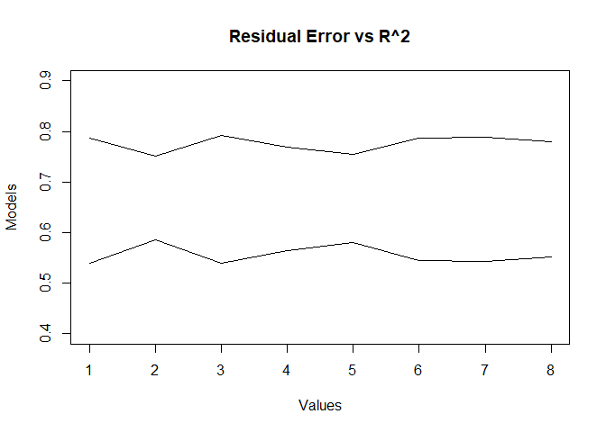

modern regression analysis hw1
================
Saeah Go
3/16/2022

# Before starting the homework

-   I used block quotes to answer the questions.
-   I tried to type question first, then write code for the question,
    and wrote the result(or answer) at the end.

# Problem 1 (2.1)

The dataset `teengamb` concerns a study of teenage gambling in Britain.
Fit a regression model with the expenditure on gambling as the response
and the sex, status, income and verbal score as predictors. Present the
output.

``` r
data(teengamb, package = "faraway") # load the data
teengamb
```

1.  What percentage of variation in the response is explained by these
    predictors?

``` r
lmod <- lm(gamble ~ sex + status + income + verbal, data = teengamb)
summary(lmod) # the summary of the data
```

    ## 
    ## Call:
    ## lm(formula = gamble ~ sex + status + income + verbal, data = teengamb)
    ## 
    ## Residuals:
    ##     Min      1Q  Median      3Q     Max 
    ## -51.082 -11.320  -1.451   9.452  94.252 
    ## 
    ## Coefficients:
    ##              Estimate Std. Error t value Pr(>|t|)    
    ## (Intercept)  22.55565   17.19680   1.312   0.1968    
    ## sex         -22.11833    8.21111  -2.694   0.0101 *  
    ## status        0.05223    0.28111   0.186   0.8535    
    ## income        4.96198    1.02539   4.839 1.79e-05 ***
    ## verbal       -2.95949    2.17215  -1.362   0.1803    
    ## ---
    ## Signif. codes:  0 '***' 0.001 '**' 0.01 '*' 0.05 '.' 0.1 ' ' 1
    ## 
    ## Residual standard error: 22.69 on 42 degrees of freedom
    ## Multiple R-squared:  0.5267, Adjusted R-squared:  0.4816 
    ## F-statistic: 11.69 on 4 and 42 DF,  p-value: 1.815e-06

``` r
lmod$residual
```

    ##           1           2           3           4           5           6 
    ##  10.6507430   9.3711318   5.4630298 -17.4957487  29.5194692  -2.9846919 
    ##           7           8           9          10          11          12 
    ##  -7.0242994 -12.3060734   6.8496267 -10.3329505   1.5934936  -3.0958161 
    ##          13          14          15          16          17          18 
    ##   0.1172839   9.5331344   2.8488167  17.2107726 -25.2627227 -27.7998544 
    ##          19          20          21          22          23          24 
    ##  13.1446553 -15.9510624 -16.0041386  -9.5801478 -27.2711657  94.2522174 
    ##          25          26          27          28          29          30 
    ##   0.6993361  -9.1670510 -25.8747696  -8.7455549  -6.8803097 -19.8090866 
    ##          31          32          33          34          35          36 
    ##  10.8793766  15.0599340  11.7462296  -3.5932770 -14.4016736  45.6051264 
    ##          37          38          39          40          41          42 
    ##  20.5472529  11.2429290 -51.0824078   8.8669438  -1.4513921  -3.8361619 
    ##          43          44          45          46          47 
    ##  -4.3831786 -14.8940753   5.4506347   1.4092321   7.1662399

> percentage of variation is R<sup>2</sup>, which is the Multiple
> R-squared in the summary: *0.5267*

2.  Which observation has the largest (positive) residual? Give the case
    number.

``` r
max(lmod$residual) # (b)
```

    ## [1] 94.25222

> The largest residual is *94.2522174*, and its case number is *24*, as
> we could find in the summary.

3.  Compute the mean and median of the residuals.

``` r
mean(lmod$residual) # the mean of the residuals
```

    ## [1] -3.065293e-17

``` r
median(lmod$residual) # the median of the residuals
```

    ## [1] -1.451392

> The mean of the residuals is *-3.0653e-17*, and the median is
> *-1.4514*.

4.  Compute the correlation of the residuals with the fitted values.

``` r
cor(lmod$residual, lmod$fitted.values) # (d)
```

    ## [1] -1.070659e-16

> The correlation of the residuals with the fitted values is
> *-1.070659e-16*

5.  Compute the correlation of the residuals with the income.

``` r
cor(lmod$residual, teengamb$income) # The correlation of the residuals with the income
```

    ## [1] -7.242382e-17

> The correlation of the residuals with the income is *-7.242382e-17*.

6.  For all other predictors held constant, what would be the difference
    in predicted expenditure on gambling for a male compared to a
    female?

``` r
teengamb$sex <- factor(teengamb$sex)
levels(teengamb$sex) <- c("male", "female")
linearmodel <- lm(gamble ~ sex + status + income + verbal, teengamb)
linearmodel$coefficients
```

    ##  (Intercept)    sexfemale       status       income       verbal 
    ##  22.55565063 -22.11833009   0.05223384   4.96197922  -2.95949350

> We know that 1 denotes female and 0 denotes male in the sex column
> (From the description of faraway::teengamb). The difference in
> predicted expenditure on gambling for a male compared to a female is
> *22.11833*. Since the beta of sex 1(female) is *-22.11833*, the
> expenditure on gambling for female is *22.11* less than male.

# Problem 2 (2.2)

The dataset `uswages` is drawn as a sample from the Current Population
Survey in 1988. Fit a model with weekly wages as the response and years
of education and experience as predictors. Report and give a simple
interpretation to the regression coefficient for years of education. Not
fit the same model but with logged weekly wages. Give an interpretation
to the regression coefficient for years of education. Which
interpretation is more natural?

``` r
data(uswages, package="faraway") # import data
lmod2 <- lm(wage ~ educ + exper, data = uswages) # wage as the response (y) and years of education and experience as predictors (x)
summary(lmod2)
```

    ## 
    ## Call:
    ## lm(formula = wage ~ educ + exper, data = uswages)
    ## 
    ## Residuals:
    ##     Min      1Q  Median      3Q     Max 
    ## -1018.2  -237.9   -50.9   149.9  7228.6 
    ## 
    ## Coefficients:
    ##              Estimate Std. Error t value Pr(>|t|)    
    ## (Intercept) -242.7994    50.6816  -4.791 1.78e-06 ***
    ## educ          51.1753     3.3419  15.313  < 2e-16 ***
    ## exper          9.7748     0.7506  13.023  < 2e-16 ***
    ## ---
    ## Signif. codes:  0 '***' 0.001 '**' 0.01 '*' 0.05 '.' 0.1 ' ' 1
    ## 
    ## Residual standard error: 427.9 on 1997 degrees of freedom
    ## Multiple R-squared:  0.1351, Adjusted R-squared:  0.1343 
    ## F-statistic:   156 on 2 and 1997 DF,  p-value: < 2.2e-16

Give a simple interpretation to the regression coefficient for years of
education:

    ## (Intercept)        educ       exper 
    ## -242.799412   51.175268    9.774767

> As we can see above, the coefficients are: (Intercept) -242.7994, educ
> 51.1753, exper 9.7748. So the interpretation is that for every unit
> increase in years of education the wage increases by 51.1753, when the
> experience is held fixed.

``` r
lmod2logged <- lm(log(wage) ~ educ + exper, data = uswages) # the second model, with logged wages
summary(lmod2logged)
```

    ## 
    ## Call:
    ## lm(formula = log(wage) ~ educ + exper, data = uswages)
    ## 
    ## Residuals:
    ##     Min      1Q  Median      3Q     Max 
    ## -2.7533 -0.3495  0.1068  0.4381  3.5699 
    ## 
    ## Coefficients:
    ##             Estimate Std. Error t value Pr(>|t|)    
    ## (Intercept) 4.650319   0.078354   59.35   <2e-16 ***
    ## educ        0.090506   0.005167   17.52   <2e-16 ***
    ## exper       0.018079   0.001160   15.58   <2e-16 ***
    ## ---
    ## Signif. codes:  0 '***' 0.001 '**' 0.01 '*' 0.05 '.' 0.1 ' ' 1
    ## 
    ## Residual standard error: 0.6615 on 1997 degrees of freedom
    ## Multiple R-squared:  0.1749, Adjusted R-squared:  0.174 
    ## F-statistic: 211.6 on 2 and 1997 DF,  p-value: < 2.2e-16

Give an interpretation to the regression coefficient for years of
education.

    ## (Intercept)        educ       exper 
    ##  4.65031905  0.09050628  0.01807855

> As we can see above, the second model’s coefficients are: (Intercept)
> 4.650319, educ 0.090506, exper 0.018079. The interpretation is that,
> with experience held fixed with 1 year increase in education the wage
> becomes e<sup>0.090506</sup> = 1.094728, which means wages increase by
> 9.4728%.

> For the first model with extreme values of the covariates there is a
> chance of getting negative wage, which sounds really ridiculous, and
> the problem is avoided in second model, as exponentiation is a
> non-negative function.So we can say the second model(interpretation)
> is more natural.

# Problem 3 (2.4)

The dataset `prostate` comes from a study on 97 men with prostate cancer
who were due to receive a radical prostatectomy. Fit a model with `lpsa`
as the response and `lcavol` as the predictor. Record the residual
standard error and the *R<sup>2</sup>*. Now add `lweight`, `svi`,
`lbph`, `age`, `lcp`, `pgg45` and `gleason` to the model one at a time.
For each model record the residual standard error and the
*R<sup>2</sup>*. Plot the trends in these two statistics.

``` r
data(prostate, package="faraway") # load the data
lmod3 <- lm(lpsa ~ lcavol, data = prostate)
lmod3_sum <- summary(lmod3) # for plotting the trends
summary(lmod3)
```

    ## 
    ## Call:
    ## lm(formula = lpsa ~ lcavol, data = prostate)
    ## 
    ## Residuals:
    ##      Min       1Q   Median       3Q      Max 
    ## -1.67625 -0.41648  0.09859  0.50709  1.89673 
    ## 
    ## Coefficients:
    ##             Estimate Std. Error t value Pr(>|t|)    
    ## (Intercept)  1.50730    0.12194   12.36   <2e-16 ***
    ## lcavol       0.71932    0.06819   10.55   <2e-16 ***
    ## ---
    ## Signif. codes:  0 '***' 0.001 '**' 0.01 '*' 0.05 '.' 0.1 ' ' 1
    ## 
    ## Residual standard error: 0.7875 on 95 degrees of freedom
    ## Multiple R-squared:  0.5394, Adjusted R-squared:  0.5346 
    ## F-statistic: 111.3 on 1 and 95 DF,  p-value: < 2.2e-16

> As we can see in the summary of lmod3, the residual standard
> error(RSS) is *0.7875* on *95* degrees of freedom. And the
> R<sup>2</sup> is *0.5394*.

``` r
lmod3_2 <- lm(lpsa ~ lcavol + lweight + svi + lbph + age + lcp + pgg45 + gleason, data = prostate)
summary(lmod3_2)
```

    ## 
    ## Call:
    ## lm(formula = lpsa ~ lcavol + lweight + svi + lbph + age + lcp + 
    ##     pgg45 + gleason, data = prostate)
    ## 
    ## Residuals:
    ##     Min      1Q  Median      3Q     Max 
    ## -1.7331 -0.3713 -0.0170  0.4141  1.6381 
    ## 
    ## Coefficients:
    ##              Estimate Std. Error t value Pr(>|t|)    
    ## (Intercept)  0.669337   1.296387   0.516  0.60693    
    ## lcavol       0.587022   0.087920   6.677 2.11e-09 ***
    ## lweight      0.454467   0.170012   2.673  0.00896 ** 
    ## svi          0.766157   0.244309   3.136  0.00233 ** 
    ## lbph         0.107054   0.058449   1.832  0.07040 .  
    ## age         -0.019637   0.011173  -1.758  0.08229 .  
    ## lcp         -0.105474   0.091013  -1.159  0.24964    
    ## pgg45        0.004525   0.004421   1.024  0.30886    
    ## gleason      0.045142   0.157465   0.287  0.77503    
    ## ---
    ## Signif. codes:  0 '***' 0.001 '**' 0.01 '*' 0.05 '.' 0.1 ' ' 1
    ## 
    ## Residual standard error: 0.7084 on 88 degrees of freedom
    ## Multiple R-squared:  0.6548, Adjusted R-squared:  0.6234 
    ## F-statistic: 20.86 on 8 and 88 DF,  p-value: < 2.2e-16

> As we can see in the summary, the residual standard error(RSS) is
> *0.7084* on *88* degrees of freedom. The R<sup>2</sup> is *0.6548*.

``` r
# plot the trends in these two statistics
R2<- c()
Sgma <- c()
R2 = lmod3_sum$r.squared
Sgma = lmod3_sum$sigma

for(i in 1:7){
model_temp = lm(prostate$lpsa ~ prostate$lcavol + prostate[,i+1], data = prostate)
lmod_temp_sum = summary(model_temp)
R2[i+1] = lmod_temp_sum$r.squared
Sgma[i+1] = lmod_temp_sum$sigma
}

a = 1:8 # pick from 1 to 8
plot(a, Sgma, type = "l", main = "Residual Error vs R^2", xlab = "Values", ylab = "Models" , ylim = c(.40,.90))
points(a, R2, type = "l")
```

<!-- -->

# Problem 4 (2.6, no d)

Thirty samples of cheddar cheese were analyzed for their content of
acetic acid, hydrogen sulfide and lactic acid. Each sample was tasted
and scored by a panel of judges and the average taste score produced.
Use the `cheddar` data to answer the following:

1.  Fit a regression model with taste as the response and the three
    chemical contents as predictors. Report the values of the regression
    coefficients.

``` r
data("cheddar", package="faraway")
lmod4 <- lm(taste ~ Acetic + H2S + Lactic, data = cheddar)
summary(lmod4)
```

    ## 
    ## Call:
    ## lm(formula = taste ~ Acetic + H2S + Lactic, data = cheddar)
    ## 
    ## Residuals:
    ##     Min      1Q  Median      3Q     Max 
    ## -17.390  -6.612  -1.009   4.908  25.449 
    ## 
    ## Coefficients:
    ##             Estimate Std. Error t value Pr(>|t|)   
    ## (Intercept) -28.8768    19.7354  -1.463  0.15540   
    ## Acetic        0.3277     4.4598   0.073  0.94198   
    ## H2S           3.9118     1.2484   3.133  0.00425 **
    ## Lactic       19.6705     8.6291   2.280  0.03108 * 
    ## ---
    ## Signif. codes:  0 '***' 0.001 '**' 0.01 '*' 0.05 '.' 0.1 ' ' 1
    ## 
    ## Residual standard error: 10.13 on 26 degrees of freedom
    ## Multiple R-squared:  0.6518, Adjusted R-squared:  0.6116 
    ## F-statistic: 16.22 on 3 and 26 DF,  p-value: 3.81e-06

The regression coefficients are:

``` r
lmod4$coefficients
```

    ## (Intercept)      Acetic         H2S      Lactic 
    ## -28.8767696   0.3277413   3.9118411  19.6705434

2.  Compute the correlation between the fitted values and the response.
    Square it. Identify where this value appears in the regression
    output.

``` r
cor_value <- cor(lmod4$fitted.values, cheddar$taste) # the correlation between the fitted values and the response
squared_value <- cor_value^2 # squared value
```

> The correlation between the fitted values and the response is:
> *0.8073256*. If we square it, we get, *0.8073256<sup>2</sup> =
> 0.6518*, which is the multiple R-squared.

3.  Fit the same regression model but without an intercept term. What is
    the value of *R<sup>2</sup>* reported in the output? Compute a more
    reasonable measure of the goodness of fit for this example.

``` r
# we could get the regression model without an intercept term by adding -1 or 0. I tried both ways just in case.
lmod4_2 <- lm(taste ~ Acetic + H2S + Lactic - 1, data = cheddar) # method 1
summary(lmod4_2)
```

    ## 
    ## Call:
    ## lm(formula = taste ~ Acetic + H2S + Lactic - 1, data = cheddar)
    ## 
    ## Residuals:
    ##      Min       1Q   Median       3Q      Max 
    ## -15.4521  -6.5262  -0.6388   4.6811  28.4744 
    ## 
    ## Coefficients:
    ##        Estimate Std. Error t value Pr(>|t|)    
    ## Acetic   -5.454      2.111  -2.583  0.01553 *  
    ## H2S       4.576      1.187   3.854  0.00065 ***
    ## Lactic   19.127      8.801   2.173  0.03871 *  
    ## ---
    ## Signif. codes:  0 '***' 0.001 '**' 0.01 '*' 0.05 '.' 0.1 ' ' 1
    ## 
    ## Residual standard error: 10.34 on 27 degrees of freedom
    ## Multiple R-squared:  0.8877, Adjusted R-squared:  0.8752 
    ## F-statistic: 71.15 on 3 and 27 DF,  p-value: 6.099e-13

``` r
lmod4_3 <- lm(taste ~ 0 + Acetic + H2S + Lactic, data = cheddar) # method 2
summary(lmod4_3)
```

    ## 
    ## Call:
    ## lm(formula = taste ~ 0 + Acetic + H2S + Lactic, data = cheddar)
    ## 
    ## Residuals:
    ##      Min       1Q   Median       3Q      Max 
    ## -15.4521  -6.5262  -0.6388   4.6811  28.4744 
    ## 
    ## Coefficients:
    ##        Estimate Std. Error t value Pr(>|t|)    
    ## Acetic   -5.454      2.111  -2.583  0.01553 *  
    ## H2S       4.576      1.187   3.854  0.00065 ***
    ## Lactic   19.127      8.801   2.173  0.03871 *  
    ## ---
    ## Signif. codes:  0 '***' 0.001 '**' 0.01 '*' 0.05 '.' 0.1 ' ' 1
    ## 
    ## Residual standard error: 10.34 on 27 degrees of freedom
    ## Multiple R-squared:  0.8877, Adjusted R-squared:  0.8752 
    ## F-statistic: 71.15 on 3 and 27 DF,  p-value: 6.099e-13

``` r
cor_value_2 <- cor(lmod4_2$fitted.values, cheddar$taste) # the correlation between the fitted values and the response
squared_value_2   <- cor_value_2^2 # squared value
squared_value_2 
```

    ## [1] 0.6244075

> To get the same regression model without an intercept term, I should
> add 0 or -1. With that, I got *0.8877* for the R squared value in the
> output.But as we could see above, the correlation coefficient squared
> value without an intercept term is *0.6244* (The R squared value and
> the correlation coefficient squared value is different) . And in the
> textbook, it says R<sup>2</sup> has a null model with an intercept in
> mind when the sum of squares is calculated. And added that R uses this
> definition and will give a misleadingly high R<sup>2</sup>. So I must
> have an R<sup>2</sup> use the *c**o**r*<sup>2</sup>(*ŷ*, *y*)
> definition when there is no intercept. So the more reasonable measure
> of the goodness of fit for this example is *0.6244075*.

# Additional Questions

1.  Prove if $\\sum\\limits\_{i=1}^{n} e\_{i} = 0$ then
    $\\sum\\limits\_{i=1}^{n} y\_{i} = \\sum\\limits\_{i=1}^{n} \\hat{y}\_{i}$.
    <br> Let’s assume $\\sum\\limits\_{i=1}^{n} e\_{i} = 0$ first. <br>
    We know that *y* = *ŷ* + *ϵ̂* when *ŷ* is predictor and *ϵ̂* is error.
    <br> By taking Riemann Sum, we get <br>
    ∑*y* = ∑*ŷ* + ∑*ϵ̂*
    And we know that ∑*ϵ̂* = 0, since we assumed that
    $\\sum\\limits\_{i=1}^{n} e\_{i} = 0$. <br> Then the formula looks
    like: ∑*y* = ∑*ŷ* + 0 <br> Thus we can conclude that ∑*y* = ∑*ŷ*,
    which is
    $\\sum\\limits\_{i=1}^{n} y\_{i} = \\sum\\limits\_{i=1}^{n} \\hat{y}\_{i}$
    <br>

2.  Prove if $\\sum\\limits\_{i=1}^{n} x\_{i}e\_{i} = 0$ then
    $\\sum\\limits\_{i=1}^{n} \\hat{y}\_ie\_{i} = 0$ <br> We assume that
    $\\sum\\limits\_{i=1}^{n} x\_{i}e\_{i} = 0$ <br> This means
    *x*<sub>1</sub>*e*<sub>1</sub> + *x*<sub>2</sub>*e*<sub>2</sub> + *x*<sub>3</sub>*e*<sub>3</sub> + ... + *x*<sub>*n*</sub>*e*<sub>*n*</sub> = 0
    <br> Which denotes that the formula should be like
    0 + 0 + 0 + ... + 0 = 0, since that is the only way we could get the
    sum is zero. <br> And in the problem earlier (Additional Question \#
    1), we know that $\\sum\\limits\_{i=1}^{n} e\_{i} = 0$. <br> Then
    since
    $\\sum\\limits\_{i=1}^{n} e\_{i} = 0, \\sum\\limits\_{i=1}^{n} \\hat{y}\_ie\_{i}$
    is zero either.
