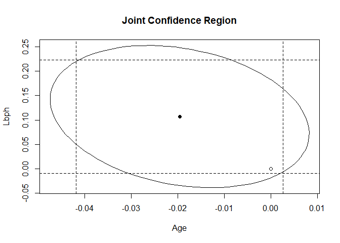

modern regression analysis hw2
================
Saeah Go
October 20, 2021

# Before starting the homework

-   I used block quotes to answer the questions.

# Problem 1 (3.1 a, b, d)

For the `prostate` data, fit a model with `lpsa` as the response and the
other variables as predictors:

``` r
data(prostate, package="faraway") # load the data
lmod <- lm(lpsa ~ ., data = prostate)
```

1.  Compute 90 and 95% CIs for the parameter associated with `age`.
    Using just these intervals, what could we have deduced about the
    *p*-value for `age` in the regression summary?

``` r
summary(lmod)
```

    ## 
    ## Call:
    ## lm(formula = lpsa ~ ., data = prostate)
    ## 
    ## Residuals:
    ##     Min      1Q  Median      3Q     Max 
    ## -1.7331 -0.3713 -0.0170  0.4141  1.6381 
    ## 
    ## Coefficients:
    ##              Estimate Std. Error t value Pr(>|t|)    
    ## (Intercept)  0.669337   1.296387   0.516  0.60693    
    ## lcavol       0.587022   0.087920   6.677 2.11e-09 ***
    ## lweight      0.454467   0.170012   2.673  0.00896 ** 
    ## age         -0.019637   0.011173  -1.758  0.08229 .  
    ## lbph         0.107054   0.058449   1.832  0.07040 .  
    ## svi          0.766157   0.244309   3.136  0.00233 ** 
    ## lcp         -0.105474   0.091013  -1.159  0.24964    
    ## gleason      0.045142   0.157465   0.287  0.77503    
    ## pgg45        0.004525   0.004421   1.024  0.30886    
    ## ---
    ## Signif. codes:  0 '***' 0.001 '**' 0.01 '*' 0.05 '.' 0.1 ' ' 1
    ## 
    ## Residual standard error: 0.7084 on 88 degrees of freedom
    ## Multiple R-squared:  0.6548, Adjusted R-squared:  0.6234 
    ## F-statistic: 20.86 on 8 and 88 DF,  p-value: < 2.2e-16

``` r
confint(lmod, c("age"), level = 0.9) # 90% CI for age
```

    ##            5 %         95 %
    ## age -0.0382102 -0.001064151

``` r
confint(lmod, c("age"), level = 0.95) # 95% CI for age
```

    ##           2.5 %      97.5 %
    ## age -0.04184062 0.002566267

> 90% confidence Interval is: *(-0.0382102, -0.001064151)*.  
> Similarly, 95% confidence interval is: *(-0.04184062, 0.002566267)*.  
> age is statistically n not significant and the regression summary
> confirms this by returning a p-value of *0.08229* (greater than
> *0.05*).

2.  Compute and display a 95% joint confidence region for the parameters
    associated with `age` and `lbph`. Plot the origin on this display.
    The location of the origin on the display tells us the outcome of a
    certain hypothesis test. State that test and its outcome.

``` r
require(ellipse)
plot(ellipse(lmod, c("age", "lbph")), # or I can use c(3,4) instead of c("age", "lbph")
     type = "l", # line
     main = "Joint Confidence Region", # title
     xlab = "Age", # x-axis title
     ylab = "Lbph") # y-axis title
points(0, 0) # plot the origin
points(coef(lmod)["age"], coef(lmod)["lbph"], pch = 19)
abline(v = confint(lmod)["age",], lty = 2) # vertical dashed line
abline(h = confint(lmod)["lbph",], lty = 2) # horizontal dashed line
```

<!-- -->

> The joint null hypothesis is *H*<sub>0</sub>: `age = lbph = 0`, and it
> can not be rejected because the origin lies inside of the confidence
> region ellipse. Similarly the null hypothesis `age = 0` can not be
> rejected because 0 lies with the 95% confidence bounds and the same is
> true for the null hypothesis `lbph = 0`.

4.  Remove all the predictors that are not significant at the 5% level.
    Test this model against the original model. Which model is
    preferred?

``` r
reduced_mod <- update(lmod, . ~ lcavol + lweight + svi) # reduced model: removed all the predictors that are not significant
anova(lmod, reduced_mod)
```

    ## Analysis of Variance Table
    ## 
    ## Model 1: lpsa ~ lcavol + lweight + age + lbph + svi + lcp + gleason + 
    ##     pgg45
    ## Model 2: lpsa ~ lcavol + lweight + svi
    ##   Res.Df    RSS Df Sum of Sq      F Pr(>F)
    ## 1     88 44.163                           
    ## 2     93 47.785 -5   -3.6218 1.4434 0.2167

> The reduced model is not significantly better than the full model so
> we would choose `lmod` over `reduced_mod`.

# Problem 2 (3.2 a, b, c, d)

Thirty samples of cheddar cheese were analyzed for their content of
acetic acid, hydrogen sulfide and lactic acid. Each sample was tested
and scored by a panel of judges and the average taste score produced.
Use the `cheddar` data to answer the following:

1.  Fit a regression model with taste as the response and the three
    chemical contents as predictors. Identify the predictors that are
    statistically significant at the 5% level.

``` r
data("cheddar", package="faraway")
lmod2 <- lm(taste ~ Acetic + H2S + Lactic, data = cheddar)
summary(lmod2)
```

    ## 
    ## Call:
    ## lm(formula = taste ~ Acetic + H2S + Lactic, data = cheddar)
    ## 
    ## Residuals:
    ##     Min      1Q  Median      3Q     Max 
    ## -17.390  -6.612  -1.009   4.908  25.449 
    ## 
    ## Coefficients:
    ##             Estimate Std. Error t value Pr(>|t|)   
    ## (Intercept) -28.8768    19.7354  -1.463  0.15540   
    ## Acetic        0.3277     4.4598   0.073  0.94198   
    ## H2S           3.9118     1.2484   3.133  0.00425 **
    ## Lactic       19.6705     8.6291   2.280  0.03108 * 
    ## ---
    ## Signif. codes:  0 '***' 0.001 '**' 0.01 '*' 0.05 '.' 0.1 ' ' 1
    ## 
    ## Residual standard error: 10.13 on 26 degrees of freedom
    ## Multiple R-squared:  0.6518, Adjusted R-squared:  0.6116 
    ## F-statistic: 16.22 on 3 and 26 DF,  p-value: 3.81e-06

> The predictors, H2S and Lactic, are statistically significant at the
> 5% level since their p-value(Pr(&gt;\|t\|)) is smaller than *0.05*.

2.  `Acetic` and `H2S` are measured on a log scale. Fit a linear model
    where all three predictors are measured on their original scale.
    Identify the predictors that are statistically significant at the 5%
    level for this model.

``` r
lmod2_exp <- lm(taste ~ exp(Acetic) + exp(H2S) + Lactic, data = cheddar) # take exponential to the predictors Acetic and H2S
summary(lmod2_exp)
```

    ## 
    ## Call:
    ## lm(formula = taste ~ exp(Acetic) + exp(H2S) + Lactic, data = cheddar)
    ## 
    ## Residuals:
    ##     Min      1Q  Median      3Q     Max 
    ## -16.209  -7.266  -1.651   7.385  26.335 
    ## 
    ## Coefficients:
    ##               Estimate Std. Error t value Pr(>|t|)  
    ## (Intercept) -1.897e+01  1.127e+01  -1.684   0.1042  
    ## exp(Acetic)  1.891e-02  1.562e-02   1.210   0.2371  
    ## exp(H2S)     7.668e-04  4.188e-04   1.831   0.0786 .
    ## Lactic       2.501e+01  9.062e+00   2.760   0.0105 *
    ## ---
    ## Signif. codes:  0 '***' 0.001 '**' 0.01 '*' 0.05 '.' 0.1 ' ' 1
    ## 
    ## Residual standard error: 11.19 on 26 degrees of freedom
    ## Multiple R-squared:  0.5754, Adjusted R-squared:  0.5264 
    ## F-statistic: 11.75 on 3 and 26 DF,  p-value: 4.746e-05

> We could see that only Lactic is statistically significant at the 5%
> level as the p-value of the Lactic (*0.0105*) is smaller than *0.05*.
> Acetic and H2S are not statistically significant from zero on their
> original scale.

3.  Can we use an *F*-test to compare these two models? Explain. Which
    model provides a better fit to the data? Explain your reasoning.

> We cannot use an F-test to compare these two models since F-test
> cannot be used to test a non-linear hypothesis and cannot be used to
> compare two models that are not nested. In this problem, the two
> models are not nested. Thus F-test is not appropriate for this
> problem.  
> To answer which model provides a better fit to the data, we should
> compare R-squared value for both models.  
> lmod2’s R-squared values are: Multiple R-squared: *0.6518*, Adjusted
> R-squared: *0.6116*  
> lmod2\_2 R-squared values are: Multiple R-squared: *0.5754*, Adjusted
> R-squared: *0.5264*  
> We know that if R<sup>2</sup> is close to 1 then it is a good model.
> So, the first model (lmod2) is better since both the R-squared and
> Adjusted R-squared values are bigger than the second model
> (lmod2\_exp).

4.  If `H2S` is increased *0.01* for the model used in (a), what change
    in the `taste` would be expected?

> From the linear regression summary result in (a) (which is lmod2), we
> know that the estimate of coefficient for H2S is *3.9118*. If H2S is
> increased *0.01*, then we can expect that taste increases 0.01 ×
> 3.9118 = 0.039 on average, holding everything else constant.

# Problem 3 (3.7)

In the `punting` data, we find the average distance punted and hang
times of 10 punts of an American football as related to various measures
of leg strength for 13 volunteers.  
(a) Fit a regression model with Distance as the response and the right
and left leg strengths and flexibilities as predictors. Which predictors
are significant at the 5% level?

``` r
data(punting, package="faraway") # import the data
lmod3 <- lm(Distance ~ RStr + LStr + RFlex + LFlex, data = punting)
summary(lmod3)
```

    ## 
    ## Call:
    ## lm(formula = Distance ~ RStr + LStr + RFlex + LFlex, data = punting)
    ## 
    ## Residuals:
    ##     Min      1Q  Median      3Q     Max 
    ## -23.941  -8.958  -4.441  13.523  17.016 
    ## 
    ## Coefficients:
    ##             Estimate Std. Error t value Pr(>|t|)
    ## (Intercept) -79.6236    65.5935  -1.214    0.259
    ## RStr          0.5116     0.4856   1.054    0.323
    ## LStr         -0.1862     0.5130  -0.363    0.726
    ## RFlex         2.3745     1.4374   1.652    0.137
    ## LFlex        -0.5277     0.8255  -0.639    0.541
    ## 
    ## Residual standard error: 16.33 on 8 degrees of freedom
    ## Multiple R-squared:  0.7365, Adjusted R-squared:  0.6047 
    ## F-statistic:  5.59 on 4 and 8 DF,  p-value: 0.01902

> When we look at the Pr(&gt;\|t\|) column, we can see that all the
> p-values are above *0.05*.Thus all variables are not significant at 5%
> level.

2.  Use an F-test to determine whether collectively these four
    predictors have a relationship to the response.

> Our null hypothesis would be
> *H*<sub>0</sub> : *β*<sub>*R**S**t**r*</sub> = *β*<sub>*L**S**t**r*</sub> = *β*<sub>*R**F**l**e**x*</sub> = *β*<sub>*L**F**l**e**x*</sub> = 0
> and alternative hypothesis would be *H*<sub>1</sub>: at least one is
> nonzero (*β*<sub>*i*</sub> ≠ 0 for at least one i = 1,2,3,4).

``` r
null_mod3 <- lm(Distance ~ 1, data = punting) # reduced model
anova(null_mod3, lmod3)
```

    ## Analysis of Variance Table
    ## 
    ## Model 1: Distance ~ 1
    ## Model 2: Distance ~ RStr + LStr + RFlex + LFlex
    ##   Res.Df    RSS Df Sum of Sq      F  Pr(>F)  
    ## 1     12 8093.3                              
    ## 2      8 2132.6  4    5960.7 5.5899 0.01902 *
    ## ---
    ## Signif. codes:  0 '***' 0.001 '**' 0.01 '*' 0.05 '.' 0.1 ' ' 1

``` r
summary(lmod3)
```

    ## 
    ## Call:
    ## lm(formula = Distance ~ RStr + LStr + RFlex + LFlex, data = punting)
    ## 
    ## Residuals:
    ##     Min      1Q  Median      3Q     Max 
    ## -23.941  -8.958  -4.441  13.523  17.016 
    ## 
    ## Coefficients:
    ##             Estimate Std. Error t value Pr(>|t|)
    ## (Intercept) -79.6236    65.5935  -1.214    0.259
    ## RStr          0.5116     0.4856   1.054    0.323
    ## LStr         -0.1862     0.5130  -0.363    0.726
    ## RFlex         2.3745     1.4374   1.652    0.137
    ## LFlex        -0.5277     0.8255  -0.639    0.541
    ## 
    ## Residual standard error: 16.33 on 8 degrees of freedom
    ## Multiple R-squared:  0.7365, Adjusted R-squared:  0.6047 
    ## F-statistic:  5.59 on 4 and 8 DF,  p-value: 0.01902

> Our p-value(*0.01902*) is less than *0.05* and *F = 5.59*. We have
> *α* = 0.05 and we know that if *p* − *v**a**l**u**e* &lt; *α* then we
> reject *H*<sub>0</sub> at *α* = 0.05. In other words,
> *β*<sub>*i*</sub> ≠ 0 for at least one *i* = 1, 2, 3, 4. The model is
> significant overall under 5% significance level. These four predictors
> have a significant relationship with the response Distance.

3.  Relative to the model in (a), test whether the right and left leg
    strengths have the same effect.

``` r
reduced_mod3 <- lm(Distance ~ (RStr + LStr), data = punting)
anova(reduced_mod3, lmod3)
```

    ## Analysis of Variance Table
    ## 
    ## Model 1: Distance ~ (RStr + LStr)
    ## Model 2: Distance ~ RStr + LStr + RFlex + LFlex
    ##   Res.Df    RSS Df Sum of Sq      F Pr(>F)
    ## 1     10 2973.1                           
    ## 2      8 2132.6  2    840.43 1.5763 0.2648

``` r
summary(reduced_mod3)
```

    ## 
    ## Call:
    ## lm(formula = Distance ~ (RStr + LStr), data = punting)
    ## 
    ## Residuals:
    ##     Min      1Q  Median      3Q     Max 
    ## -29.280  -9.583   3.147  10.266  26.450 
    ## 
    ## Coefficients:
    ##             Estimate Std. Error t value Pr(>|t|)
    ## (Intercept)  12.8490    33.0334   0.389    0.705
    ## RStr          0.7208     0.4913   1.467    0.173
    ## LStr          0.2011     0.4883   0.412    0.689
    ## 
    ## Residual standard error: 17.24 on 10 degrees of freedom
    ## Multiple R-squared:  0.6327, Adjusted R-squared:  0.5592 
    ## F-statistic: 8.611 on 2 and 10 DF,  p-value: 0.00669

> To test for significance of each predictor, we can use t-test:  
> *H*<sub>0</sub> : *β*<sub>*i*</sub> = 0 and
> *H*<sub>1</sub> : *β*<sub>*i*</sub> ≠ 0 ; , where i = 1,2.  
> For each predictor, p-values are greater than 0.05. Thus we fail to
> reject *H*<sub>0</sub> and say that for all i = 1,2,
> *β*<sub>*i*</sub> = 0. Conclusion: the predictors, RStr and LStr, are
> not significant individually in the model.  
> To test for overall fit of the model,  
> The null hypothesis is:
> *H*<sub>0</sub> : *β*<sub>*R**S**t**r*</sub> = *β*<sub>*L**S**t**r*</sub>
> (the right and left leg strengths have the same effect) and the
> alternative hypothesis is:
> *H*<sub>1</sub> : *β*<sub>*R**S**t**r*</sub> ≠ *β*<sub>*L**S**t**r*</sub>.  
> Note that test statistic *F = 8.611* and p-value is *0.00669*. Since
> p-value is less than *α* = 0.05, we reject *H*<sub>0</sub> at
> *α* = 0.05.  
> The model is significant and *the predictors (RStr and LStr) have a
> significant relationship with the response Distance*.

4.  Construct a 95% confidence region for (βRStr,βLStr). Explain how the
    test in (c) relates to this region.

``` r
confint(reduced_mod3)
```

    ##                   2.5 %    97.5 %
    ## (Intercept) -60.7540194 86.452019
    ## RStr         -0.3738903  1.815490
    ## LStr         -0.8868949  1.289095

> For *β*<sub>1</sub> the confidence interval is: *(-0.3738903,
> 1.815490)*  
> For *β*<sub>2</sub> the confidence interval is: *(-0.8868949,
> 1.289095)*  
> We can see that 95% CIs for both *β*<sub>1</sub> and *β*<sub>2</sub>
> include zero. Zero is within the limits of 95% CIs for both (RStr and
> LStr). This is in agreement with the result of the t-test for
> significance of predictors where we concluded that *β*<sub>1</sub> = 0
> and *β*<sub>2</sub> = 0 (RStr and LStr are not significant in the
> model)

5.  Fit a model to test the hypothesis that it is total leg strength
    defined by adding the right and left leg strengths that is
    sufficient to predict the response in comparison to using individual
    left and right leg strengths.

> If we want to check whether right and left leg strength have the same
> effect or not, the two models(lmod3, reduced\_mod3\_2)

``` r
lmod3_2 <- lm(Distance ~ RStr + LStr, data=punting)
summary(lmod3_2)
```

    ## 
    ## Call:
    ## lm(formula = Distance ~ RStr + LStr, data = punting)
    ## 
    ## Residuals:
    ##     Min      1Q  Median      3Q     Max 
    ## -29.280  -9.583   3.147  10.266  26.450 
    ## 
    ## Coefficients:
    ##             Estimate Std. Error t value Pr(>|t|)
    ## (Intercept)  12.8490    33.0334   0.389    0.705
    ## RStr          0.7208     0.4913   1.467    0.173
    ## LStr          0.2011     0.4883   0.412    0.689
    ## 
    ## Residual standard error: 17.24 on 10 degrees of freedom
    ## Multiple R-squared:  0.6327, Adjusted R-squared:  0.5592 
    ## F-statistic: 8.611 on 2 and 10 DF,  p-value: 0.00669

``` r
lmod3_3 <- lm(Distance ~ I(RStr + LStr), data=punting)
summary(lmod3_3)
```

    ## 
    ## Call:
    ## lm(formula = Distance ~ I(RStr + LStr), data = punting)
    ## 
    ## Residuals:
    ##     Min      1Q  Median      3Q     Max 
    ## -27.632 -11.531   2.171   8.443  30.672 
    ## 
    ## Coefficients:
    ##                Estimate Std. Error t value Pr(>|t|)   
    ## (Intercept)     14.0936    31.8838   0.442  0.66703   
    ## I(RStr + LStr)   0.4601     0.1082   4.252  0.00136 **
    ## ---
    ## Signif. codes:  0 '***' 0.001 '**' 0.01 '*' 0.05 '.' 0.1 ' ' 1
    ## 
    ## Residual standard error: 16.68 on 11 degrees of freedom
    ## Multiple R-squared:  0.6217, Adjusted R-squared:  0.5874 
    ## F-statistic: 18.08 on 1 and 11 DF,  p-value: 0.001361

``` r
anova(lmod3_2,lmod3_3)
```

    ## Analysis of Variance Table
    ## 
    ## Model 1: Distance ~ RStr + LStr
    ## Model 2: Distance ~ I(RStr + LStr)
    ##   Res.Df    RSS Df Sum of Sq      F Pr(>F)
    ## 1     10 2973.1                           
    ## 2     11 3061.3 -1   -88.281 0.2969 0.5978

> Because the p-value of the F test is larger than *0.05*, we cannot
> reject the null hypothesis. It means that total leg strength is not
> sufficient to predict the response in comparison to using individual
> left and right leg strengths.

6.  Relative to the model in (a), test whether the right and left leg
    flexibilities have the same effect.

> We are testing *H*<sub>0</sub>:
> *β*<sub>*R**F**l**e**x*</sub> = *β*<sub>*L**F**l**e**x*</sub>. Then
> *H*<sub>1</sub> would be
> *β*<sub>*R**F**l**e**x*</sub> ≠ *β*<sub>*L**F**l**e**x*</sub>.

``` r
reduced_mod3_3 <- lm(Distance ~ RStr + LStr + I(RFlex + LFlex), data = punting)
anova(reduced_mod3_3, lmod3)
```

    ## Analysis of Variance Table
    ## 
    ## Model 1: Distance ~ RStr + LStr + I(RFlex + LFlex)
    ## Model 2: Distance ~ RStr + LStr + RFlex + LFlex
    ##   Res.Df    RSS Df Sum of Sq      F Pr(>F)
    ## 1      9 2648.4                           
    ## 2      8 2132.6  1    515.72 1.9346 0.2017

``` r
summary(reduced_mod3_3)
```

    ## 
    ## Call:
    ## lm(formula = Distance ~ RStr + LStr + I(RFlex + LFlex), data = punting)
    ## 
    ## Residuals:
    ##     Min      1Q  Median      3Q     Max 
    ## -17.510 -13.417   2.165   7.988  23.316 
    ## 
    ## Coefficients:
    ##                   Estimate Std. Error t value Pr(>|t|)
    ## (Intercept)      -44.26189   63.52790  -0.697    0.504
    ## RStr               0.70392    0.48904   1.439    0.184
    ## LStr               0.01518    0.51703   0.029    0.977
    ## I(RFlex + LFlex)   0.46194    0.43975   1.050    0.321
    ## 
    ## Residual standard error: 17.15 on 9 degrees of freedom
    ## Multiple R-squared:  0.6728, Adjusted R-squared:  0.5637 
    ## F-statistic: 6.168 on 3 and 9 DF,  p-value: 0.01451

> We can see that the p-value is *0.2017* (greater than 0.05), which
> means we do not have enough evidence to reject *H*<sub>0</sub> that
> the right and left leg flexibility have the same effect.

7.  Test for left–right symmetry by performing the tests in (c) and (f)
    simultaneously.

> Our *H*<sub>0</sub> would be:
> *β*<sub>*R**F**l**e**x*</sub> = *β*<sub>*L**F**l**e**x*</sub> and
> *β*<sub>*R**S**t**r*</sub> = *β*<sub>*L**S**t**r*</sub>.

``` r
reduced_mod3 <- lm(Distance ~ I(RStr + LStr) + I(RFlex + LFlex), data = punting)
anova(reduced_mod3, lmod3)
```

    ## Analysis of Variance Table
    ## 
    ## Model 1: Distance ~ I(RStr + LStr) + I(RFlex + LFlex)
    ## Model 2: Distance ~ RStr + LStr + RFlex + LFlex
    ##   Res.Df    RSS Df Sum of Sq    F Pr(>F)
    ## 1     10 2799.1                         
    ## 2      8 2132.6  2    666.43 1.25  0.337

> The p-value is *0.337* (greater than 0.05), and it means we fail to
> reject *H*<sub>0</sub>.

8.  Fit a model with Hang as the response and the same four predictors.
    Can we make a test to compare this model to that used in (a)?
    Explain.

``` r
lmod3_2 <- lm(Hang ~ RStr + LStr + RFlex + LFlex, data = punting)
summary(lmod3_2)
```

    ## 
    ## Call:
    ## lm(formula = Hang ~ RStr + LStr + RFlex + LFlex, data = punting)
    ## 
    ## Residuals:
    ##      Min       1Q   Median       3Q      Max 
    ## -0.36297 -0.13528 -0.07849  0.09938  0.35893 
    ## 
    ## Coefficients:
    ##              Estimate Std. Error t value Pr(>|t|)
    ## (Intercept) -0.225239   1.032784  -0.218    0.833
    ## RStr         0.005153   0.007645   0.674    0.519
    ## LStr         0.007697   0.008077   0.953    0.369
    ## RFlex        0.019404   0.022631   0.857    0.416
    ## LFlex        0.004614   0.012998   0.355    0.732
    ## 
    ## Residual standard error: 0.2571 on 8 degrees of freedom
    ## Multiple R-squared:  0.8156, Adjusted R-squared:  0.7235 
    ## F-statistic: 8.848 on 4 and 8 DF,  p-value: 0.004925

> It is not clear what the criteria is for comparison in this case. We
> know we can’t use an F-test for this problem since the models are not
> nested.
