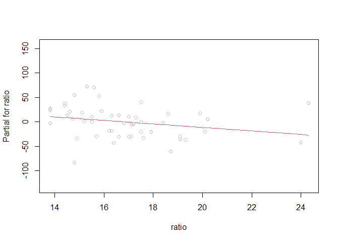
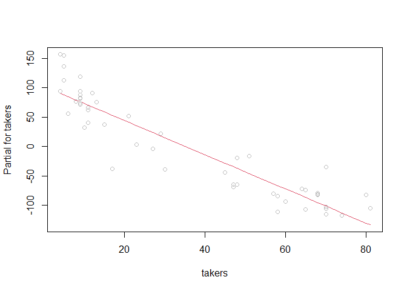

modern regression analysis hw3
================
Saeah Go
November 17, 2021

# Chapter 6, Exercise 1

Using the `sat` dataset, fit a model with the total SAT score as the
response and expend, salary, ratio and takers as predictors. Perform
regression diagnostics on this model to answer the following questions.
Display any plots that are relevant. Do not provide any plots about
which you have nothing to say. Suggest possible improvements or
corrections to the model where appropriate.  

``` r
data(sat, package = "faraway")
lmod <- lm(total ~ expend + salary + ratio + takers, data = sat)
```

1.  Check the constant variance assumption for the errors.  

> First we check the assumption that variance of *ϵ* is a constant. We
> use plot of *ϵ̂* v.s.*ŷ*. We expect is no pattern existing in the plot.
> (When we have no pattern, satisfy the assumption) Otherwise, it
> violates the constant variance assumption. (So, no constant variance)

``` r
plot(fitted(lmod), residuals(lmod), xlab="Fitted", ylab="Residuals")
abline(h=0)
```

<!-- -->

> We can see a pattern that it splited up into two groups. So it
> violates the assumption that variance of *ϵ* is a constant. Thus
> constant variance does not exist.

2.  Check the normality assumption.  

> We are now testing the normality of *ϵ*, whether *ϵ* is normal
> distributed or not. So we can plot QQ plot and histogram to figure
> out.

``` r
par(mfrow = c(1,2))
qqnorm(residuals(lmod),ylab="Residuals",main="")
qqline(residuals(lmod))
hist(residuals(lmod))
```

<!-- -->

> We can see from the QQ plot that the graph is a little skewed, we see
> some points off the straight line. And when we are looking at the
> histogram of residuals, we can see that it’s almost normal shape (bell
> curve shape) except there is a hole around -75. We can see that the
> residuals are roughly normally distributed.

3.  Check for large leverage points.

``` r
require(faraway)
```

    ## Loading required package: faraway

``` r
#using 2p/n half normal threshold
hatv <- hatvalues(lmod)
states <- row.names(sat)
halfnorm(hatv, labs = states, ylab = "Leverages")
```

<!-- -->

> We can see that our leverage points are California and Utah.

4.  Check for outliers.

``` r
# using studentized residuals
stud <- rstudent(lmod)
stud
```

    ##        Alabama         Alaska        Arizona       Arkansas     California 
    ##    -0.06574555    -1.02091600    -0.86394293    -0.90546917    -0.56764583 
    ##       Colorado    Connecticut       Delaware        Florida        Georgia 
    ##     0.12375609     0.97811087     0.41584816    -0.89619150    -0.64380944 
    ##         Hawaii          Idaho       Illinois        Indiana           Iowa 
    ##    -0.52185887    -0.68138366     0.34240342    -0.57108388     1.56037417 
    ##         Kansas       Kentucky      Louisiana          Maine       Maryland 
    ##     0.38967283    -0.92044224    -0.08013841     0.53951189     0.36099300 
    ##  Massachusetts       Michigan      Minnesota    Mississippi       Missouri 
    ##     1.55127336    -0.26522896     1.36779678     0.09173934     0.19418490 
    ##        Montana       Nebraska         Nevada  New Hampshire     New Jersey 
    ##     0.34070604     0.17614652    -1.73200396     2.19000605    -0.47250752 
    ##     New Mexico       New York North Carolina   North Dakota           Ohio 
    ##    -0.11823952    -0.16415440    -0.67193751     2.21368580    -0.99430251 
    ##       Oklahoma         Oregon   Pennsylvania   Rhode Island South Carolina 
    ##    -0.13785064     0.94590973    -0.17154457    -0.04457306    -1.46883156 
    ##   South Dakota      Tennessee          Texas           Utah        Vermont 
    ##     0.79638212     0.75084252    -1.07088136     2.52958734     0.45748671 
    ##       Virginia     Washington  West Virginia      Wisconsin        Wyoming 
    ##     0.40448538     0.58126580    -3.12442832     0.57665563    -1.31188995

``` r
stud[which.max(abs(stud))] # show the outlier
```

    ## West Virginia 
    ##     -3.124428

> West Virginia is the ourlier.

5.  Check for influential points.

``` r
cook <- cooks.distance(lmod)
halfnorm(cook,3,labs=states,ylab="Cook’s distances")
```

<!-- -->

> Utah is the most influential point that affects to the model. We also
> got West Virginia and New Hampshire for influential points too.

6.  Check the structure of the relationship between the predictors and
    the response.

``` r
require(car)
```

    ## Loading required package: car

    ## Loading required package: carData

    ## 
    ## Attaching package: 'car'

    ## The following objects are masked from 'package:faraway':
    ## 
    ##     logit, vif

``` r
termplot(lmod, partial.resid = TRUE, terms = NULL) # easier way to check the structure of the model
```

<!-- --><!-- --><!-- --><!-- -->

> For the takers, we can see split of two groups. For expend and ratio,
> it’s slightly split (or say divided). For the salary, we cannot see
> any split.

# Chapter 6, Exercise 4

For the `swiss` data, fit a model with Fertility as the response and the
other variables as predictors. Answer the questions posed in the first
question.

``` r
data(swiss, package = "datasets")
lmod2 <- lm(Fertility ~ ., data = swiss)
```

1.  Check the constant variance assumption for the errors.  

> First we check the assumption that variance of *ϵ* is a constant. We
> use plot of *ϵ̂* v.s.*ŷ*. We expect is no pattern existing in the plot.
> (When we have no pattern, satisfy the assumption) Otherwise, it
> violates the constant variance assumption. (So, no constant variance)

``` r
plot(fitted(lmod2), residuals(lmod2), xlab="Fitted", ylab="Residuals")
abline(h=0)
```

<!-- -->

> There is no pattern, so we can conclude that our assumption is valid.
> The variance of *ϵ* is a constant.

2.  Check the normality assumption.  

> We are now testing the normality of *ϵ*, whether *ϵ* is normal
> distributed or not. So we can plot QQ plot and histogram to figure
> out.

``` r
par(mfrow = c(1,2))
qqnorm(residuals(lmod2),ylab="Residuals",main="")
qqline(residuals(lmod2))
hist(residuals(lmod2))
```

<!-- -->

> We can see from the QQ plot that there are no crazy skewed points, so
> we can say there are no points off the straight line. But when we are
> looking at the histogram of residuals, we can see that it’s normal
> shape (bell curve shape). We can see that the residuals are roughly
> normally distributed.

3.  Check for large leverage points.

``` r
#using 2p/n half normal threshold
hatv <- hatvalues(lmod2)
provinces <- row.names(swiss)
halfnorm(hatv, labs = provinces, ylab = "Leverages")
```

<!-- -->

> Our leverage points are La Vallee and V. De Ger.

4.  Check for outliers.

``` r
# using studentized residuals
stud <- rstudent(lmod2)
stud
```

    ##   Courtelary     Delemont Franches-Mnt      Moutier   Neuveville   Porrentruy 
    ##   0.84584030   0.08684212   1.01074888   1.31796269   1.81614211  -2.36721827 
    ##        Broye        Glane      Gruyere       Sarine      Veveyse        Aigle 
    ##   0.61438409   1.66113713   0.15298493   0.50049516   0.51646133   0.73437530 
    ##      Aubonne     Avenches     Cossonay    Echallens     Grandson     Lausanne 
    ##   0.07248412   0.42104970  -0.54614038  -0.74687721   0.01511285   0.02925763 
    ##    La Vallee       Lavaux       Morges       Moudon        Nyone         Orbe 
    ##   0.61245225   0.24191247   0.47865752  -1.60418331  -0.71558271  -0.99565881 
    ##         Oron      Payerne Paysd'enhaut        Rolle        Vevey      Yverdon 
    ##  -0.15431971   0.24875019   0.07942498  -0.21167094  -0.77601876  -1.02128559 
    ##      Conthey    Entremont       Herens     Martigwy      Monthey   St Maurice 
    ##  -0.11516331  -1.12779737  -0.18491467  -0.85417952  -0.56297196  -1.20389559 
    ##       Sierre         Sion       Boudry La Chauxdfnd     Le Locle    Neuchatel 
    ##   2.44522679   1.22241299   0.69339739  -1.00648626   0.60322648   1.74541155 
    ##   Val de Ruz ValdeTravers V. De Geneve  Rive Droite  Rive Gauche 
    ##   0.73018972  -0.83329565   0.03781782  -1.54311369  -2.39447054

``` r
stud[which.max(abs(stud))]
```

    ##   Sierre 
    ## 2.445227

> Sierre is the ourlier.

5.  Check for influential points.

``` r
cook <- cooks.distance(lmod2)
halfnorm(cook,3,labs=provinces,ylab="Cook’s distances")
```

<!-- -->

> The influential points are Porrentr, Sierre, and Neuchatel.

6.  Check the structure of the relationship between the predictors and
    the response.

``` r
termplot(lmod2, partial.resid = TRUE, terms = NULL)
```

<!-- --><!-- --><!-- --><!-- --><!-- -->

> For the Agriculture and Examination, there are no patterns. For the
> Education, we can see that the graph is skewed more left. For the
> Catholic, we can see the split of two groups. For Infant Mortality, we
> can check that skewed to right side.

# Chapter 7, Exercise 3

Using the `divusa` data:  
(a) Fit a regression model with `divorce` as the response and
`unemployed`, `femlab`, `marriage`, `birth` and `military` as
predictors. Compute the condition numbers and interpret their
meanings.  

``` r
data(divusa, package = "faraway") # load data
lmod3 <- lm(divorce ~ unemployed + femlab + marriage + birth + military, data = divusa)

sumary(lmod3)
```

    ##              Estimate Std. Error t value  Pr(>|t|)
    ## (Intercept)  2.487845   3.393779  0.7331   0.46594
    ## unemployed  -0.111252   0.055925 -1.9893   0.05052
    ## femlab       0.383649   0.030587 12.5430 < 2.2e-16
    ## marriage     0.118674   0.024414  4.8609 6.772e-06
    ## birth       -0.129959   0.015595 -8.3334 4.027e-12
    ## military    -0.026734   0.014247 -1.8764   0.06471
    ## 
    ## n = 77, p = 6, Residual SE = 1.65042, R-Squared = 0.92

``` r
round(cor(divusa[, -6]),2) # 1.00 means they are perfectly correlated each other
```

    ##             year divorce unemployed femlab marriage military
    ## year        1.00    0.88      -0.23   0.99    -0.62     0.01
    ## divorce     0.88    1.00      -0.21   0.91    -0.53     0.02
    ## unemployed -0.23   -0.21       1.00  -0.26    -0.27    -0.40
    ## femlab      0.99    0.91      -0.26   1.00    -0.65     0.05
    ## marriage   -0.62   -0.53      -0.27  -0.65     1.00     0.26
    ## military    0.01    0.02      -0.40   0.05     0.26     1.00

``` r
x <- model.matrix(lmod3)[, -1]
e <- eigen(t(x) %*% x)
e$val
```

    ## [1] 1174600.548   21261.741   16133.842    6206.181    1856.894

``` r
sqrt(e$val[1]/e$val) # compute the condition numbers
```

    ## [1]  1.000000  7.432684  8.532498 13.757290 25.150782

> The range in the eigenvalues is not that wide and all condition
> numbers (*κ*) are small, since they are smaller than 30 (so, not
> considered as large values). Large *κ* means that problems are being
> caused by more than just one linear combination. In other words, small
> errors in the input can cause large errors in the output. So in this
> case, we have small condition numbers, it means a problem is said to
> be well conditioned. It means small changes in the data produce small
> changes in the output.

2.  For the same model, compute the VIFs. Is there evidence that
    collinearity causes some predictors not to be significant?
    Explain.  

``` r
# calculate the VIF of unemployed by hand
summary(lm(x[,1] ~ x[,-1]))$r.squared
```

    ## [1] 0.5561253

``` r
1/(1-0.5561253) 
```

    ## [1] 2.252888

``` r
# easiest and simple way to get the VIF values
vif(lmod3) 
```

    ## unemployed     femlab   marriage      birth   military 
    ##   2.252888   3.613276   2.864864   2.585485   1.249596

> The VIF(variance inflation factor) value for the predictor variable
> `femlab` is higher (VIF = 3.613276) compared to other predictors. This
> denotes that standard error for female participation in the labor
> force is 1.90086191 ($\\because \\sqrt{3.613276} = 1.90086191$) times
> larger than it would have been without collinearity.  
> We see that none of the VIF values are extremely large to pose any
> problem. Normally, if the VIF values are high than 10 then we shall
> have a problem of multicollinearity. However, we see that all values
> are less than 4 . Hence VIF does not pose any problem as such.  
> Multicollinearity affects the coefficients and p-values, but it does
> not influence the predictions, precision of the predictions, and the
> goodness-of-fit statistics. So there is no evidence that collinearity
> causes some predictors not to be significant.

3.  Does the removal of insignificant predictors from the model reduce
    the collinearity? Investigate.

``` r
# make another model, by excluding the predictors unemployed and military which p-values are greater than 0.05 (not significant)
lmod3_2 <- lm(divorce ~ femlab + marriage + birth, data = divusa) 
summary(lmod3_2)
```

    ## 
    ## Call:
    ## lm(formula = divorce ~ femlab + marriage + birth, data = divusa)
    ## 
    ## Residuals:
    ##     Min      1Q  Median      3Q     Max 
    ## -3.6923 -1.1934 -0.0534  1.2265  3.6701 
    ## 
    ## Coefficients:
    ##             Estimate Std. Error t value Pr(>|t|)    
    ## (Intercept) -1.54545    2.21247  -0.699    0.487    
    ## femlab       0.41337    0.02275  18.174  < 2e-16 ***
    ## marriage     0.12609    0.02199   5.735 2.07e-07 ***
    ## birth       -0.11627    0.01412  -8.235 5.10e-12 ***
    ## ---
    ## Signif. codes:  0 '***' 0.001 '**' 0.01 '*' 0.05 '.' 0.1 ' ' 1
    ## 
    ## Residual standard error: 1.695 on 73 degrees of freedom
    ## Multiple R-squared:  0.9141, Adjusted R-squared:  0.9106 
    ## F-statistic: 258.9 on 3 and 73 DF,  p-value: < 2.2e-16

``` r
vif(lmod3_2)
```

    ##   femlab marriage    birth 
    ## 1.893390 2.201891 2.008469

> Through summary of lmod3, we can see that the predictors, unemployed
> and military, are insignificant. So tried to remove those three
> predictors. Removal of insignificant variables has not improved the
> model. In fact, it has an adverse effect on parameters R<sup>2</sup>,
> residual standard error (RSS) and intercept.

# Chapter 7, Exercise 8

Use the `fat` data, fitting the model described in Section 4.2.

``` r
data(fat, package = "faraway")
lmod4 <- lm(brozek ~ age + weight + height + neck + chest + abdom + hip + thigh + knee + ankle + biceps + forearm + wrist, data=fat)
sumary(lmod4)
```

    ##               Estimate Std. Error t value  Pr(>|t|)
    ## (Intercept) -15.292549  16.069921 -0.9516  0.342252
    ## age           0.056786   0.029965  1.8951  0.059290
    ## weight       -0.080310   0.049581 -1.6198  0.106602
    ## height       -0.064600   0.088930 -0.7264  0.468299
    ## neck         -0.437541   0.215334 -2.0319  0.043273
    ## chest        -0.023603   0.091839 -0.2570  0.797396
    ## abdom         0.885429   0.080077 11.0572 < 2.2e-16
    ## hip          -0.198419   0.135156 -1.4681  0.143406
    ## thigh         0.231895   0.133718  1.7342  0.084175
    ## knee         -0.011677   0.224143 -0.0521  0.958496
    ## ankle         0.163536   0.205143  0.7972  0.426142
    ## biceps        0.152799   0.158513  0.9640  0.336048
    ## forearm       0.430489   0.184452  2.3339  0.020436
    ## wrist        -1.476537   0.495519 -2.9798  0.003183
    ## 
    ## n = 252, p = 14, Residual SE = 3.98797, R-Squared = 0.75

1.  Compute the condition numbers and variance inflation factors.
    Comment on the degree of collinearity observed in the data.

``` r
# condition number
x <- model.matrix(lmod4)[, -1]
e <- eigen(t(x) %*% x)
e$val
```

    ##  [1] 1.959256e+07 6.418499e+04 3.059739e+04 5.704341e+03 2.803947e+03
    ##  [6] 1.934715e+03 1.030340e+03 6.376692e+02 5.280964e+02 4.318186e+02
    ## [11] 3.763758e+02 2.723663e+02 6.345357e+01

``` r
sqrt(e$val[1]/e$val)
```

    ##  [1]   1.00000  17.47144  25.30482  58.60610  83.59121 100.63222 137.89717
    ##  [8] 175.28623 192.61449 213.00748 228.15747 268.20620 555.67072

``` r
# variance inflation factors
vif(lmod4)
```

    ##       age    weight    height      neck     chest     abdom       hip     thigh 
    ##  2.250450 33.509320  1.674591  4.324463  9.460877 11.767073 14.796520  7.777865 
    ##      knee     ankle    biceps   forearm     wrist 
    ##  4.612147  1.907961  3.619744  2.192492  3.377515

> Using the condition number greater than 30 is considered large and
> represents multicollinearity, we see a high condition number for the
> model.  
> Using the rule considering VIF is greater than 10 to be a cause for
> concern, we see that `weight`, `abdom` and `hip` indicate collinearity
> with other predictors.  
> For comment on the degree of collinearity observed in the data, we
> know that the VIF (variance inflation factors) provides a measure of
> the degree of collinearity, such that a VIF 1 or 2 shows essentially
> no collinearity and a measure of 20 or higher shows extreme
> collinearity. All of our VIF values are lower than 20 except weight.
> So we can say our VIF values except weight shows no collinearity or
> small collinearity but weight shows extreme collinearity.

2.  Cases 39 and 42 are unusual. Refit the model without these two cases
    and recompute the collinearity diagnostics. Comment on the
    differences observed from the full data fit.

``` r
fat_reduced <- fat[-c(39,42),] # remove case 39 and 42
lmod4_reduced <- lm(brozek ~ age + weight + height + neck + chest + abdom + hip + thigh + knee + ankle + biceps + forearm + wrist, data=fat_reduced) # refit the model
summary(lmod4_reduced)
```

    ## 
    ## Call:
    ## lm(formula = brozek ~ age + weight + height + neck + chest + 
    ##     abdom + hip + thigh + knee + ankle + biceps + forearm + wrist, 
    ##     data = fat_reduced)
    ## 
    ## Residuals:
    ##      Min       1Q   Median       3Q      Max 
    ## -10.0975  -2.8719  -0.2185   2.7420   9.2030 
    ## 
    ## Coefficients:
    ##             Estimate Std. Error t value Pr(>|t|)    
    ## (Intercept)  2.62251   21.65491   0.121  0.90371    
    ## age          0.06583    0.02981   2.209  0.02817 *  
    ## weight      -0.01596    0.06220  -0.257  0.79771    
    ## height      -0.22355    0.17708  -1.262  0.20806    
    ## neck        -0.35926    0.21759  -1.651  0.10004    
    ## chest       -0.11059    0.10029  -1.103  0.27127    
    ## abdom        0.83988    0.08468   9.919  < 2e-16 ***
    ## hip         -0.15313    0.13513  -1.133  0.25830    
    ## thigh        0.17447    0.13603   1.283  0.20090    
    ## knee        -0.06941    0.22754  -0.305  0.76060    
    ## ankle        0.17426    0.20368   0.856  0.39310    
    ## biceps       0.15160    0.15786   0.960  0.33785    
    ## forearm      0.26827    0.19170   1.399  0.16300    
    ## wrist       -1.64288    0.49384  -3.327  0.00102 ** 
    ## ---
    ## Signif. codes:  0 '***' 0.001 '**' 0.01 '*' 0.05 '.' 0.1 ' ' 1
    ## 
    ## Residual standard error: 3.942 on 236 degrees of freedom
    ## Multiple R-squared:  0.7503, Adjusted R-squared:  0.7366 
    ## F-statistic: 54.56 on 13 and 236 DF,  p-value: < 2.2e-16

``` r
# condition number
x <- model.matrix(lmod4_reduced)[, -1]
e <- eigen(t(x) %*% x)
e$val
```

    ##  [1] 1.929452e+07 5.700314e+04 2.807492e+04 5.095990e+03 2.326071e+03
    ##  [6] 1.473052e+03 8.722982e+02 6.034713e+02 4.724511e+02 4.301792e+02
    ## [11] 3.330435e+02 2.526472e+02 6.268514e+01

``` r
sqrt(e$val[1]/e$val) 
```

    ##  [1]   1.00000  18.39787  26.21547  61.53224  91.07633 114.44792 148.72518
    ##  [8] 178.80871 202.08708 211.78359 240.69468 276.35018 554.79777

``` r
# variance inflation factors
vif(lmod4_reduced)
```

    ##       age    weight    height      neck     chest     abdom       hip     thigh 
    ##  2.278191 45.298843  3.439587  3.978898 10.712505 11.967580 12.146249  7.153711 
    ##      knee     ankle    biceps   forearm     wrist 
    ##  4.441752  1.810253  3.409524  2.422878  3.263677

> We see fewer significant predictors in the fit without the outliers
> (With the full model, neck, abdom, forearm, and wrist so total four
> predictors are significant, but with the rifitted model, only three
> predictors, age, abdom, and wrist, are significant). This makes
> intuitive sense, if the outlier(s) is(are) related to abnormal values
> of one of the predictors then it possible that predictor will have
> undue influence on the fit through the outliers. Removing the outliers
> eliminates the influence and the significance. Neck and thigh are
> predictors that we’d consider for this effect, and indeed inspecting
> the data confirms that is the case for one (39) of the redacted data
> points. The other outlier (42) has a very small value for the height
> predictor. Although it is not significant in the model fit with the
> redacted data, the p-value is half that for the mode with the
> outliers.  
> And, compared to the full data fit, the R-squared value has increased,
> which suggests that removing unusual data can improve the fittness of
> our model.

3.  Fit a model with brozek as the response and just age, weight and
    height as predictors. Compute the collinearity diagnostics and
    compare to the full data fit.

``` r
lmod4_2 <- lm(brozek ~ age + weight + height, data = fat)

# condition number
x <- model.matrix(lmod4_2)[, -1]
e <- eigen(t(x) %*% x)
e$val
```

    ## [1] 10001051.85    54778.52    19455.70

``` r
sqrt(e$val[1]/e$val)
```

    ## [1]  1.00000 13.51194 22.67250

``` r
#kappa(lmod4_2)

# variance inflation factors
vif(lmod4_2)
```

    ##      age   weight   height 
    ## 1.032253 1.107050 1.140470

> We can see that the condition numbers are not that high.

4.  Compute a 95% prediction interval for brozek for the median values
    of age, weight and height.

``` r
x <- model.matrix(lmod4_2)
val <- apply(x,2,median)
val
```

    ## (Intercept)         age      weight      height 
    ##         1.0        43.0       176.5        70.0

``` r
pred <- predict(lmod4_2, data.frame(t(val)), interval="prediction")
pred # 95% Prediction Interval For Univariate Median of Predictors
```

    ##        fit      lwr      upr
    ## 1 18.28132 7.659609 28.90304

``` r
pred_width <- pred[3]-pred[2]
pred_width # 95% Prediction Interval Width For Univariate Median of Predictors
```

    ## [1] 21.24343

5.  Compute a 95% prediction interval for brozek for age=40, weight=200
    and height=73. How does the interval compare to the previous
    prediction?

``` r
# 95% Prediction Interval For (age=40, weight=200 and height=73)
given_values <- data.frame(age = 40, weight = 200, height = 73)
pred_2 <- predict(lmod4_2, new = given_values, interval = "prediction")
pred_2
```

    ##        fit      lwr      upr
    ## 1 20.47854 9.837784 31.11929

``` r
# 95% Prediction Interval Width For(age=40, weight=200 and height=73)
pred_width_2 <- pred_2[3]-pred_2[2]
pred_width_2
```

    ## [1] 21.28151

> We can see that the fitted value, the lower and upper bounds of the
> prediction interval in (e) is larger than those in (d). The width of
> the prediction interval about to same.

6.  Compute a 95% prediction interval for brozek for age=40, weight=130
    and height=73. Are the values of predictors unusual? Comment on how
    the interval compares to the previous two answers.

``` r
# 95% Prediction Interval For (age=40, weight=130 and height=73)
given_values_2 <- data.frame(age = 40, weight = 130, height = 73)
pred_3 <- predict(lmod4_2, new = given_values_2, interval = "prediction")
pred_3
```

    ##        fit       lwr     upr
    ## 1 7.617419 -3.101062 18.3359

``` r
# 95% Prediction Interval Width For(age=40, weight=200 and height=73)
pred_width_3 <- pred_3[3]-pred_3[2]
pred_width_3
```

    ## [1] 21.43696

> We can see that the fitted value, the lower and upper bounds of the
> prediction interval in (f) is much smaller than those in (d) and (e),
> and thus is suspected to be unusual. The width of the prediction
> interval remains unchanged.

# Chapter 8, Exercise 1.

Researchers at National Institutes of Standards and Technology (NIST)
collected `pipeline` data on ultrasonic measurements of the depth of
defects in the Alaska pipeline in the field. The depth of the defects
were then remeasured in the laboratory. These measurements were
performed in six different batches. It turns out that this batch effect
is not significant and so can be ignored in the analysis that follows.
The laboratory measurements are more accurate than the in-field
measurements, but more time consuming and expensive. We want to develop
a regression equation for correcting the in-field measurements.  

``` r
data(pipeline, package = "faraway")
```

1.  Fit a regression model Lab \~ Field. Check for non-constant
    variance.  

``` r
lmod5 <- lm(Lab ~ Field, data = pipeline)
summary(lmod5)
```

    ## 
    ## Call:
    ## lm(formula = Lab ~ Field, data = pipeline)
    ## 
    ## Residuals:
    ##     Min      1Q  Median      3Q     Max 
    ## -21.985  -4.072  -1.431   2.504  24.334 
    ## 
    ## Coefficients:
    ##             Estimate Std. Error t value Pr(>|t|)    
    ## (Intercept) -1.96750    1.57479  -1.249    0.214    
    ## Field        1.22297    0.04107  29.778   <2e-16 ***
    ## ---
    ## Signif. codes:  0 '***' 0.001 '**' 0.01 '*' 0.05 '.' 0.1 ' ' 1
    ## 
    ## Residual standard error: 7.865 on 105 degrees of freedom
    ## Multiple R-squared:  0.8941, Adjusted R-squared:  0.8931 
    ## F-statistic: 886.7 on 1 and 105 DF,  p-value: < 2.2e-16

``` r
plot(fitted(lmod5), residuals(lmod5), xlab="Fitted", ylab="Residuals")
abline(h=0)
```

<!-- -->

> Based on the residual plot we see that we have evidence of
> non-constant variance(∵ we can see a pattern) (also known as
> heteroscedasticity). Variance increases with increasing predictor
> value.

2.  We wish to use weights to account for the non-constant variance.
    Here we split the range of Field into 12 groups of size nine (except
    for the last group which has only eight values). Within each group,
    we compute the variance of Lab as `varlab` and the mean of Field as
    `meanfield`. Supposing pipeline is the name of your data frame, the
    following R code will make the needed computations:

``` r
i <- order(pipeline$Field)
npipe <- pipeline[i,]
ff <- gl(12,9)[-108]
meanfield <- unlist(lapply(split(npipe$Field,ff),mean))
varlab <- unlist(lapply(split(npipe$Lab,ff),var))
```

Suppose we guess that the the variance in the response is linked to the
predictor in the following way:  
<p align="center">
*v**a**r*(*L**a**b*) = *a*<sub>0</sub>*F**i**e**l**d*<sup>*a*<sub>1</sub></sup>  
</p>

Regress log(varlab) on log(meanfield) to estimate *a*<sub>0</sub> and
*a*<sub>1</sub>. (You might choose to remove the last point.) Use this
to determine appropriate weights in a WLS fit of Lab on Field. Show the
regression summary.

``` r
new_pipeline <- data.frame(log_varlab = log(varlab), log_meanfield = log(meanfield))
lmod5_2 <- lm(log_varlab ~ log_meanfield, new_pipeline, weights=1/meanfield) #WLS fit of Lab on Field
lmod5_2
```

    ## 
    ## Call:
    ## lm(formula = log_varlab ~ log_meanfield, data = new_pipeline, 
    ##     weights = 1/meanfield)
    ## 
    ## Coefficients:
    ##   (Intercept)  log_meanfield  
    ##      -0.07856        1.03344

``` r
summary(lmod5_2)
```

    ## 
    ## Call:
    ## lm(formula = log_varlab ~ log_meanfield, data = new_pipeline, 
    ##     weights = 1/meanfield)
    ## 
    ## Weighted Residuals:
    ##      Min       1Q   Median       3Q      Max 
    ## -0.25034 -0.12237  0.02634  0.13204  0.17924 
    ## 
    ## Coefficients:
    ##               Estimate Std. Error t value Pr(>|t|)  
    ## (Intercept)   -0.07856    1.02902  -0.076   0.9406  
    ## log_meanfield  1.03344    0.34426   3.002   0.0133 *
    ## ---
    ## Signif. codes:  0 '***' 0.001 '**' 0.01 '*' 0.05 '.' 0.1 ' ' 1
    ## 
    ## Residual standard error: 0.158 on 10 degrees of freedom
    ## Multiple R-squared:  0.474,  Adjusted R-squared:  0.4214 
    ## F-statistic: 9.011 on 1 and 10 DF,  p-value: 0.0133

``` r
coef(lmod5_2)
```

    ##   (Intercept) log_meanfield 
    ##    -0.0785624     1.0334369

3.  An alternative to weighting is transformation. Find transformations
    on Lab and/or Field so that in the transformed scale the
    relationship is approximately linear with constant variance. You may
    restrict your choice of transformation to square root, log and
    inverse.

``` r
lmod5_3 <- lm((Lab)^0.5 ~log(Field), data = pipeline)
summary(lmod5_3)
```

    ## 
    ## Call:
    ## lm(formula = (Lab)^0.5 ~ log(Field), data = pipeline)
    ## 
    ## Residuals:
    ##     Min      1Q  Median      3Q     Max 
    ## -1.2157 -0.5066 -0.1625  0.5191  1.4991 
    ## 
    ## Coefficients:
    ##             Estimate Std. Error t value Pr(>|t|)    
    ## (Intercept) -3.57141    0.33200  -10.76   <2e-16 ***
    ## log(Field)   2.85554    0.09786   29.18   <2e-16 ***
    ## ---
    ## Signif. codes:  0 '***' 0.001 '**' 0.01 '*' 0.05 '.' 0.1 ' ' 1
    ## 
    ## Residual standard error: 0.6553 on 105 degrees of freedom
    ## Multiple R-squared:  0.8902, Adjusted R-squared:  0.8892 
    ## F-statistic: 851.4 on 1 and 105 DF,  p-value: < 2.2e-16

``` r
plot(log(pipeline$Field),pipeline$Lab^0.5, col=as.factor(pipeline$Batch), pch='*', cex=1.5)
legend("topleft",title="Batch",legend= unique(pipeline$Batch), fill=1:length(pipeline$Batch) )
abline(coef(lmod5_3),lty=5)
```

<!-- -->

``` r
plot(residuals(lmod5_3) ~ Field, pipeline, main ="Residuals versus log(time) for simple linear model")
```

<!-- -->
