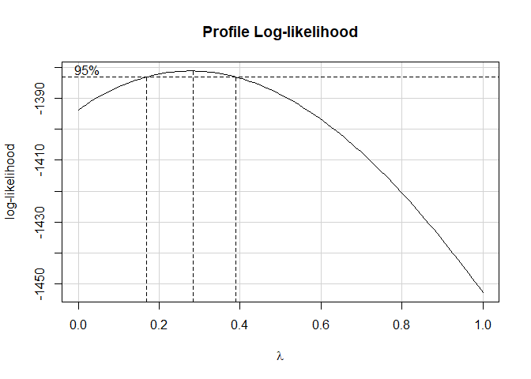
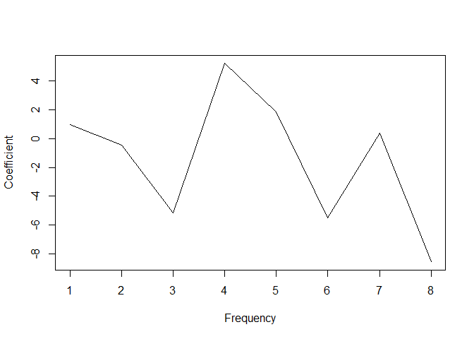
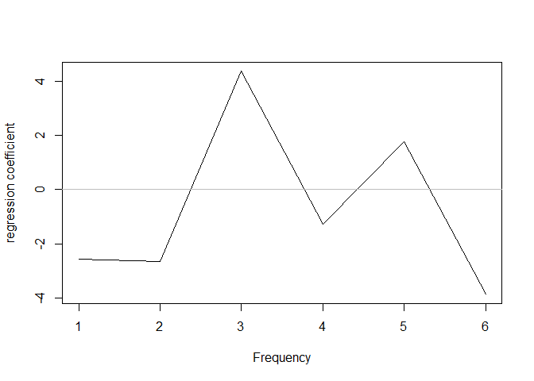
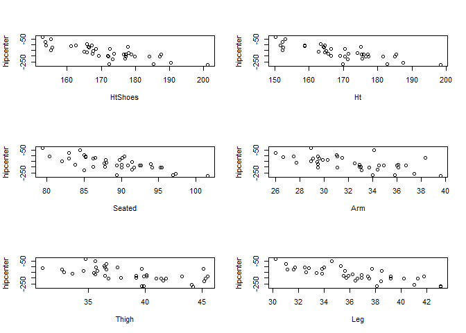
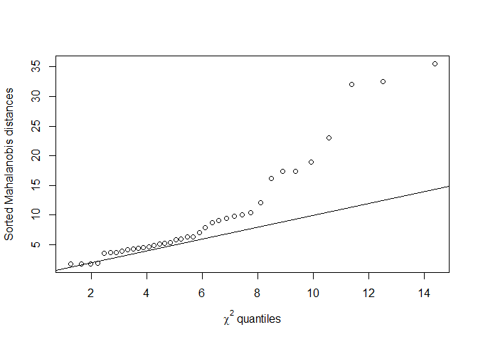
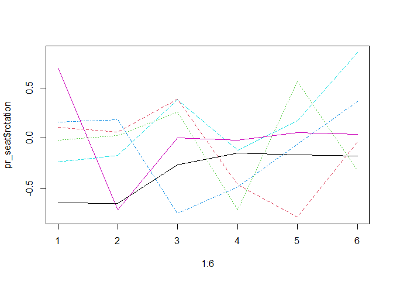
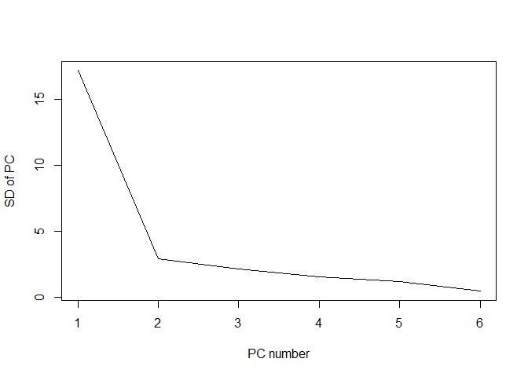
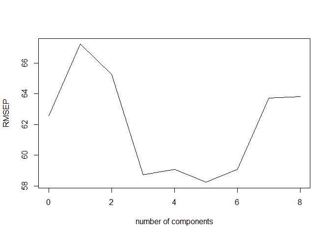

modern regression analysis hw4
================
Saeah Go
November 24, 2021

# Chapter 9, Exercise 3

Using the `ozone` data, fit a model with `O3` as the response and
`temp`, `humidity` and `ibh` as predictors. Use the Box–Cox method to
determine the best transformation on the response.

``` r
data(ozone, package = "faraway")
lmod <- lm(O3 ~ temp + humidity + ibh, data = ozone) # fit model
summary(lmod)
```

    ## 
    ## Call:
    ## lm(formula = O3 ~ temp + humidity + ibh, data = ozone)
    ## 
    ## Residuals:
    ##      Min       1Q   Median       3Q      Max 
    ## -11.5291  -3.0137  -0.2249   2.8239  13.9303 
    ## 
    ## Coefficients:
    ##               Estimate Std. Error t value Pr(>|t|)    
    ## (Intercept) -1.049e+01  1.616e+00  -6.492 3.16e-10 ***
    ## temp         3.296e-01  2.109e-02  15.626  < 2e-16 ***
    ## humidity     7.738e-02  1.339e-02   5.777 1.77e-08 ***
    ## ibh         -1.004e-03  1.639e-04  -6.130 2.54e-09 ***
    ## ---
    ## Signif. codes:  0 '***' 0.001 '**' 0.01 '*' 0.05 '.' 0.1 ' ' 1
    ## 
    ## Residual standard error: 4.524 on 326 degrees of freedom
    ## Multiple R-squared:  0.684,  Adjusted R-squared:  0.6811 
    ## F-statistic: 235.2 on 3 and 326 DF,  p-value: < 2.2e-16

> Now use Box-Cox method

``` r
require(car)
bc <- boxCox(lmod, lambda = seq(0,1,by=.1))
```

<!-- -->

``` r
bc
```

    ## $x
    ##   [1] 0.00000000 0.01010101 0.02020202 0.03030303 0.04040404 0.05050505
    ##   [7] 0.06060606 0.07070707 0.08080808 0.09090909 0.10101010 0.11111111
    ##  [13] 0.12121212 0.13131313 0.14141414 0.15151515 0.16161616 0.17171717
    ##  [19] 0.18181818 0.19191919 0.20202020 0.21212121 0.22222222 0.23232323
    ##  [25] 0.24242424 0.25252525 0.26262626 0.27272727 0.28282828 0.29292929
    ##  [31] 0.30303030 0.31313131 0.32323232 0.33333333 0.34343434 0.35353535
    ##  [37] 0.36363636 0.37373737 0.38383838 0.39393939 0.40404040 0.41414141
    ##  [43] 0.42424242 0.43434343 0.44444444 0.45454545 0.46464646 0.47474747
    ##  [49] 0.48484848 0.49494949 0.50505051 0.51515152 0.52525253 0.53535354
    ##  [55] 0.54545455 0.55555556 0.56565657 0.57575758 0.58585859 0.59595960
    ##  [61] 0.60606061 0.61616162 0.62626263 0.63636364 0.64646465 0.65656566
    ##  [67] 0.66666667 0.67676768 0.68686869 0.69696970 0.70707071 0.71717172
    ##  [73] 0.72727273 0.73737374 0.74747475 0.75757576 0.76767677 0.77777778
    ##  [79] 0.78787879 0.79797980 0.80808081 0.81818182 0.82828283 0.83838384
    ##  [85] 0.84848485 0.85858586 0.86868687 0.87878788 0.88888889 0.89898990
    ##  [91] 0.90909091 0.91919192 0.92929293 0.93939394 0.94949495 0.95959596
    ##  [97] 0.96969697 0.97979798 0.98989899 1.00000000
    ## 
    ## $y
    ##   [1] -1393.664 -1392.761 -1391.892 -1391.056 -1390.255 -1389.487 -1388.753
    ##   [8] -1388.053 -1387.387 -1386.754 -1386.155 -1385.590 -1385.058 -1384.560
    ##  [15] -1384.096 -1383.665 -1383.267 -1382.903 -1382.572 -1382.275 -1382.011
    ##  [22] -1381.781 -1381.583 -1381.419 -1381.288 -1381.190 -1381.124 -1381.092
    ##  [29] -1381.092 -1381.124 -1381.189 -1381.286 -1381.415 -1381.576 -1381.769
    ##  [36] -1381.994 -1382.250 -1382.538 -1382.857 -1383.207 -1383.587 -1383.999
    ##  [43] -1384.441 -1384.914 -1385.416 -1385.949 -1386.511 -1387.103 -1387.724
    ##  [50] -1388.375 -1389.054 -1389.762 -1390.499 -1391.264 -1392.057 -1392.878
    ##  [57] -1393.727 -1394.603 -1395.506 -1396.436 -1397.393 -1398.376 -1399.385
    ##  [64] -1400.421 -1401.482 -1402.569 -1403.681 -1404.818 -1405.980 -1407.166
    ##  [71] -1408.377 -1409.612 -1410.870 -1412.152 -1413.458 -1414.786 -1416.137
    ##  [78] -1417.511 -1418.907 -1420.326 -1421.766 -1423.227 -1424.710 -1426.215
    ##  [85] -1427.740 -1429.285 -1430.851 -1432.438 -1434.044 -1435.670 -1437.316
    ##  [92] -1438.980 -1440.664 -1442.367 -1444.088 -1445.827 -1447.584 -1449.360
    ##  [99] -1451.153 -1452.963

> We can see that the graph suggest that the best transformation is at
> *0.282*

> Get the power from the Box Cox transformation

``` r
trans <- bc$x[which.max(bc$y)]
```

> For the power, we get approximately *0.2828283*.

> Now fitting a new model with the suggested transformation:

``` r
lmod_trans <- lm(O3^trans ~ temp + humidity + ibh, data = ozone)
summary(lmod_trans)
```

    ## 
    ## Call:
    ## lm(formula = O3^trans ~ temp + humidity + ibh, data = ozone)
    ## 
    ## Residuals:
    ##      Min       1Q   Median       3Q      Max 
    ## -0.64888 -0.13022  0.01064  0.14979  0.59737 
    ## 
    ## Coefficients:
    ##               Estimate Std. Error t value Pr(>|t|)    
    ## (Intercept)  8.647e-01  7.521e-02  11.497  < 2e-16 ***
    ## temp         1.595e-02  9.814e-04  16.257  < 2e-16 ***
    ## humidity     3.653e-03  6.231e-04   5.863 1.11e-08 ***
    ## ibh         -5.873e-05  7.624e-06  -7.703 1.61e-13 ***
    ## ---
    ## Signif. codes:  0 '***' 0.001 '**' 0.01 '*' 0.05 '.' 0.1 ' ' 1
    ## 
    ## Residual standard error: 0.2105 on 326 degrees of freedom
    ## Multiple R-squared:  0.7163, Adjusted R-squared:  0.7137 
    ## F-statistic: 274.4 on 3 and 326 DF,  p-value: < 2.2e-16

> The results are

``` r
(trans <- bc$x[which.max(bc$y)])
```

    ## [1] 0.2828283

> We can check that *0.2828283* is power that we must use. And when we
> compare the summary of lmod and lmod\_trans, we can clearly see that
> the transformation has increased the R<sup>2</sup> value by 3% (lmod’s
> multiple R-squared value is *0.684*, and lmod\_trans’s multiple
> R-squared value is *0.7163*).

# Chapter 10, Exercise 1

Use the `prostate` data with `lpsa` as the response and the other
variables as predictors. Implement the following variable selection
methods to determine the “best” model:

``` r
data(prostate, package = "faraway")
lmod2 <- lm(lpsa ~ ., data = prostate)
```

1.  Backward elimination

> With the backward elimination, we start from the full model. Each step
> we remove one predictor whose p-value is the largest and larger than
> our critical level 0.05. After several steps, we stop at where no more
> predictors can be removed based on our critical level 0.05.

``` r
library(faraway)
sumary(lmod2)
```

    ##               Estimate Std. Error t value  Pr(>|t|)
    ## (Intercept)  0.6693367  1.2963875  0.5163  0.606934
    ## lcavol       0.5870218  0.0879203  6.6767 2.111e-09
    ## lweight      0.4544674  0.1700124  2.6731  0.008955
    ## age         -0.0196372  0.0111727 -1.7576  0.082293
    ## lbph         0.1070540  0.0584492  1.8316  0.070398
    ## svi          0.7661573  0.2443091  3.1360  0.002329
    ## lcp         -0.1054743  0.0910135 -1.1589  0.249638
    ## gleason      0.0451416  0.1574645  0.2867  0.775033
    ## pgg45        0.0045252  0.0044212  1.0235  0.308860
    ## 
    ## n = 97, p = 9, Residual SE = 0.70842, R-Squared = 0.65

> We can see that `gleason` has the biggest p-value, which is *0.77503*.
> So let’s remove `gleason` first.

``` r
lmod2 <- update(lmod2, . ~ . - gleason)
sumary(lmod2)
```

    ##               Estimate Std. Error t value  Pr(>|t|)
    ## (Intercept)  0.9539260  0.8294393  1.1501  0.253190
    ## lcavol       0.5916145  0.0860015  6.8791 8.069e-10
    ## lweight      0.4482924  0.1677706  2.6721  0.008965
    ## age         -0.0193365  0.0110659 -1.7474  0.084018
    ## lbph         0.1076711  0.0581076  1.8530  0.067202
    ## svi          0.7577335  0.2412818  3.1405  0.002290
    ## lcp         -0.1044823  0.0904775 -1.1548  0.251269
    ## pgg45        0.0053177  0.0034326  1.5492  0.124884
    ## 
    ## n = 97, p = 8, Residual SE = 0.70475, R-Squared = 0.65

> After removing `gleason`, we can see that the `intercept` has the
> highest p-value, and its value is *0.253190*. We should remove the
> `intercept` term now.

``` r
lmod2 <- update(lmod2, . ~ . - 1)
sumary(lmod2)
```

    ##           Estimate Std. Error t value  Pr(>|t|)
    ## lcavol   0.5834468  0.0858613  6.7952 1.138e-09
    ## lweight  0.5613599  0.1361908  4.1219 8.347e-05
    ## age     -0.0106971  0.0081401 -1.3141  0.192144
    ## lbph     0.0755918  0.0510666  1.4803  0.142296
    ## svi      0.7449263  0.2414564  3.0851  0.002703
    ## lcp     -0.1073241  0.0906058 -1.1845  0.239327
    ## pgg45    0.0052592  0.0034383  1.5296  0.129632
    ## 
    ## n = 97, p = 7, Residual SE = 0.70602, R-Squared = 0.94

> We can see that `lcp` is the highest, and its p-value is *0.239327*.
> We will remove `lcp` now.

``` r
lmod2 <- update(lmod2, . ~ . - lcp)
sumary(lmod2)
```

    ##           Estimate Std. Error t value  Pr(>|t|)
    ## lcavol   0.5360896  0.0761533  7.0396 3.537e-10
    ## lweight  0.5657370  0.1364419  4.1464 7.571e-05
    ## age     -0.0085348  0.0079503 -1.0735  0.285878
    ## lbph     0.0727180  0.0511218  1.4224  0.158316
    ## svi      0.6252519  0.2197879  2.8448  0.005489
    ## pgg45    0.0034174  0.0030735  1.1119  0.269111
    ## 
    ## n = 97, p = 6, Residual SE = 0.70758, R-Squared = 0.94

> Now the `age` is highest one, its p-value is *0.285878*. We will
> update the model again.

``` r
lmod2 <- update(lmod2, . ~ . - age)
sumary(lmod2)
```

    ##          Estimate Std. Error t value  Pr(>|t|)
    ## lcavol  0.5329633  0.0761606  6.9979 4.116e-10
    ## lweight 0.4232672  0.0317063 13.3496 < 2.2e-16
    ## lbph    0.0802582  0.0506789  1.5837  0.116702
    ## svi     0.6508316  0.2186734  2.9763  0.003728
    ## pgg45   0.0025805  0.0029754  0.8673  0.388052
    ## 
    ## n = 97, p = 5, Residual SE = 0.70816, R-Squared = 0.94

> Now the `pgg45` is highest one, its p-value is *0.388052*. We will
> update the model again.

``` r
lmod2 <- update(lmod2, . ~ . - pgg45)
sumary(lmod2)
```

    ##         Estimate Std. Error t value  Pr(>|t|)
    ## lcavol  0.549375   0.073674  7.4569 4.546e-11
    ## lweight 0.430617   0.030512 14.1130 < 2.2e-16
    ## lbph    0.084188   0.050409  1.6701 0.0982582
    ## svi     0.707835   0.208283  3.3984 0.0009994
    ## 
    ## n = 97, p = 4, Residual SE = 0.70722, R-Squared = 0.94

> Now we see `lbph` is the highest and its value is *0.0982582*, which
> is bigger than *0.05*. We will remove `lbph` now.

``` r
lmod2 <- update(lmod2, . ~ . - lbph)
sumary(lmod2)
```

    ##         Estimate Std. Error t value  Pr(>|t|)
    ## lcavol  0.552456   0.074348  7.4306 4.905e-11
    ## lweight 0.436036   0.030626 14.2373 < 2.2e-16
    ## svi     0.668228   0.208889  3.1990  0.001881
    ## 
    ## n = 97, p = 3, Residual SE = 0.71392, R-Squared = 0.93

``` r
summary(lmod2)
```

    ## 
    ## Call:
    ## lm(formula = lpsa ~ lcavol + lweight + svi - 1, data = prostate)
    ## 
    ## Residuals:
    ##      Min       1Q   Median       3Q      Max 
    ## -1.70579 -0.48587 -0.01677  0.45844  1.57123 
    ## 
    ## Coefficients:
    ##         Estimate Std. Error t value Pr(>|t|)    
    ## lcavol   0.55246    0.07435   7.431  4.9e-11 ***
    ## lweight  0.43604    0.03063  14.237  < 2e-16 ***
    ## svi      0.66823    0.20889   3.199  0.00188 ** 
    ## ---
    ## Signif. codes:  0 '***' 0.001 '**' 0.01 '*' 0.05 '.' 0.1 ' ' 1
    ## 
    ## Residual standard error: 0.7139 on 94 degrees of freedom
    ## Multiple R-squared:  0.9338, Adjusted R-squared:  0.9317 
    ## F-statistic:   442 on 3 and 94 DF,  p-value: < 2.2e-16

> Now the predictors `lcavol`, `lweight`, and `svi` have p-values which
> are less than 0.05. So we can stop here. We keep these three `lcavol`,
> `lweight`, and `svi` predictors.

2.  AIC

``` r
require(leaps)
b <- regsubsets(lpsa ~ ., data = prostate)
rs <- summary(b)
rs$which
```

    ##   (Intercept) lcavol lweight   age  lbph   svi   lcp gleason pgg45
    ## 1        TRUE   TRUE   FALSE FALSE FALSE FALSE FALSE   FALSE FALSE
    ## 2        TRUE   TRUE    TRUE FALSE FALSE FALSE FALSE   FALSE FALSE
    ## 3        TRUE   TRUE    TRUE FALSE FALSE  TRUE FALSE   FALSE FALSE
    ## 4        TRUE   TRUE    TRUE FALSE  TRUE  TRUE FALSE   FALSE FALSE
    ## 5        TRUE   TRUE    TRUE  TRUE  TRUE  TRUE FALSE   FALSE FALSE
    ## 6        TRUE   TRUE    TRUE  TRUE  TRUE  TRUE FALSE   FALSE  TRUE
    ## 7        TRUE   TRUE    TRUE  TRUE  TRUE  TRUE  TRUE   FALSE  TRUE
    ## 8        TRUE   TRUE    TRUE  TRUE  TRUE  TRUE  TRUE    TRUE  TRUE

``` r
rs
```

    ## Subset selection object
    ## Call: regsubsets.formula(lpsa ~ ., data = prostate)
    ## 8 Variables  (and intercept)
    ##         Forced in Forced out
    ## lcavol      FALSE      FALSE
    ## lweight     FALSE      FALSE
    ## age         FALSE      FALSE
    ## lbph        FALSE      FALSE
    ## svi         FALSE      FALSE
    ## lcp         FALSE      FALSE
    ## gleason     FALSE      FALSE
    ## pgg45       FALSE      FALSE
    ## 1 subsets of each size up to 8
    ## Selection Algorithm: exhaustive
    ##          lcavol lweight age lbph svi lcp gleason pgg45
    ## 1  ( 1 ) "*"    " "     " " " "  " " " " " "     " "  
    ## 2  ( 1 ) "*"    "*"     " " " "  " " " " " "     " "  
    ## 3  ( 1 ) "*"    "*"     " " " "  "*" " " " "     " "  
    ## 4  ( 1 ) "*"    "*"     " " "*"  "*" " " " "     " "  
    ## 5  ( 1 ) "*"    "*"     "*" "*"  "*" " " " "     " "  
    ## 6  ( 1 ) "*"    "*"     "*" "*"  "*" " " " "     "*"  
    ## 7  ( 1 ) "*"    "*"     "*" "*"  "*" "*" " "     "*"  
    ## 8  ( 1 ) "*"    "*"     "*" "*"  "*" "*" "*"     "*"

``` r
library(MASS)
step <- stepAIC(lm(lpsa ~ 1, data = prostate), direction = "forward", trace = T)
```

    ## Start:  AIC=28.84
    ## lpsa ~ 1

``` r
summary(step(lm(lpsa ~ ., data = prostate), direction = "backward", trace = T))
```

    ## Start:  AIC=-58.32
    ## lpsa ~ lcavol + lweight + age + lbph + svi + lcp + gleason + 
    ##     pgg45
    ## 
    ##           Df Sum of Sq    RSS     AIC
    ## - gleason  1    0.0412 44.204 -60.231
    ## - pgg45    1    0.5258 44.689 -59.174
    ## - lcp      1    0.6740 44.837 -58.853
    ## <none>                 44.163 -58.322
    ## - age      1    1.5503 45.713 -56.975
    ## - lbph     1    1.6835 45.847 -56.693
    ## - lweight  1    3.5861 47.749 -52.749
    ## - svi      1    4.9355 49.099 -50.046
    ## - lcavol   1   22.3721 66.535 -20.567
    ## 
    ## Step:  AIC=-60.23
    ## lpsa ~ lcavol + lweight + age + lbph + svi + lcp + pgg45
    ## 
    ##           Df Sum of Sq    RSS     AIC
    ## - lcp      1    0.6623 44.867 -60.789
    ## <none>                 44.204 -60.231
    ## - pgg45    1    1.1920 45.396 -59.650
    ## - age      1    1.5166 45.721 -58.959
    ## - lbph     1    1.7053 45.910 -58.560
    ## - lweight  1    3.5462 47.750 -54.746
    ## - svi      1    4.8984 49.103 -52.037
    ## - lcavol   1   23.5039 67.708 -20.872
    ## 
    ## Step:  AIC=-60.79
    ## lpsa ~ lcavol + lweight + age + lbph + svi + pgg45
    ## 
    ##           Df Sum of Sq    RSS     AIC
    ## - pgg45    1    0.6590 45.526 -61.374
    ## <none>                 44.867 -60.789
    ## - age      1    1.2649 46.131 -60.092
    ## - lbph     1    1.6465 46.513 -59.293
    ## - lweight  1    3.5647 48.431 -55.373
    ## - svi      1    4.2503 49.117 -54.009
    ## - lcavol   1   25.4189 70.285 -19.248
    ## 
    ## Step:  AIC=-61.37
    ## lpsa ~ lcavol + lweight + age + lbph + svi
    ## 
    ##           Df Sum of Sq    RSS     AIC
    ## <none>                 45.526 -61.374
    ## - age      1    0.9592 46.485 -61.352
    ## - lbph     1    1.8568 47.382 -59.497
    ## - lweight  1    3.2251 48.751 -56.735
    ## - svi      1    5.9517 51.477 -51.456
    ## - lcavol   1   28.7665 74.292 -15.871

    ## 
    ## Call:
    ## lm(formula = lpsa ~ lcavol + lweight + age + lbph + svi, data = prostate)
    ## 
    ## Residuals:
    ##      Min       1Q   Median       3Q      Max 
    ## -1.83505 -0.39396  0.00414  0.46336  1.57888 
    ## 
    ## Coefficients:
    ##             Estimate Std. Error t value Pr(>|t|)    
    ## (Intercept)  0.95100    0.83175   1.143 0.255882    
    ## lcavol       0.56561    0.07459   7.583 2.77e-11 ***
    ## lweight      0.42369    0.16687   2.539 0.012814 *  
    ## age         -0.01489    0.01075  -1.385 0.169528    
    ## lbph         0.11184    0.05805   1.927 0.057160 .  
    ## svi          0.72095    0.20902   3.449 0.000854 ***
    ## ---
    ## Signif. codes:  0 '***' 0.001 '**' 0.01 '*' 0.05 '.' 0.1 ' ' 1
    ## 
    ## Residual standard error: 0.7073 on 91 degrees of freedom
    ## Multiple R-squared:  0.6441, Adjusted R-squared:  0.6245 
    ## F-statistic: 32.94 on 5 and 91 DF,  p-value: < 2.2e-16

3.  Adjusted R<sup>2</sup>

``` r
adj2 <-leaps( x=prostate[,1:8], y=prostate[,9], names=names(prostate)[1:8], method="adjr2")
adj2
```

    ## $which
    ##   lcavol lweight   age  lbph   svi   lcp gleason pgg45
    ## 1   TRUE   FALSE FALSE FALSE FALSE FALSE   FALSE FALSE
    ## 1  FALSE   FALSE FALSE FALSE  TRUE FALSE   FALSE FALSE
    ## 1  FALSE   FALSE FALSE FALSE FALSE  TRUE   FALSE FALSE
    ## 1  FALSE   FALSE FALSE FALSE FALSE FALSE   FALSE  TRUE
    ## 1  FALSE   FALSE FALSE FALSE FALSE FALSE    TRUE FALSE
    ## 1  FALSE    TRUE FALSE FALSE FALSE FALSE   FALSE FALSE
    ## 1  FALSE   FALSE FALSE  TRUE FALSE FALSE   FALSE FALSE
    ## 1  FALSE   FALSE  TRUE FALSE FALSE FALSE   FALSE FALSE
    ## 2   TRUE    TRUE FALSE FALSE FALSE FALSE   FALSE FALSE
    ## 2   TRUE   FALSE FALSE FALSE  TRUE FALSE   FALSE FALSE
    ## 2   TRUE   FALSE FALSE  TRUE FALSE FALSE   FALSE FALSE
    ## 2   TRUE   FALSE FALSE FALSE FALSE FALSE   FALSE  TRUE
    ## 2   TRUE   FALSE FALSE FALSE FALSE  TRUE   FALSE FALSE
    ## 2   TRUE   FALSE FALSE FALSE FALSE FALSE    TRUE FALSE
    ## 2   TRUE   FALSE  TRUE FALSE FALSE FALSE   FALSE FALSE
    ## 2  FALSE    TRUE FALSE FALSE  TRUE FALSE   FALSE FALSE
    ## 2  FALSE    TRUE FALSE FALSE FALSE  TRUE   FALSE FALSE
    ## 2  FALSE   FALSE FALSE  TRUE  TRUE FALSE   FALSE FALSE
    ## 3   TRUE    TRUE FALSE FALSE  TRUE FALSE   FALSE FALSE
    ## 3   TRUE   FALSE FALSE  TRUE  TRUE FALSE   FALSE FALSE
    ## 3   TRUE    TRUE FALSE FALSE FALSE FALSE   FALSE  TRUE
    ## 3   TRUE    TRUE FALSE FALSE FALSE  TRUE   FALSE FALSE
    ## 3   TRUE    TRUE FALSE FALSE FALSE FALSE    TRUE FALSE
    ## 3   TRUE    TRUE FALSE  TRUE FALSE FALSE   FALSE FALSE
    ## 3   TRUE    TRUE  TRUE FALSE FALSE FALSE   FALSE FALSE
    ## 3   TRUE   FALSE FALSE FALSE  TRUE FALSE   FALSE  TRUE
    ## 3   TRUE   FALSE FALSE FALSE  TRUE FALSE    TRUE FALSE
    ## 3   TRUE   FALSE FALSE FALSE  TRUE  TRUE   FALSE FALSE
    ## 4   TRUE    TRUE FALSE  TRUE  TRUE FALSE   FALSE FALSE
    ## 4   TRUE    TRUE FALSE FALSE  TRUE FALSE   FALSE  TRUE
    ## 4   TRUE    TRUE  TRUE FALSE  TRUE FALSE   FALSE FALSE
    ## 4   TRUE    TRUE FALSE FALSE  TRUE FALSE    TRUE FALSE
    ## 4   TRUE    TRUE FALSE FALSE  TRUE  TRUE   FALSE FALSE
    ## 4   TRUE   FALSE  TRUE  TRUE  TRUE FALSE   FALSE FALSE
    ## 4   TRUE   FALSE FALSE  TRUE  TRUE  TRUE   FALSE FALSE
    ## 4   TRUE   FALSE FALSE  TRUE  TRUE FALSE   FALSE  TRUE
    ## 4   TRUE   FALSE FALSE  TRUE  TRUE FALSE    TRUE FALSE
    ## 4   TRUE    TRUE  TRUE FALSE FALSE FALSE   FALSE  TRUE
    ## 5   TRUE    TRUE  TRUE  TRUE  TRUE FALSE   FALSE FALSE
    ## 5   TRUE    TRUE FALSE  TRUE  TRUE FALSE   FALSE  TRUE
    ## 5   TRUE    TRUE FALSE  TRUE  TRUE FALSE    TRUE FALSE
    ## 5   TRUE    TRUE FALSE  TRUE  TRUE  TRUE   FALSE FALSE
    ## 5   TRUE    TRUE  TRUE FALSE  TRUE FALSE   FALSE  TRUE
    ## 5   TRUE    TRUE  TRUE FALSE  TRUE FALSE    TRUE FALSE
    ## 5   TRUE    TRUE FALSE FALSE  TRUE  TRUE   FALSE  TRUE
    ## 5   TRUE    TRUE FALSE FALSE  TRUE  TRUE    TRUE FALSE
    ## 5   TRUE    TRUE FALSE FALSE  TRUE FALSE    TRUE  TRUE
    ## 5   TRUE    TRUE  TRUE FALSE  TRUE  TRUE   FALSE FALSE
    ## 6   TRUE    TRUE  TRUE  TRUE  TRUE FALSE   FALSE  TRUE
    ## 6   TRUE    TRUE  TRUE  TRUE  TRUE FALSE    TRUE FALSE
    ## 6   TRUE    TRUE  TRUE  TRUE  TRUE  TRUE   FALSE FALSE
    ## 6   TRUE    TRUE FALSE  TRUE  TRUE  TRUE   FALSE  TRUE
    ## 6   TRUE    TRUE  TRUE FALSE  TRUE  TRUE   FALSE  TRUE
    ## 6   TRUE    TRUE FALSE  TRUE  TRUE  TRUE    TRUE FALSE
    ## 6   TRUE    TRUE FALSE  TRUE  TRUE FALSE    TRUE  TRUE
    ## 6   TRUE    TRUE  TRUE FALSE  TRUE  TRUE    TRUE FALSE
    ## 6   TRUE    TRUE  TRUE FALSE  TRUE FALSE    TRUE  TRUE
    ## 6   TRUE    TRUE FALSE FALSE  TRUE  TRUE    TRUE  TRUE
    ## 7   TRUE    TRUE  TRUE  TRUE  TRUE  TRUE   FALSE  TRUE
    ## 7   TRUE    TRUE  TRUE  TRUE  TRUE  TRUE    TRUE FALSE
    ## 7   TRUE    TRUE  TRUE  TRUE  TRUE FALSE    TRUE  TRUE
    ## 7   TRUE    TRUE FALSE  TRUE  TRUE  TRUE    TRUE  TRUE
    ## 7   TRUE    TRUE  TRUE FALSE  TRUE  TRUE    TRUE  TRUE
    ## 7   TRUE   FALSE  TRUE  TRUE  TRUE  TRUE    TRUE  TRUE
    ## 7   TRUE    TRUE  TRUE  TRUE FALSE  TRUE    TRUE  TRUE
    ## 7  FALSE    TRUE  TRUE  TRUE  TRUE  TRUE    TRUE  TRUE
    ## 8   TRUE    TRUE  TRUE  TRUE  TRUE  TRUE    TRUE  TRUE
    ## 
    ## $label
    ## [1] "(Intercept)" "lcavol"      "lweight"     "age"         "lbph"       
    ## [6] "svi"         "lcp"         "gleason"     "pgg45"      
    ## 
    ## $size
    ##  [1] 2 2 2 2 2 2 2 2 3 3 3 3 3 3 3 3 3 3 4 4 4 4 4 4 4 4 4 4 5 5 5 5 5 5 5 5 5 5
    ## [39] 6 6 6 6 6 6 6 6 6 6 7 7 7 7 7 7 7 7 7 7 8 8 8 8 8 8 8 8 9
    ## 
    ## $adjr2
    ##  [1] 0.53458382 0.31345148 0.29384005 0.16970165 0.12705803 0.11619597
    ##  [7] 0.02214547 0.01853819 0.57712461 0.57144796 0.55570607 0.54318885
    ## [13] 0.53487159 0.53295048 0.52965284 0.39458857 0.37862507 0.35982707
    ## [19] 0.61438994 0.60227477 0.58830476 0.57933250 0.57888035 0.57802549
    ## [25] 0.57596669 0.57032356 0.56802887 0.56800067 0.62080363 0.61487658
    ## [31] 0.61348194 0.61337185 0.61072155 0.60232002 0.59953129 0.59938135
    ## [37] 0.59827750 0.59171924 0.62454759 0.61955049 0.61838960 0.61748029
    ## [43] 0.61640317 0.61443934 0.61411708 0.61100224 0.61079384 0.60982626
    ## [49] 0.62587075 0.62417839 0.62145384 0.61874770 0.61717360 0.61615008
    ## [55] 0.61536518 0.61282425 0.61254642 0.61001745 0.62725212 0.62316656
    ## [61] 0.62191651 0.61452716 0.61340359 0.59736065 0.58598169 0.43894972
    ## [67] 0.62336809

``` r
#summary(adj2)
```

4.  Mallows *C*<sub>*p*</sub>

``` r
# forward selection using Mallow Cp
leaps(x = prostate[,1:8], y = prostate[,9], names=names(prostate)[1:8], method = "Cp")
```

    ## $which
    ##   lcavol lweight   age  lbph   svi   lcp gleason pgg45
    ## 1   TRUE   FALSE FALSE FALSE FALSE FALSE   FALSE FALSE
    ## 1  FALSE   FALSE FALSE FALSE  TRUE FALSE   FALSE FALSE
    ## 1  FALSE   FALSE FALSE FALSE FALSE  TRUE   FALSE FALSE
    ## 1  FALSE   FALSE FALSE FALSE FALSE FALSE   FALSE  TRUE
    ## 1  FALSE   FALSE FALSE FALSE FALSE FALSE    TRUE FALSE
    ## 1  FALSE    TRUE FALSE FALSE FALSE FALSE   FALSE FALSE
    ## 1  FALSE   FALSE FALSE  TRUE FALSE FALSE   FALSE FALSE
    ## 1  FALSE   FALSE  TRUE FALSE FALSE FALSE   FALSE FALSE
    ## 2   TRUE    TRUE FALSE FALSE FALSE FALSE   FALSE FALSE
    ## 2   TRUE   FALSE FALSE FALSE  TRUE FALSE   FALSE FALSE
    ## 2   TRUE   FALSE FALSE  TRUE FALSE FALSE   FALSE FALSE
    ## 2   TRUE   FALSE FALSE FALSE FALSE FALSE   FALSE  TRUE
    ## 2   TRUE   FALSE FALSE FALSE FALSE  TRUE   FALSE FALSE
    ## 2   TRUE   FALSE FALSE FALSE FALSE FALSE    TRUE FALSE
    ## 2   TRUE   FALSE  TRUE FALSE FALSE FALSE   FALSE FALSE
    ## 2  FALSE    TRUE FALSE FALSE  TRUE FALSE   FALSE FALSE
    ## 2  FALSE    TRUE FALSE FALSE FALSE  TRUE   FALSE FALSE
    ## 2  FALSE   FALSE FALSE  TRUE  TRUE FALSE   FALSE FALSE
    ## 3   TRUE    TRUE FALSE FALSE  TRUE FALSE   FALSE FALSE
    ## 3   TRUE   FALSE FALSE  TRUE  TRUE FALSE   FALSE FALSE
    ## 3   TRUE    TRUE FALSE FALSE FALSE FALSE   FALSE  TRUE
    ## 3   TRUE    TRUE FALSE FALSE FALSE  TRUE   FALSE FALSE
    ## 3   TRUE    TRUE FALSE FALSE FALSE FALSE    TRUE FALSE
    ## 3   TRUE    TRUE FALSE  TRUE FALSE FALSE   FALSE FALSE
    ## 3   TRUE    TRUE  TRUE FALSE FALSE FALSE   FALSE FALSE
    ## 3   TRUE   FALSE FALSE FALSE  TRUE FALSE   FALSE  TRUE
    ## 3   TRUE   FALSE FALSE FALSE  TRUE FALSE    TRUE FALSE
    ## 3   TRUE   FALSE FALSE FALSE  TRUE  TRUE   FALSE FALSE
    ## 4   TRUE    TRUE FALSE  TRUE  TRUE FALSE   FALSE FALSE
    ## 4   TRUE    TRUE FALSE FALSE  TRUE FALSE   FALSE  TRUE
    ## 4   TRUE    TRUE  TRUE FALSE  TRUE FALSE   FALSE FALSE
    ## 4   TRUE    TRUE FALSE FALSE  TRUE FALSE    TRUE FALSE
    ## 4   TRUE    TRUE FALSE FALSE  TRUE  TRUE   FALSE FALSE
    ## 4   TRUE   FALSE  TRUE  TRUE  TRUE FALSE   FALSE FALSE
    ## 4   TRUE   FALSE FALSE  TRUE  TRUE  TRUE   FALSE FALSE
    ## 4   TRUE   FALSE FALSE  TRUE  TRUE FALSE   FALSE  TRUE
    ## 4   TRUE   FALSE FALSE  TRUE  TRUE FALSE    TRUE FALSE
    ## 4   TRUE    TRUE  TRUE FALSE FALSE FALSE   FALSE  TRUE
    ## 5   TRUE    TRUE  TRUE  TRUE  TRUE FALSE   FALSE FALSE
    ## 5   TRUE    TRUE FALSE  TRUE  TRUE FALSE   FALSE  TRUE
    ## 5   TRUE    TRUE FALSE  TRUE  TRUE FALSE    TRUE FALSE
    ## 5   TRUE    TRUE FALSE  TRUE  TRUE  TRUE   FALSE FALSE
    ## 5   TRUE    TRUE  TRUE FALSE  TRUE FALSE   FALSE  TRUE
    ## 5   TRUE    TRUE  TRUE FALSE  TRUE FALSE    TRUE FALSE
    ## 5   TRUE    TRUE FALSE FALSE  TRUE  TRUE   FALSE  TRUE
    ## 5   TRUE    TRUE FALSE FALSE  TRUE  TRUE    TRUE FALSE
    ## 5   TRUE    TRUE FALSE FALSE  TRUE FALSE    TRUE  TRUE
    ## 5   TRUE    TRUE  TRUE FALSE  TRUE  TRUE   FALSE FALSE
    ## 6   TRUE    TRUE  TRUE  TRUE  TRUE FALSE   FALSE  TRUE
    ## 6   TRUE    TRUE  TRUE  TRUE  TRUE FALSE    TRUE FALSE
    ## 6   TRUE    TRUE  TRUE  TRUE  TRUE  TRUE   FALSE FALSE
    ## 6   TRUE    TRUE FALSE  TRUE  TRUE  TRUE   FALSE  TRUE
    ## 6   TRUE    TRUE  TRUE FALSE  TRUE  TRUE   FALSE  TRUE
    ## 6   TRUE    TRUE FALSE  TRUE  TRUE  TRUE    TRUE FALSE
    ## 6   TRUE    TRUE FALSE  TRUE  TRUE FALSE    TRUE  TRUE
    ## 6   TRUE    TRUE  TRUE FALSE  TRUE  TRUE    TRUE FALSE
    ## 6   TRUE    TRUE  TRUE FALSE  TRUE FALSE    TRUE  TRUE
    ## 6   TRUE    TRUE FALSE FALSE  TRUE  TRUE    TRUE  TRUE
    ## 7   TRUE    TRUE  TRUE  TRUE  TRUE  TRUE   FALSE  TRUE
    ## 7   TRUE    TRUE  TRUE  TRUE  TRUE  TRUE    TRUE FALSE
    ## 7   TRUE    TRUE  TRUE  TRUE  TRUE FALSE    TRUE  TRUE
    ## 7   TRUE    TRUE FALSE  TRUE  TRUE  TRUE    TRUE  TRUE
    ## 7   TRUE    TRUE  TRUE FALSE  TRUE  TRUE    TRUE  TRUE
    ## 7   TRUE   FALSE  TRUE  TRUE  TRUE  TRUE    TRUE  TRUE
    ## 7   TRUE    TRUE  TRUE  TRUE FALSE  TRUE    TRUE  TRUE
    ## 7  FALSE    TRUE  TRUE  TRUE  TRUE  TRUE    TRUE  TRUE
    ## 8   TRUE    TRUE  TRUE  TRUE  TRUE  TRUE    TRUE  TRUE
    ## 
    ## $label
    ## [1] "(Intercept)" "lcavol"      "lweight"     "age"         "lbph"       
    ## [6] "svi"         "lcp"         "gleason"     "pgg45"      
    ## 
    ## $size
    ##  [1] 2 2 2 2 2 2 2 2 3 3 3 3 3 3 3 3 3 3 4 4 4 4 4 4 4 4 4 4 5 5 5 5 5 5 5 5 5 5
    ## [39] 6 6 6 6 6 6 6 6 6 6 7 7 7 7 7 7 7 7 7 7 8 8 8 8 8 8 8 8 9
    ## 
    ## $Cp
    ##  [1]  24.394559  80.172023  85.118725 116.430859 127.187098 129.926898
    ##  [7] 153.649788 154.559673  14.541475  15.958255  19.887125  23.011181
    ## [13]  25.087007  25.566479  26.389504  60.098921  64.083099  68.774715
    ## [19]   6.216935   9.208478  12.658030  14.873508  14.985154  15.196243
    ## [25]  15.704613  17.098045  17.664662  17.671625   5.626422   7.074224
    ## [31]   7.414893   7.441786   8.089176  10.141420  10.822624  10.859249
    ## [37]  11.128887  12.730876   5.715016   6.922392   7.202880   7.422583
    ## [43]   7.682832   8.157323   8.235184   8.987779   9.038131   9.271914
    ## [49]   6.401965   6.806372   7.457430   8.104089   8.480237   8.724817
    ## [55]   8.912378   9.519557   9.585948  10.190270   7.082184   8.047624
    ## [61]   8.343017  10.089156  10.354661  14.145690  16.834595  51.578982
    ## [67]   9.000000

> The first part of the output, denoted $which, lists seven possible
> sub-models in seven rows. The first column indicates the number of
> predictors in the sub-model for each row. The variables in each
> sub-model are those designated TRUE in each row.  
> The next two parts of the output don’t give us any new information,
> but the last part, designated *C*<sub>*p*</sub>, gives us the value of
> the Mallows’ *C*<sub>*p*</sub> criterion for each sub-model, in the
> same order. The best sub-model is that for which the *C*<sub>*p*</sub>
> value is closest to *p* (the number of parameters in the model,
> including the intercept). For the full model, we always have
> *C*<sub>*p*</sub> = *p*. The idea is to find a suitable reduced model,
> if possible. Here the best reduced model is the third one, for which
> *C*<sub>*p*</sub> = 6.216935 and *p* = 3.

# Chapter 10, Exercise 6

Use the `seatpos` data with `hipcenter` as the response.  
(a) Fit a model with all eight predictors. Comment on the effect of leg
length on the response.

``` r
data(seatpos, package = "faraway")
lmod3 <- lm(hipcenter ~ ., data = seatpos)
summary(lmod3)
```

    ## 
    ## Call:
    ## lm(formula = hipcenter ~ ., data = seatpos)
    ## 
    ## Residuals:
    ##     Min      1Q  Median      3Q     Max 
    ## -73.827 -22.833  -3.678  25.017  62.337 
    ## 
    ## Coefficients:
    ##              Estimate Std. Error t value Pr(>|t|)  
    ## (Intercept) 436.43213  166.57162   2.620   0.0138 *
    ## Age           0.77572    0.57033   1.360   0.1843  
    ## Weight        0.02631    0.33097   0.080   0.9372  
    ## HtShoes      -2.69241    9.75304  -0.276   0.7845  
    ## Ht            0.60134   10.12987   0.059   0.9531  
    ## Seated        0.53375    3.76189   0.142   0.8882  
    ## Arm          -1.32807    3.90020  -0.341   0.7359  
    ## Thigh        -1.14312    2.66002  -0.430   0.6706  
    ## Leg          -6.43905    4.71386  -1.366   0.1824  
    ## ---
    ## Signif. codes:  0 '***' 0.001 '**' 0.01 '*' 0.05 '.' 0.1 ' ' 1
    ## 
    ## Residual standard error: 37.72 on 29 degrees of freedom
    ## Multiple R-squared:  0.6866, Adjusted R-squared:  0.6001 
    ## F-statistic:  7.94 on 8 and 29 DF,  p-value: 1.306e-05

> The Estimate of Leg is *-6.43905*, which is much smaller compare to
> others. Regression coefficients are estimates of the unknown
> population parameters and describe the relationship between a
> predictor variable and the response. A negative sign indicates that as
> the predictor variable increases, the response variable decreases. So
> in this case, we can comment on the effect of leg length on the
> response that as the predictor variable (Leg) increases, the response
> variable (hipcenter) decreases. This makes sense because as a driver’s
> lower leg length is longer, then the horizontal distance of the
> midpoint of the hips from a fixed location in the car, because the
> driver needs to adjust chair to back. In sum, if Leg increases by 1
> cm, then the horizontal distance of the midpoint of the hips from a
> fixed location in the car decreases *6.43905*   mm.

2.  Compute a 95% prediction interval for the mean value of the
    predictors.

``` r
x <- model.matrix(lmod3)
val <- apply(x, 2, mean)
val
```

    ## (Intercept)         Age      Weight     HtShoes          Ht      Seated 
    ##     1.00000    35.26316   155.63158   171.38947   169.08421    88.95263 
    ##         Arm       Thigh         Leg 
    ##    32.21579    38.65526    36.26316

``` r
pred <- predict(lmod3, data.frame(t(val)), interval = "prediction")
pred # 95% Prediction Interval For univariate mean of predictors
```

    ##         fit     lwr       upr
    ## 1 -164.8849 -243.04 -86.72972

> Thus the 95% prediction interval for the mean value of the predictors
> is: ( − 243.04,  − 86.72972).

3.  Use AIC to select a model. Now interpret the effect of leg length
    and compute the prediction interval. Compare the conclusions from
    the two models.

``` r
require(leaps)
b <- regsubsets(lpsa ~ ., data = prostate)
rs <- summary(b)
rs$which
```

    ##   (Intercept) lcavol lweight   age  lbph   svi   lcp gleason pgg45
    ## 1        TRUE   TRUE   FALSE FALSE FALSE FALSE FALSE   FALSE FALSE
    ## 2        TRUE   TRUE    TRUE FALSE FALSE FALSE FALSE   FALSE FALSE
    ## 3        TRUE   TRUE    TRUE FALSE FALSE  TRUE FALSE   FALSE FALSE
    ## 4        TRUE   TRUE    TRUE FALSE  TRUE  TRUE FALSE   FALSE FALSE
    ## 5        TRUE   TRUE    TRUE  TRUE  TRUE  TRUE FALSE   FALSE FALSE
    ## 6        TRUE   TRUE    TRUE  TRUE  TRUE  TRUE FALSE   FALSE  TRUE
    ## 7        TRUE   TRUE    TRUE  TRUE  TRUE  TRUE  TRUE   FALSE  TRUE
    ## 8        TRUE   TRUE    TRUE  TRUE  TRUE  TRUE  TRUE    TRUE  TRUE

``` r
rs
```

    ## Subset selection object
    ## Call: regsubsets.formula(lpsa ~ ., data = prostate)
    ## 8 Variables  (and intercept)
    ##         Forced in Forced out
    ## lcavol      FALSE      FALSE
    ## lweight     FALSE      FALSE
    ## age         FALSE      FALSE
    ## lbph        FALSE      FALSE
    ## svi         FALSE      FALSE
    ## lcp         FALSE      FALSE
    ## gleason     FALSE      FALSE
    ## pgg45       FALSE      FALSE
    ## 1 subsets of each size up to 8
    ## Selection Algorithm: exhaustive
    ##          lcavol lweight age lbph svi lcp gleason pgg45
    ## 1  ( 1 ) "*"    " "     " " " "  " " " " " "     " "  
    ## 2  ( 1 ) "*"    "*"     " " " "  " " " " " "     " "  
    ## 3  ( 1 ) "*"    "*"     " " " "  "*" " " " "     " "  
    ## 4  ( 1 ) "*"    "*"     " " "*"  "*" " " " "     " "  
    ## 5  ( 1 ) "*"    "*"     "*" "*"  "*" " " " "     " "  
    ## 6  ( 1 ) "*"    "*"     "*" "*"  "*" " " " "     "*"  
    ## 7  ( 1 ) "*"    "*"     "*" "*"  "*" "*" " "     "*"  
    ## 8  ( 1 ) "*"    "*"     "*" "*"  "*" "*" "*"     "*"

``` r
step <- stepAIC(lm(lpsa ~ 1, data = prostate), direction = "forward", trace = T)
```

    ## Start:  AIC=28.84
    ## lpsa ~ 1

``` r
summary(step(lm(lpsa ~ ., data = prostate), direction = "backward", trace = T))
```

    ## Start:  AIC=-58.32
    ## lpsa ~ lcavol + lweight + age + lbph + svi + lcp + gleason + 
    ##     pgg45
    ## 
    ##           Df Sum of Sq    RSS     AIC
    ## - gleason  1    0.0412 44.204 -60.231
    ## - pgg45    1    0.5258 44.689 -59.174
    ## - lcp      1    0.6740 44.837 -58.853
    ## <none>                 44.163 -58.322
    ## - age      1    1.5503 45.713 -56.975
    ## - lbph     1    1.6835 45.847 -56.693
    ## - lweight  1    3.5861 47.749 -52.749
    ## - svi      1    4.9355 49.099 -50.046
    ## - lcavol   1   22.3721 66.535 -20.567
    ## 
    ## Step:  AIC=-60.23
    ## lpsa ~ lcavol + lweight + age + lbph + svi + lcp + pgg45
    ## 
    ##           Df Sum of Sq    RSS     AIC
    ## - lcp      1    0.6623 44.867 -60.789
    ## <none>                 44.204 -60.231
    ## - pgg45    1    1.1920 45.396 -59.650
    ## - age      1    1.5166 45.721 -58.959
    ## - lbph     1    1.7053 45.910 -58.560
    ## - lweight  1    3.5462 47.750 -54.746
    ## - svi      1    4.8984 49.103 -52.037
    ## - lcavol   1   23.5039 67.708 -20.872
    ## 
    ## Step:  AIC=-60.79
    ## lpsa ~ lcavol + lweight + age + lbph + svi + pgg45
    ## 
    ##           Df Sum of Sq    RSS     AIC
    ## - pgg45    1    0.6590 45.526 -61.374
    ## <none>                 44.867 -60.789
    ## - age      1    1.2649 46.131 -60.092
    ## - lbph     1    1.6465 46.513 -59.293
    ## - lweight  1    3.5647 48.431 -55.373
    ## - svi      1    4.2503 49.117 -54.009
    ## - lcavol   1   25.4189 70.285 -19.248
    ## 
    ## Step:  AIC=-61.37
    ## lpsa ~ lcavol + lweight + age + lbph + svi
    ## 
    ##           Df Sum of Sq    RSS     AIC
    ## <none>                 45.526 -61.374
    ## - age      1    0.9592 46.485 -61.352
    ## - lbph     1    1.8568 47.382 -59.497
    ## - lweight  1    3.2251 48.751 -56.735
    ## - svi      1    5.9517 51.477 -51.456
    ## - lcavol   1   28.7665 74.292 -15.871

    ## 
    ## Call:
    ## lm(formula = lpsa ~ lcavol + lweight + age + lbph + svi, data = prostate)
    ## 
    ## Residuals:
    ##      Min       1Q   Median       3Q      Max 
    ## -1.83505 -0.39396  0.00414  0.46336  1.57888 
    ## 
    ## Coefficients:
    ##             Estimate Std. Error t value Pr(>|t|)    
    ## (Intercept)  0.95100    0.83175   1.143 0.255882    
    ## lcavol       0.56561    0.07459   7.583 2.77e-11 ***
    ## lweight      0.42369    0.16687   2.539 0.012814 *  
    ## age         -0.01489    0.01075  -1.385 0.169528    
    ## lbph         0.11184    0.05805   1.927 0.057160 .  
    ## svi          0.72095    0.20902   3.449 0.000854 ***
    ## ---
    ## Signif. codes:  0 '***' 0.001 '**' 0.01 '*' 0.05 '.' 0.1 ' ' 1
    ## 
    ## Residual standard error: 0.7073 on 91 degrees of freedom
    ## Multiple R-squared:  0.6441, Adjusted R-squared:  0.6245 
    ## F-statistic: 32.94 on 5 and 91 DF,  p-value: < 2.2e-16

``` r
c <- regsubsets(hipcenter ~ ., data = seatpos)
rs_c <- summary(c)
rs_c$which
```

    ##   (Intercept)   Age Weight HtShoes    Ht Seated   Arm Thigh   Leg
    ## 1        TRUE FALSE  FALSE   FALSE  TRUE  FALSE FALSE FALSE FALSE
    ## 2        TRUE FALSE  FALSE   FALSE  TRUE  FALSE FALSE FALSE  TRUE
    ## 3        TRUE  TRUE  FALSE   FALSE  TRUE  FALSE FALSE FALSE  TRUE
    ## 4        TRUE  TRUE  FALSE    TRUE FALSE  FALSE FALSE  TRUE  TRUE
    ## 5        TRUE  TRUE  FALSE    TRUE FALSE  FALSE  TRUE  TRUE  TRUE
    ## 6        TRUE  TRUE  FALSE    TRUE FALSE   TRUE  TRUE  TRUE  TRUE
    ## 7        TRUE  TRUE   TRUE    TRUE FALSE   TRUE  TRUE  TRUE  TRUE
    ## 8        TRUE  TRUE   TRUE    TRUE  TRUE   TRUE  TRUE  TRUE  TRUE

``` r
rs_c
```

    ## Subset selection object
    ## Call: regsubsets.formula(hipcenter ~ ., data = seatpos)
    ## 8 Variables  (and intercept)
    ##         Forced in Forced out
    ## Age         FALSE      FALSE
    ## Weight      FALSE      FALSE
    ## HtShoes     FALSE      FALSE
    ## Ht          FALSE      FALSE
    ## Seated      FALSE      FALSE
    ## Arm         FALSE      FALSE
    ## Thigh       FALSE      FALSE
    ## Leg         FALSE      FALSE
    ## 1 subsets of each size up to 8
    ## Selection Algorithm: exhaustive
    ##          Age Weight HtShoes Ht  Seated Arm Thigh Leg
    ## 1  ( 1 ) " " " "    " "     "*" " "    " " " "   " "
    ## 2  ( 1 ) " " " "    " "     "*" " "    " " " "   "*"
    ## 3  ( 1 ) "*" " "    " "     "*" " "    " " " "   "*"
    ## 4  ( 1 ) "*" " "    "*"     " " " "    " " "*"   "*"
    ## 5  ( 1 ) "*" " "    "*"     " " " "    "*" "*"   "*"
    ## 6  ( 1 ) "*" " "    "*"     " " "*"    "*" "*"   "*"
    ## 7  ( 1 ) "*" "*"    "*"     " " "*"    "*" "*"   "*"
    ## 8  ( 1 ) "*" "*"    "*"     "*" "*"    "*" "*"   "*"

``` r
step_c <- stepAIC(lm(hipcenter ~ 1, data = seatpos), direction = "backward", trace  = T)
```

    ## Start:  AIC=311.71
    ## hipcenter ~ 1

``` r
step_c
```

    ## 
    ## Call:
    ## lm(formula = hipcenter ~ 1, data = seatpos)
    ## 
    ## Coefficients:
    ## (Intercept)  
    ##      -164.9

``` r
summary(step(lm(hipcenter ~ ., data = seatpos), direction = "backward"))
```

    ## Start:  AIC=283.62
    ## hipcenter ~ Age + Weight + HtShoes + Ht + Seated + Arm + Thigh + 
    ##     Leg
    ## 
    ##           Df Sum of Sq   RSS    AIC
    ## - Ht       1      5.01 41267 281.63
    ## - Weight   1      8.99 41271 281.63
    ## - Seated   1     28.64 41290 281.65
    ## - HtShoes  1    108.43 41370 281.72
    ## - Arm      1    164.97 41427 281.78
    ## - Thigh    1    262.76 41525 281.87
    ## <none>                 41262 283.62
    ## - Age      1   2632.12 43894 283.97
    ## - Leg      1   2654.85 43917 283.99
    ## 
    ## Step:  AIC=281.63
    ## hipcenter ~ Age + Weight + HtShoes + Seated + Arm + Thigh + Leg
    ## 
    ##           Df Sum of Sq   RSS    AIC
    ## - Weight   1     11.10 41278 279.64
    ## - Seated   1     30.52 41297 279.66
    ## - Arm      1    160.50 41427 279.78
    ## - Thigh    1    269.08 41536 279.88
    ## - HtShoes  1    971.84 42239 280.51
    ## <none>                 41267 281.63
    ## - Leg      1   2664.65 43931 282.01
    ## - Age      1   2808.52 44075 282.13
    ## 
    ## Step:  AIC=279.64
    ## hipcenter ~ Age + HtShoes + Seated + Arm + Thigh + Leg
    ## 
    ##           Df Sum of Sq   RSS    AIC
    ## - Seated   1     35.10 41313 277.67
    ## - Arm      1    156.47 41434 277.78
    ## - Thigh    1    285.16 41563 277.90
    ## - HtShoes  1    975.48 42253 278.53
    ## <none>                 41278 279.64
    ## - Leg      1   2661.39 43939 280.01
    ## - Age      1   3011.86 44290 280.31
    ## 
    ## Step:  AIC=277.67
    ## hipcenter ~ Age + HtShoes + Arm + Thigh + Leg
    ## 
    ##           Df Sum of Sq   RSS    AIC
    ## - Arm      1    172.02 41485 275.83
    ## - Thigh    1    344.61 41658 275.99
    ## - HtShoes  1   1853.43 43166 277.34
    ## <none>                 41313 277.67
    ## - Leg      1   2871.07 44184 278.22
    ## - Age      1   2976.77 44290 278.31
    ## 
    ## Step:  AIC=275.83
    ## hipcenter ~ Age + HtShoes + Thigh + Leg
    ## 
    ##           Df Sum of Sq   RSS    AIC
    ## - Thigh    1     472.8 41958 274.26
    ## <none>                 41485 275.83
    ## - HtShoes  1    2340.7 43826 275.92
    ## - Age      1    3501.0 44986 276.91
    ## - Leg      1    3591.7 45077 276.98
    ## 
    ## Step:  AIC=274.26
    ## hipcenter ~ Age + HtShoes + Leg
    ## 
    ##           Df Sum of Sq   RSS    AIC
    ## <none>                 41958 274.26
    ## - Age      1    3108.8 45067 274.98
    ## - Leg      1    3476.3 45434 275.28
    ## - HtShoes  1    4218.6 46176 275.90

    ## 
    ## Call:
    ## lm(formula = hipcenter ~ Age + HtShoes + Leg, data = seatpos)
    ## 
    ## Residuals:
    ##     Min      1Q  Median      3Q     Max 
    ## -79.269 -22.770  -4.342  21.853  60.907 
    ## 
    ## Coefficients:
    ##             Estimate Std. Error t value Pr(>|t|)    
    ## (Intercept) 456.2137   102.8078   4.438 9.09e-05 ***
    ## Age           0.5998     0.3779   1.587   0.1217    
    ## HtShoes      -2.3023     1.2452  -1.849   0.0732 .  
    ## Leg          -6.8297     4.0693  -1.678   0.1024    
    ## ---
    ## Signif. codes:  0 '***' 0.001 '**' 0.01 '*' 0.05 '.' 0.1 ' ' 1
    ## 
    ## Residual standard error: 35.13 on 34 degrees of freedom
    ## Multiple R-squared:  0.6813, Adjusted R-squared:  0.6531 
    ## F-statistic: 24.22 on 3 and 34 DF,  p-value: 1.437e-08

> The selected model is:
> *h**i**p**c**e**n**t**e**r* ∼ *A**g**e* + *H**t**S**h**o**e**s* + *L**e**g* 
> by AIC.

> Now let’s calculate the prediction interval of the model matrix.

``` r
lmod3_2 <- lm(hipcenter ~ Age + HtShoes + Leg, data = seatpos)
y <- model.matrix(lmod3_2)
val <- apply(y, 2, mean)
val
```

    ## (Intercept)         Age     HtShoes         Leg 
    ##     1.00000    35.26316   171.38947    36.26316

``` r
pred <- predict(lmod3_2, data.frame(t(val)), interval = "prediction")
pred # 95% Prediction Interval for univariate mean of predictors
```

    ##         fit      lwr       upr
    ## 1 -164.8849 -237.209 -92.56072

> The prediction interval is (-237.209, -92.56072). To talk about the
> effect of Leg (leg length), we can say that if Leg increases by 1 cm,
> then the horizontal distance of the midpoint of the hips from a fixed
> location in the car decreases *6.8297*mm. To compare the conclusions
> from the two models, we observe that lmod3’s Multiple R-squared value
> is *0.6866* and the smaller model, lmod3\_2’s Multiple R-squared value
> is *0.6813*. There is almost no change in multiple R-squared value.
> But when we are looking at the AIC, AIC value is 283.62 when it is a
> full model, but our small model (lmod3\_2) has smaller AIC, 274.26.
> Since the AIC is used mainly to select between different models where
> the lowest score is the most preferable, we can conclude that lmod3\_2
> (the smaller model) is preferred.

# Chapter 11, Exercise 1

Using the `seatpos` data, perform a PCR analysis with `hipcenter` as the
response and `HtShoes`, `Ht`, `Seated`, `Arm`, `Thigh` and `Leg` as
predictors. Select an appropriate number of components and give an
interpretation to those you choose. Add `Age` and `Weight` as predictors
and repeat the analysis. Use both models to predict the response for
predictors taking these values:  
Age Weight HtShoes Ht Seated  
64.800 263.700 181.080 178.560 91.440  
Arm Thigh Leg  
35.640 40.950 38.790  

``` r
data1 <- seatpos[1:20,]
data2 <- seatpos[21:38,]
modlm <- lm(hipcenter ~ ., data1)
library(pls)
pcrmod <- pcr(hipcenter ~ HtShoes + Ht + Seated + Arm + Thigh + Leg, data = data1, ncomp = 5)
plot(modlm$coef[-1], xlab = "Frequency", ylab = "Coefficient", type = "l")
```

<!-- -->

``` r
coefplot(pcrmod, ncomp = 4, xlab = "Frequency", main ="")
```

<!-- -->

> Principal component analysis (PCA) is a popular method for finding
> low-dimensional linear structure in higher dimensional data.

> For observational data, many predictors are often substantially
> correlated. It would be nice if we could transform these predoctors to
> orthogonality as it could make interpretation easier.

``` r
par(mfrow=c(3,2))
plot(hipcenter ~ HtShoes,seatpos)
plot(hipcenter ~ Ht,seatpos)
plot(hipcenter ~ Seated,seatpos)
plot(hipcenter ~ Arm,seatpos)
plot(hipcenter ~ Thigh,seatpos)
plot(hipcenter ~ Leg,seatpos)
```

<!-- -->

``` r
cor(seatpos[,c(3,4,5,6,7,8)])
```

    ##           HtShoes        Ht    Seated       Arm     Thigh       Leg
    ## HtShoes 1.0000000 0.9981475 0.9296751 0.7519530 0.7248622 0.9084334
    ## Ht      0.9981475 1.0000000 0.9282281 0.7521416 0.7349604 0.9097524
    ## Seated  0.9296751 0.9282281 1.0000000 0.6251964 0.6070907 0.8119143
    ## Arm     0.7519530 0.7521416 0.6251964 1.0000000 0.6710985 0.7538140
    ## Thigh   0.7248622 0.7349604 0.6070907 0.6710985 1.0000000 0.6495412
    ## Leg     0.9084334 0.9097524 0.8119143 0.7538140 0.6495412 1.0000000

> There are some strong correlations (not surprisingly) in this
> correlation matrix.

``` r
cseat <- seatpos[,c(3,4,5,6,7,8)]
pr_seat <- prcomp(cseat)
summary(pr_seat)
```

    ## Importance of components:
    ##                            PC1     PC2     PC3     PC4     PC5     PC6
    ## Standard deviation     17.1573 2.89689 2.11907 1.56412 1.22502 0.46218
    ## Proportion of Variance  0.9453 0.02695 0.01442 0.00786 0.00482 0.00069
    ## Cumulative Proportion   0.9453 0.97222 0.98664 0.99450 0.99931 1.00000

> Most of the standard deviation is in PC1. The proportion of variance
> is .9453, which even one dimension alone may be a sufficient model.

``` r
round(pr_seat$rotation[,1],2)
```

    ## HtShoes      Ht  Seated     Arm   Thigh     Leg 
    ##   -0.65   -0.65   -0.27   -0.15   -0.17   -0.18

> This explanation may be smaller shoes, height, arms, seated height,
> thighs and legs create a smaller horizontal distance of the midpoint
> of the hips from a fixed location in the car in mm.

> Like variances, principal components analysis can be very sensitive to
> outliers so it is essential to check for these. In addition to the
> usual graphical checks of the data, it is worth checking for outliers
> in higher dimensions.

> Mahalanobis distance is a measure of the distance of a point from the
> mean that adjusts for the correlation in the data.

``` r
robseat <- cov.rob(cseat)
md <- mahalanobis(cseat, center=robseat$center, cov=robseat$cov)
n <- nrow(cseat);p <- ncol(cseat)
plot(qchisq(1:n/(n+1),p), sort(md), xlab=expression(paste(chi^2," quantiles")), ylab="Sorted Mahalanobis distances")
abline(0,1)
```

<!-- -->

> Let’s see how we can use PCA for regression. We might have a model y
> \~ X. We replace this by y \~ Z where typically we use only the first
> few columns of Z. This is known as principal components regression or
> PCR. The technique is used in two distinct ways for explanation and
> prediction purposes.

> When the goal of the regression is to find simple, well-fitting and
> understandable models for the response. PCR may help. The PCs are
> linear combinations of the predictors.

``` r
lmodpcr <- lm(seatpos$hipcenter ~ pr_seat$x[,1])
summary(lmodpcr)
```

    ## 
    ## Call:
    ## lm(formula = seatpos$hipcenter ~ pr_seat$x[, 1])
    ## 
    ## Residuals:
    ##     Min      1Q  Median      3Q     Max 
    ## -98.009 -29.349   3.694  19.930  73.502 
    ## 
    ## Coefficients:
    ##                 Estimate Std. Error t value Pr(>|t|)    
    ## (Intercept)    -164.8849     5.9017 -27.939  < 2e-16 ***
    ## pr_seat$x[, 1]    2.7770     0.3486   7.966 1.85e-09 ***
    ## ---
    ## Signif. codes:  0 '***' 0.001 '**' 0.01 '*' 0.05 '.' 0.1 ' ' 1
    ## 
    ## Residual standard error: 36.38 on 36 degrees of freedom
    ## Multiple R-squared:  0.638,  Adjusted R-squared:  0.628 
    ## F-statistic: 63.46 on 1 and 36 DF,  p-value: 1.853e-09

> The PCR here has allowed us a meaningful explanation whereas the full
> predictor regression was opaque.

> One objection to the previous analysis is that the PC still uses all
> predictors so there has been no saving in the number of variables
> needed to model the response. Furthermore, we must rely on our
> subjective interpretation of the meaning of the PCs. To answer this,
> one idea is to take a few representive predictors based on the largest
> coefficients seen in the PCs.

> The linear rotations (or loadings) can be found in the rotation
> matrix. We plot these vectors against the predictor number.

``` r
matplot(1:6, pr_seat$rotation, type="l")
```

<!-- -->

> (Eigenvectors for the PCA of the data). The solid line corresponds to
> the first PC.

> These vectors represent the linear combinations of the predictors that
> generate the PCs.

> Let’s try using the `pls` package, which contains several features
> which makes the computation more straightforward.

``` r
trainseat <- seatpos[1:30,]
testseat <- seatpos[31:38,]
pcrmod <- pcr(hipcenter ~ ., data=trainseat, ncomp=8)

rmse <- function(x,y) sqrt(mean((x-y)^2))

rmse(predict(pcrmod), trainseat$hipcenter)
```

    ## [1] 29.07376

``` r
plot(pr_seat$sdev, type="l", ylab="SD of PC", xlab="PC number")
```

<!-- -->

``` r
pcrmse <- RMSEP(pcrmod, newdata=testseat)
plot(pcrmse,main="")
```

<!-- -->

``` r
which.min(pcrmse$val)
```

    ## [1] 6

``` r
pcrmse$val[6]
```

    ## [1] 58.22981
