modern regression analysis midterm
================
Saeah Go
November 10, 2021

# Question

### I have a data set (p3.txt) to study the density of some material. I observe 3 different properties from lab (Prop1, Prop2, Prop3) and I guess these three properties may affect the density. Please fit a linear model and answer the following questions.

The data is about the property of glass. There are three properties,
strength, weight, and thickness. We will make a full model with the
response *Y* (density) and will figure out which predictor is
significant.

# (a)

### If you fit a multiple linear model, analyze your result using what we have discussed.

``` r
p3_data <- read.table("C:/Users/Saeah Go/OneDrive/Desktop/PSU/Fa2021/STAT364/Midterm/p3.txt", header = T) # load the data using read.table() function
```

> Explanation: To read the given file, p3.txt, I used the *read.table()*
> function. I indicated file path and use the option *header = T* since
> there is header in the first row.

``` r
lmod <- lm(density ~ Prop1 + Prop2 + Prop3, data = p3_data) # fit a model
summary(lmod) # the summary of the data
```

    ## 
    ## Call:
    ## lm(formula = density ~ Prop1 + Prop2 + Prop3, data = p3_data)
    ## 
    ## Residuals:
    ##      Min       1Q   Median       3Q      Max 
    ## -0.36197 -0.06624 -0.00342  0.07511  0.37918 
    ## 
    ## Coefficients:
    ##               Estimate Std. Error t value Pr(>|t|)    
    ## (Intercept)  3.1051917  0.6974362   4.452 1.06e-05 ***
    ## Prop1       -1.0545620  0.0891244 -11.832  < 2e-16 ***
    ## Prop2        0.1036271  0.0012773  81.128  < 2e-16 ***
    ## Prop3       -0.0010386  0.0002865  -3.626  0.00032 ***
    ## ---
    ## Signif. codes:  0 '***' 0.001 '**' 0.01 '*' 0.05 '.' 0.1 ' ' 1
    ## 
    ## Residual standard error: 0.1231 on 470 degrees of freedom
    ## Multiple R-squared:  0.9738, Adjusted R-squared:  0.9736 
    ## F-statistic:  5825 on 3 and 470 DF,  p-value: < 2.2e-16

**Coefficient**

> When a regression takes into account two or more predictors to create
> the linear regression, it’s called multiple linear regression. So in
> this problem, I fitted a multiple linear regression model with the
> density as the response and Prop1 (property 1 or Strength), Prop2
> (property 2 or Weight), and Prop3 (property 3 or Thickness) as the
> predictors.  

**F-test**

> We can use F-test to determine whether these three predictors have a
> relationship to the response density. And first of all, I will specify
> our null hypothesis and alternative hypothesis. Our null hypothesis
> would be
> *H*<sub>0</sub> : *β*<sub>*P**r**o**p*1</sub> = *β*<sub>*P**r**o**p*2</sub> = *β*<sub>*P**r**o**p*3</sub> = 0.
> And our alternative hypothesis would be *H*<sub>1</sub>: At least one
> is nonzero (*β*<sub>*i*</sub> ≠ 0 for at least one *i* = 1, 2, 3).

``` r
null_mod <- lm(density ~ 1, data = p3_data)
anova(null_mod, lmod)
```

    ## Analysis of Variance Table
    ## 
    ## Model 1: density ~ 1
    ## Model 2: density ~ Prop1 + Prop2 + Prop3
    ##   Res.Df     RSS Df Sum of Sq      F    Pr(>F)    
    ## 1    473 272.057                                  
    ## 2    470   7.126  3    264.93 5824.7 < 2.2e-16 ***
    ## ---
    ## Signif. codes:  0 '***' 0.001 '**' 0.01 '*' 0.05 '.' 0.1 ' ' 1

> Our p-value(2.2*e* − 16) is less than 0.05 and *F* = 5824.7. We have
> *α* = 0.05 and we know that if *p* − *v**a**l**u**e* &lt; *α* then we
> reject *H*<sub>0</sub> at *α* = 0.05. In other words,
> *β*<sub>*i*</sub> ≠ 0 for at least one *i* = 1, 2, 3. The model is
> significant overall under 5 significance level. These three predictors
> have a significant relationship with the response density.

**t-test**  

> To test the significance of each predictor, we can use t-test:  

``` r
summary(lmod) # show the summary again, to explain more clearly
```

    ## 
    ## Call:
    ## lm(formula = density ~ Prop1 + Prop2 + Prop3, data = p3_data)
    ## 
    ## Residuals:
    ##      Min       1Q   Median       3Q      Max 
    ## -0.36197 -0.06624 -0.00342  0.07511  0.37918 
    ## 
    ## Coefficients:
    ##               Estimate Std. Error t value Pr(>|t|)    
    ## (Intercept)  3.1051917  0.6974362   4.452 1.06e-05 ***
    ## Prop1       -1.0545620  0.0891244 -11.832  < 2e-16 ***
    ## Prop2        0.1036271  0.0012773  81.128  < 2e-16 ***
    ## Prop3       -0.0010386  0.0002865  -3.626  0.00032 ***
    ## ---
    ## Signif. codes:  0 '***' 0.001 '**' 0.01 '*' 0.05 '.' 0.1 ' ' 1
    ## 
    ## Residual standard error: 0.1231 on 470 degrees of freedom
    ## Multiple R-squared:  0.9738, Adjusted R-squared:  0.9736 
    ## F-statistic:  5825 on 3 and 470 DF,  p-value: < 2.2e-16

> Null hypothesis (*H*<sub>0</sub>) is *β*<sub>*i*</sub> = 0 and then
> the alternative hypothesis would be:
> *H*<sub>1</sub> : *β*<sub>*i*</sub> ≠ 0 ; , where i = 1,2,3.  
> To use t-test with the summary of lmod (our full model), we can take a
> look the p-value of the coefficients, which is *P**r*( &gt; \|*t*\|).
> Each p-value shows us each predictor is significant or not.

> If p-value is less than 0.05, then the predictor is significant at 5
> level, which means the predictor should be included in our model.
> Otherwise, if p-value is greater than 0.05, then the predictor is not
> significant at 5% level, which means the predictor should not be
> included in our model.  
> Now let’s look at the summary one by one. Note that a standard way to
> test if the predictors are meaningful is looking if the p-values
> smaller than 0.05.  
> \* The p-value (Pr(&gt;\|t\|)) for Prop1 is 2*e* − 16 or
> 0.0000000000000002. It is smaller than 0.05 (5%), so we know that the
> Prop1 is significant at 5% level. We reject the null hypothesis
> (*H*<sub>0</sub> : *β*<sub>1</sub> = 0). Thus
> *H*<sub>1</sub> : *β*<sub>1</sub> ≠ 0. A very small p-value means that
> Prop1 is probably an excellent addition to our model.  
> \* The p-value (Pr(&gt;\|t\|)) for Prop2 is 2*e* − 16 or
> 0.0000000000000002, which is very close to zero. We reject the null
> hypothesis, thus we follow the alternative hypothesis.
> *H*<sub>1</sub> : *β*<sub>2</sub> ≠ 0. \* The p-value (Pr(&gt;\|t\|))
> for Prop3 is 0.00032, which is also smaller than 0.05. We reject the
> null hypothesis, which means *β*<sub>3</sub> ≠ 0.  
> In conclusion, the predictors, Prop1, Prop2 and Prop3, are
> statistically significant at the 5% level since their
> p-value(Pr(&gt;\|t\|)) is smaller than 0.05. For each predictor, since
> p-values are smaller than 0.05, we reject *H*<sub>0</sub> and say that
> for all *i* = 1, 2, 3, *β*<sub>*i*</sub> ≠ 0. We can conclude that
> Prop1, Prop2, and Prop3 all the predictors are significant
> individually in the model.

> One measure very used to test how good is model is the coefficient of
> determination or R<sup>2</sup>. The measure is defined by the
> proportion of the total variability explained by the regression
> model.  
> *R*<sup>2</sup> =
> $\\frac{Explained Variation of the model}{Total variation of the model}$.  
> R<sup>2</sup> is also called percentage of variation. R<sup>2</sup> is
> in the range of 0 ≤ *R*<sup>2</sup> ≤ 1. Closing to 1 indicates a
> better fits and closing to 0 indicates a worse fits. The ideal case is
> that R<sup>2</sup> = 1. In this case, multiple R-squared value is
> 0.9738, which means that the model can explain 97% of the total
> variability. One problem with this R<sup>2</sup> is that it cannot
> decrease as I add more independent variables to my model. It will
> continue increasing as I make the model more complex, even if these
> variables don’t add anything to your predictions (like the example of
> the number of siblings) For this reason, the adjusted R<sup>2</sup> is
> probably better to look at if you are adding more than one variable to
> the model, since it only increases if it reduces the overall error of
> the predictions.

**Confidence Interval**

``` r
confint(lmod)
```

    ##                    2.5 %        97.5 %
    ## (Intercept)  1.734712748  4.4756705564
    ## Prop1       -1.229693496 -0.8794304378
    ## Prop2        0.101117084  0.1061370667
    ## Prop3       -0.001601547 -0.0004757419

> For *β*<sub>1</sub> the confidence interval is: *(-1.229693496,
> -0.8794304378)*  
> For *β*<sub>2</sub> the confidence interval is: *(0.1011170840,
> 0.1061370667)*  
> For *β*<sub>3</sub> the confidence interval is: *(-0.001601547,
> -0.0004757419)*  
> We can see that 95 CIs for *β*<sub>1</sub>, *β*<sub>2</sub>, and
> *β*<sub>3</sub> do not include zero. This is in agreement with the
> result of the t-test for significance of predictors where we concluded
> that *β*<sub>1</sub> ≠ 0, *β*<sub>2</sub> ≠ 0, and
> *β*<sub>3</sub> ≠ 0. (Prop1, Prop2, and Prop3 are significant in the
> model)

**Diagnostics**

> Now we need to do diagnostics, note that we assumed  
> 1. *ϵ* is normal distributed when we do inference.  
> 2. *v**a**r*(*ϵ*) = *σ*<sup>2</sup> is a constant.  
> 3. *ϵ*<sub>*i*</sub> and *ϵ*<sub>*j*</sub> are independent.  
> 4. *Y* is linearly related to *X**β*.

> First we check the assumption that variance of *ϵ* is a constant. We
> use plot of *ϵ̂* v.s.*ŷ*. We expect is no pattern existing in the plot.
> (When we have no pattern, satisfy the assumption) Otherwise, it
> violates the constant variance assumption. (So, no constant variance)

``` r
plot(fitted(lmod), residuals(lmod), xlab="Fitted", ylab="Residuals")
abline(h=0)
```

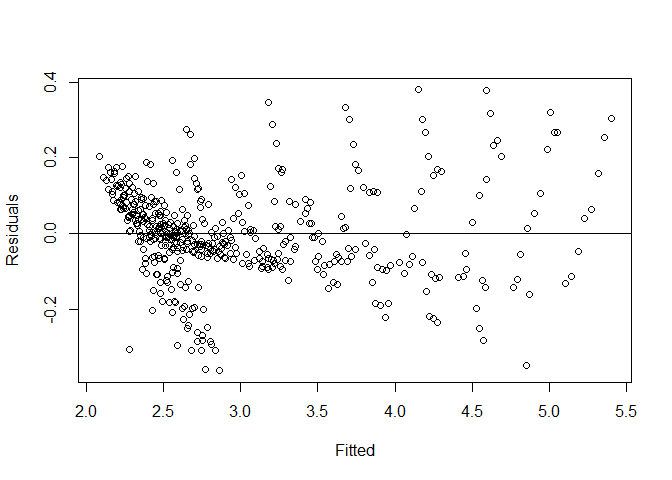<!-- -->

> We can see a slight megaphone pattern with this. Which means it
> violates the assumption and the constant variance does not exist.

``` r
plot(fitted(lmod),sqrt(abs(residuals(lmod))), xlab="Fitted",ylab=expression(sqrt(hat(epsilon))))
```

<!-- -->

> Better than the above one, but still, can see a pattern with this.
> Therefore, the variance of *ϵ* is not constant.

``` r
plot(fitted(lmod), sqrt(abs(residuals(lmod))), xlab = "Fitted",ylab = expression(sqrt(hat(epsilon))))
```

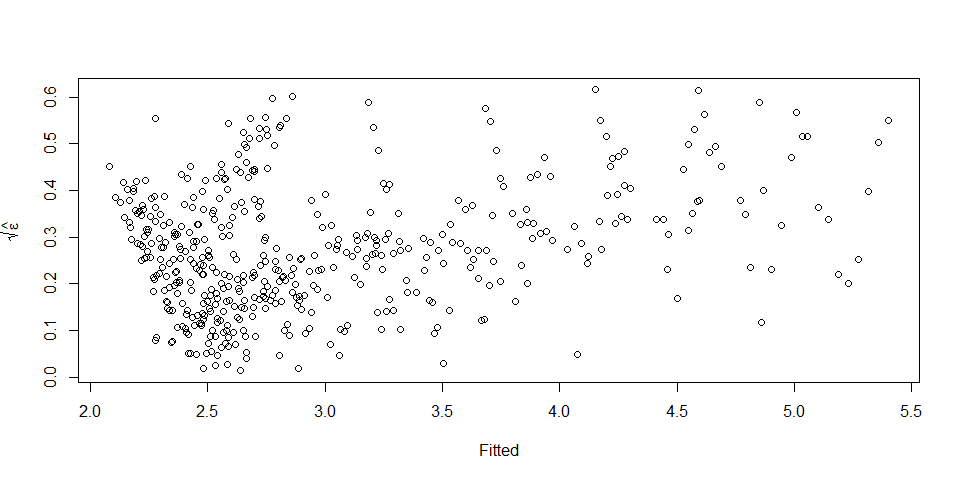<!-- -->

> So I tried some transformation.

``` r
par(mfrow=c(1,2))
plot(fitted(lmod),residuals(lmod),xlab="Fitted",ylab="Residuals",main = "Original")
abline(h=0)
lmod_transformed <- lm(log(density) ~ Prop1 + Prop2 + Prop3, data = p3_data)
plot(fitted(lmod_transformed),residuals(lmod_transformed),xlab="Fitted",ylab="Residuals",main = "Transformed 1")
abline(h=0)
```

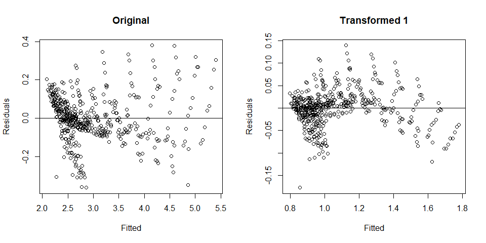<!-- -->

``` r
lmod_transformed <- lm(sqrt(exp(density)) ~ Prop1 + Prop2 + Prop3, data = p3_data)
plot(fitted(lmod_transformed),residuals(lmod_transformed),xlab="Fitted",ylab="Residuals",main = "Transformed 2")
abline(h=0)
lmod_transformed <- lm(exp(sqrt(density)) ~ Prop1 + Prop2 + Prop3, data = p3_data)
plot(fitted(lmod_transformed),residuals(lmod_transformed),xlab="Fitted",ylab="Residuals",main = "Transformed 3")
abline(h=0)
```

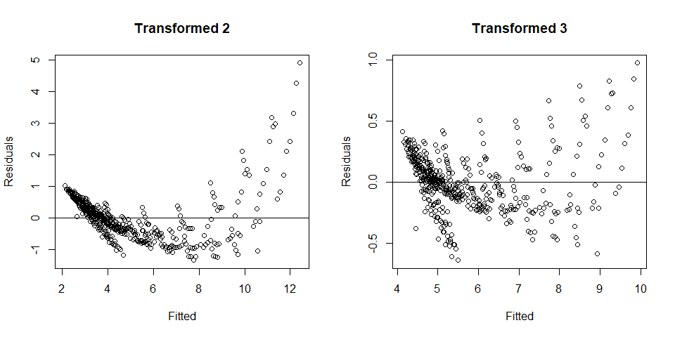<!-- -->

``` r
lmod_transformed <- lm(log(sqrt(density)) ~ Prop1 + Prop2 + Prop3, data = p3_data)
plot(fitted(lmod_transformed),residuals(lmod_transformed),xlab="Fitted",ylab="Residuals",main = "Transformed 4")
abline(h=0)
lmod_transformed <- lm(log(sqrt(exp(density))) ~ Prop1 + Prop2 + Prop3, data = p3_data)
plot(fitted(lmod_transformed),residuals(lmod_transformed),xlab="Fitted",ylab="Residuals",main = "Transformed 5")
abline(h=0)
```

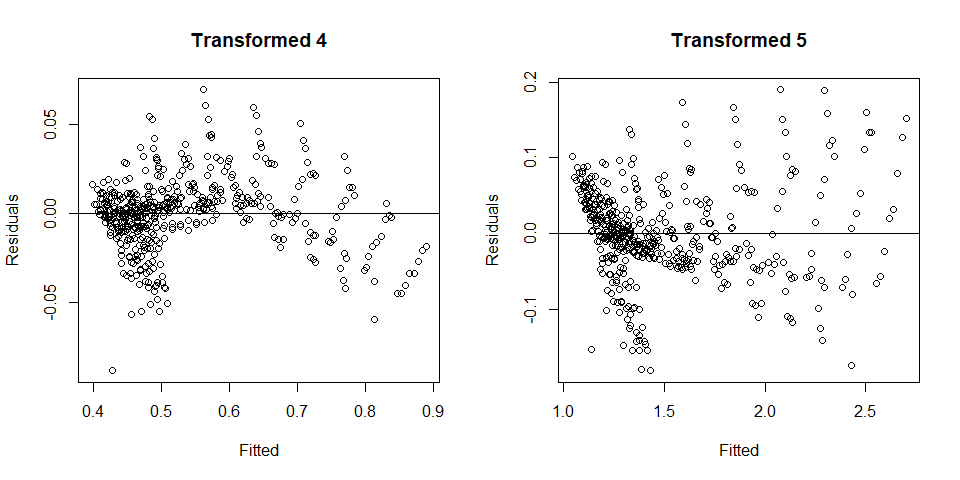<!-- -->

> With the Transformed 1, I fit a model with log function. I could still
> see patterns. For the Transformed 2 one, with the square root and
> exponential one, I could see a clear pattern. With Transformed 3, even
> though it’s not a clear pattern, we still see a pattern. The pattern
> is more vague in Transformed 4. Finally in Transformed 5, even though
> we see patterns it’s better than the original one.

**Normality**

> We are now testing the normality of *ϵ*, whether *ϵ* is normal
> distributed or not. So we can plot QQ plot and histogram to figure
> out.

``` r
par(mfrow = c(1,2))
qqnorm(residuals(lmod),ylab="Residuals",main="")
qqline(residuals(lmod))
hist(residuals(lmod))
```

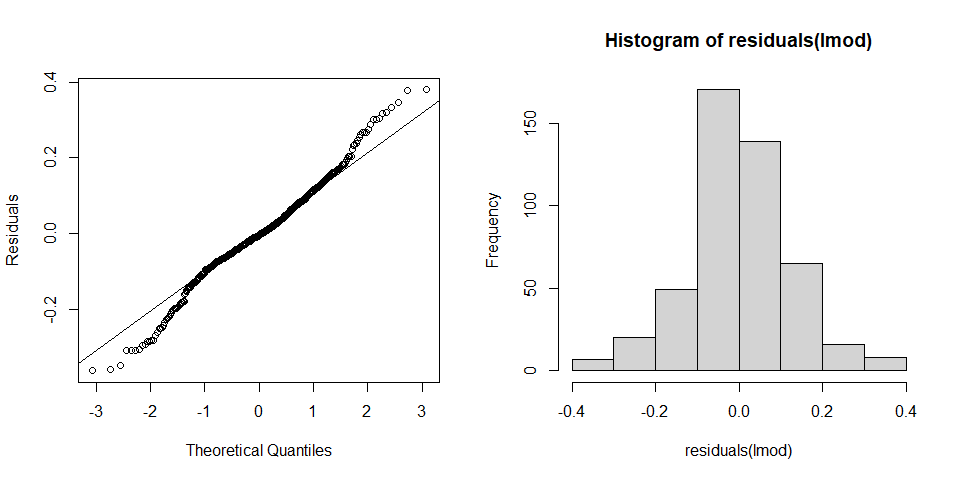<!-- -->

> We can see from the QQ plot that the graph is a little skewed, we see
> some points off the straight line. But when we are looking at the
> histogram of residuals, we can see that it’s normal shape (bell curve
> shape). We can see that the residuals are roughly normally
> distributed.

``` r
n <- length(residuals(lmod))
plot(tail(residuals(lmod),n-1) ~ head(residuals(lmod), n-1), xlab=expression(hat(epsilon)[i], ylab=expression(hat(epsilon)[i+1])), data = p3_data)
abline(h=0, v=0, col=grey(0.75))
```

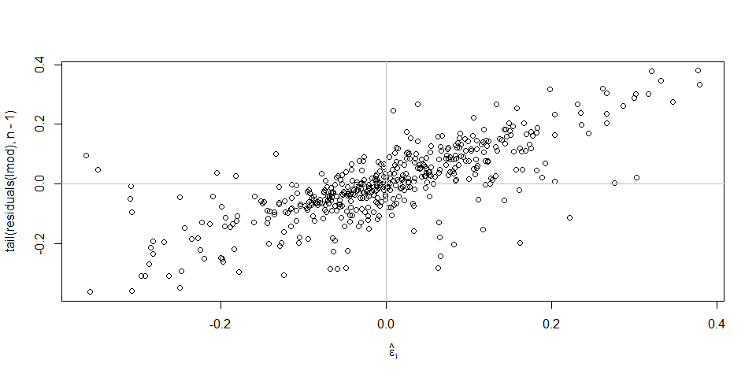<!-- -->

> We can see a obvious positive relationship between successive
> residuals. It implies the errors are related with each other, hence
> violates the independent assumption.

``` r
summary(lm(tail(residuals(lmod), n-1) ~ head(residuals(lmod), n-1) -1))
```

    ## 
    ## Call:
    ## lm(formula = tail(residuals(lmod), n - 1) ~ head(residuals(lmod), 
    ##     n - 1) - 1)
    ## 
    ## Residuals:
    ##      Min       1Q   Median       3Q      Max 
    ## -0.32842 -0.02920  0.00400  0.04118  0.36995 
    ## 
    ## Coefficients:
    ##                              Estimate Std. Error t value Pr(>|t|)    
    ## head(residuals(lmod), n - 1)  0.75534    0.03044   24.81   <2e-16 ***
    ## ---
    ## Signif. codes:  0 '***' 0.001 '**' 0.01 '*' 0.05 '.' 0.1 ' ' 1
    ## 
    ## Residual standard error: 0.0809 on 472 degrees of freedom
    ## Multiple R-squared:  0.566,  Adjusted R-squared:  0.5651 
    ## F-statistic: 615.6 on 1 and 472 DF,  p-value: < 2.2e-16

> We omitted the intercept term because the residuals have mean zero. We
> can see that the serial correlation is confirmed.

**Finding Unusual Observations**

> An outlier is a data point whose response *y* does not follow the
> general trend of the rest of the data.  
> A data point has high leverage if it has extreme predictor *x*
> values.  
> If we taking the point away then it affects slope, then we call it an
> influential point.

``` r
library(faraway) # required library for plotting halfnorm
hatv <- hatvalues(lmod)
head(hatv)
```

    ##           1           2           3           4           5           6 
    ## 0.025769637 0.016661027 0.010237723 0.006205166 0.004324999 0.004417896

``` r
p <- length(lmod$coefficients) # the number of parameter. In this case, it should be 4 since we have beta 0, beta 1, beta 2, and beta 3. 
n <- length(residuals(lmod)) # sample size (How many observations we have)
theoretical <- 2*p/n 

properties <- row.names(p3_data)
halfnorm(hatv, labs=properties, ylab = "Leverages")
```

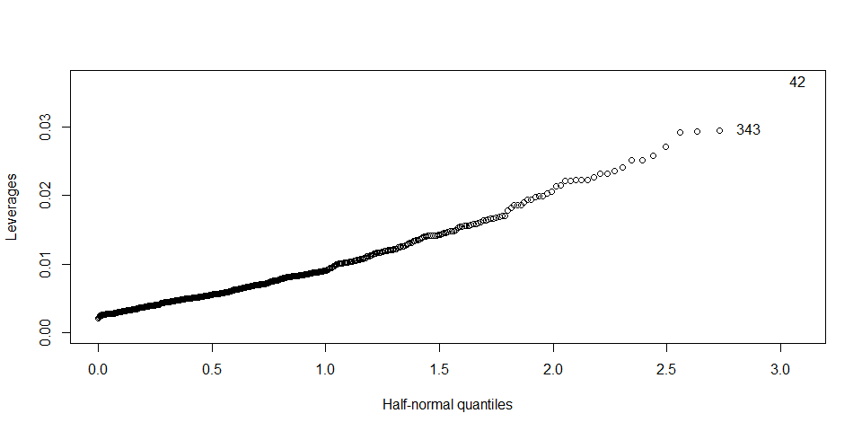<!-- -->

> We use 2*p*/*n* as our threshold of determining extreme observations.
> *p* is the number of parameters, and it should be four in this case
> since we have *β*<sub>0</sub>, *β*<sub>1</sub>, *β*<sub>2</sub>, and
> *β*<sub>3</sub> for our parameters. *n* is the sample size, so in this
> case we have 474. So the theoretical threshold value is 0.0169. When
> we use halfnorm distribution to figure out the leverage and potential
> extreme observations, we got 343 and 42. These two points (343 and 42)
> highly affect our value to draw a line.

**Conclusion**

> To conclude whether our model is in a good fir or not, we did several
> tests above. And by the diagnostics we did above, we can see the
> linear model is not appropriate. No constant variance, failed the
> normality test, (we could see some off points the straight line)

# (b)

### Doing real experiment is very expensive for all of three properties. Assuming they are of equally likely expense. If I can only afford one experiment, which property do you suggest me do? Give me your reason.

``` r
# first of all, try to make three reduced models (three univariate models)
lmod1 <- lm(density ~ Prop1, data = p3_data) # model with Prop1
summary(lmod1)
```

    ## 
    ## Call:
    ## lm(formula = density ~ Prop1, data = p3_data)
    ## 
    ## Residuals:
    ##      Min       1Q   Median       3Q      Max 
    ## -1.07567 -0.47620 -0.08851  0.36285  2.01864 
    ## 
    ## Coefficients:
    ##             Estimate Std. Error t value Pr(>|t|)    
    ## (Intercept)   4.4770     0.1054   42.48   <2e-16 ***
    ## Prop1        -4.4574     0.3041  -14.66   <2e-16 ***
    ## ---
    ## Signif. codes:  0 '***' 0.001 '**' 0.01 '*' 0.05 '.' 0.1 ' ' 1
    ## 
    ## Residual standard error: 0.6294 on 472 degrees of freedom
    ## Multiple R-squared:  0.3127, Adjusted R-squared:  0.3113 
    ## F-statistic: 214.8 on 1 and 472 DF,  p-value: < 2.2e-16

``` r
lmod2 <- lm(density ~ Prop2, data = p3_data) # model with Prop2
summary(lmod2)
```

    ## 
    ## Call:
    ## lm(formula = density ~ Prop2, data = p3_data)
    ## 
    ## Residuals:
    ##      Min       1Q   Median       3Q      Max 
    ## -0.43683 -0.09856 -0.00539  0.08497  0.40728 
    ## 
    ## Coefficients:
    ##             Estimate Std. Error t value Pr(>|t|)    
    ## (Intercept) 0.149244   0.025954    5.75  1.6e-08 ***
    ## Prop2       0.112524   0.000994  113.20  < 2e-16 ***
    ## ---
    ## Signif. codes:  0 '***' 0.001 '**' 0.01 '*' 0.05 '.' 0.1 ' ' 1
    ## 
    ## Residual standard error: 0.1431 on 472 degrees of freedom
    ## Multiple R-squared:  0.9645, Adjusted R-squared:  0.9644 
    ## F-statistic: 1.281e+04 on 1 and 472 DF,  p-value: < 2.2e-16

``` r
lmod3 <- lm(density ~ Prop3, data = p3_data) # model with Prop3
summary(lmod3)
```

    ## 
    ## Call:
    ## lm(formula = density ~ Prop3, data = p3_data)
    ## 
    ## Residuals:
    ##     Min      1Q  Median      3Q     Max 
    ## -1.3690 -0.5050 -0.2088  0.3302  2.5580 
    ## 
    ## Coefficients:
    ##              Estimate Std. Error t value Pr(>|t|)    
    ## (Intercept) 22.313294   2.758305   8.089 5.11e-15 ***
    ## Prop3       -0.008433   0.001204  -7.005 8.53e-12 ***
    ## ---
    ## Signif. codes:  0 '***' 0.001 '**' 0.01 '*' 0.05 '.' 0.1 ' ' 1
    ## 
    ## Residual standard error: 0.7226 on 472 degrees of freedom
    ## Multiple R-squared:  0.09418,    Adjusted R-squared:  0.09226 
    ## F-statistic: 49.08 on 1 and 472 DF,  p-value: 8.531e-12

**R-squared**

> The R<sup>2</sup> value, also known as coefficient of determination,
> tells us how much the predicted data, denoted by *ŷ*, explains the
> actual data, denoted by *y*. In other words, it represents the
> strength of the fit. If we only use one input variable, the
> R<sup>2</sup> value gives me a good indication of how well our model
> performs. It illustrates how much variation is explained by my model.
> The first model (input variable Prop1)’s R squared value is 0.3127,
> which means a value of 31.27%. The second model, with the model of
> Prop2, has 0.9645 for the R<sup>2</sup> value. Similarly, when we were
> looking at the summary of lmod3 (the linear model with Prop3
> predictor), I could find that the R-squared value is 0.09418.
> Apparently, the second model is better than the first and the third
> one.

**Residuals**

> The residuals are the difference between my predicted values and the
> actual values. Their benefit is that they can show us both the
> magnitude as well as the direction of our errors. So we need to make
> sure a model has equally distributed residuals around zero. When we
> are looking at the summary of each model, the first model’s residual
> range is: (-1.07567, 2.01864) The second model’s residuals within a
> range of -0.43683 and 0.40728. Lastly, the third model’s residual min
> and max values are: (-1.3690, 2.5580) We can notice that the second
> model’s residual bandwidth is smallest among the three models and has
> equally distributed around zero.

``` r
par(mfrow = c(1,2))
qqnorm(residuals(lmod1),ylab="Residuals",main="")
qqline(residuals(lmod1))
hist(residuals(lmod1))
```

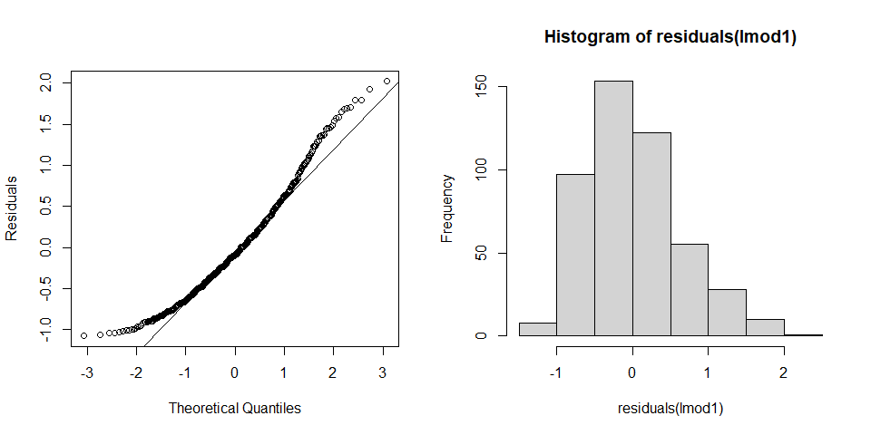<!-- -->

``` r
par(mfrow = c(1,2))
qqnorm(residuals(lmod2),ylab="Residuals",main="")
qqline(residuals(lmod2))
hist(residuals(lmod2))
```

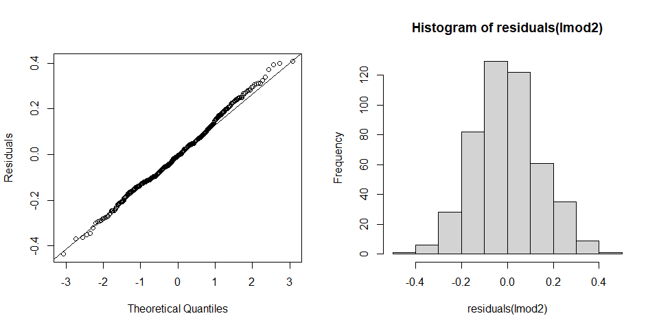<!-- -->

``` r
par(mfrow = c(1,2))
qqnorm(residuals(lmod3),ylab="Residuals",main="")
qqline(residuals(lmod3))
hist(residuals(lmod3))
```

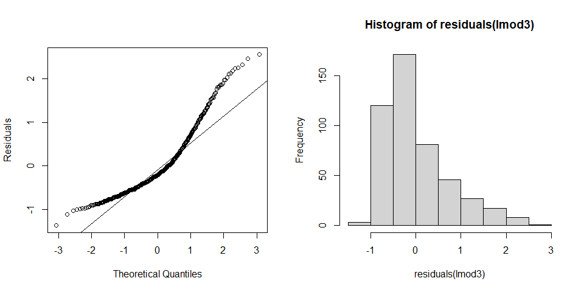<!-- -->

**Outliers**

> We can plot the histograms of residuals. The histograms summarize the
> magnitude of error terms. So it provides information about the
> bandwidth of errors and indicates how often which errors occurred. In
> the first histogram (lmod1), errors occur within a range of -2 and 3.
> The second histogram (lmod2), errors occur within a range of -0.5 and
> 0.5. In the last histogram (lmod3), errors occur within a range of
> -1.5 and 3. We can see that the second histogram indicates a smaller
> bandwidth of errors than the other two. So the outliers are much
> lower. Furthermore, most errors in the model of the second histogram
> are closer to zero. I would say that the second model (lmod2) seems to
> be a better fit. Also, when we are looking at the QQ plot (quantile
> vs. quantile), the second model (lmod2) has less off points from the
> straight line than other two plots.

**Conclusion (Final Decision)**

> With these reasons above, we can conclude that the linear model with
> the **second** property (Prop2) is better model for doing real
> experiment. Since, after I fit three different models and checked the
> summary of each model, I found out that lmod2 (with Prop2 predictor)’s
> R squared value is 0.9645, which is really close to 1. Also the second
> model has a smaller bandwidth of errors than other two models. So it
> seems to be a better fit than other two models. Thus I chose the
> linear model (**density \~ Prop2**).

# (c)

### What other ideas do you have from this data set? 

> When I first fit the multiple linear model and look at it, I thought
> it will be hard to decide which reduce model would be a good choice to
> answer (b) since the all of three predictors looked significant. But
> after I fit three simple linear models and look at the summary, it was
> pretty obvious than I thought, which made me surprising.

> Also, at first, when I do the first part, the question (a) (before
> diagnostics), I thought the linear model that I fit (lmod) is a good
> linear model with the p-value and other tests. But I eventually
> concluded that the linear model is not appropriate. I learned that it
> might be really dangerous if I make a conclusion only with p-value and
> R-squared value.
